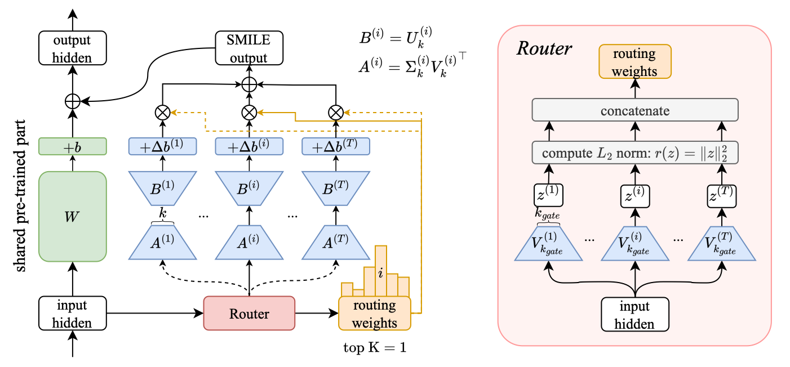
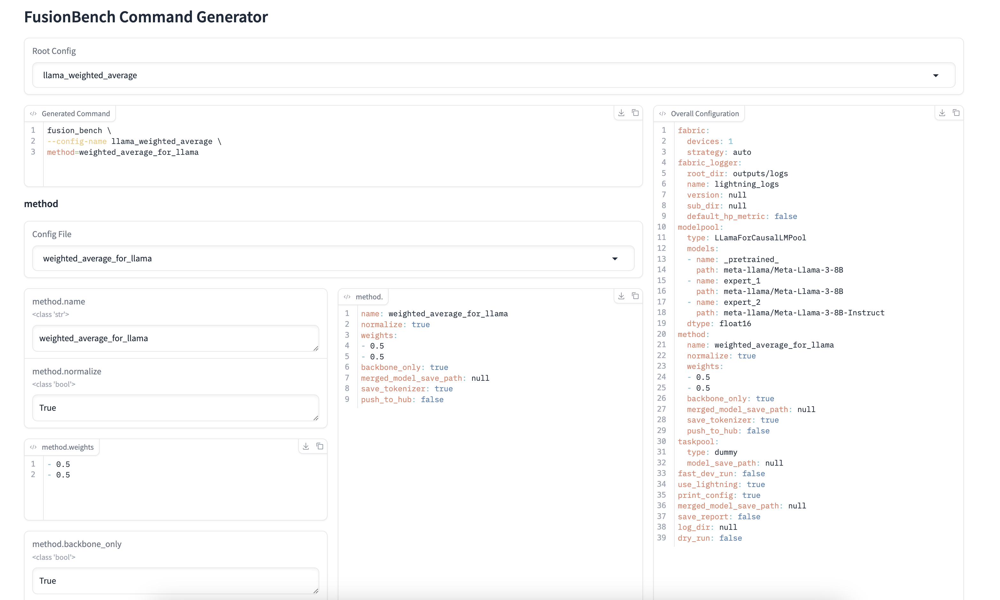

<div align='center'>

# FusionBench: A Comprehensive Benchmark/ToolKit of Deep Model Fusion

[](http://arxiv.org/abs/2406.03280)
[](https://github.com/tanganke/fusion_bench/blob/main/LICENSE)
[](https://pypi.org/project/fusion-bench/)
[](https://pepy.tech/project/fusion-bench)
[](https://tanganke.github.io/fusion_bench/)
[](https://github.com/psf/black)
[](https://github.com/google/yamlfmt)

</div>

> [!TIP]
> Documentation is available at [tanganke.github.io/fusion_bench/](https://tanganke.github.io/fusion_bench/).

## Overview

FusionBench is a benchmark suite designed to evaluate the performance of various deep model fusion techniques. It aims to provide a comprehensive comparison of different methods on a variety of datasets and tasks.

Projects based on FusionBench and news from the community (descending order of date. If you have any work based on FusionBench, please feel free to let us know, we are willing to add it to the list. :partying_face:):

<details>
  <summary>Hao Mark Chen, et al. FW-Merging: Scaling Model Merging with Frank-Wolfe Optimization. Mar 2025. https://arxiv.org/abs/2503.12649</summary>

Model merging has emerged as a promising approach for multi-task learning (MTL), offering a data-efficient alternative to conventional fine-tuning. However, with the rapid development of the open-source AI ecosystem and the increasing availability of fine-tuned foundation models, existing model merging methods face two key limitations: (i) They are primarily designed for in-house fine-tuned models, making them less adaptable to diverse model sources with partially unknown model and task information, (ii) They struggle to scale effectively when merging numerous model checkpoints. To address these challenges, we formulate model merging as a constrained optimization problem and introduce a novel approach: Frank-Wolfe Merging (FW-Merging). Inspired by Frank-Wolfe optimization, our approach iteratively selects the most relevant model in the pool to minimize a linear approximation of the objective function and then executes a local merging similar to the Frank-Wolfe update. The objective function is designed to capture the desired behavior of the target-merged model, while the fine-tuned candidate models define the constraint set. More importantly, FW-Merging serves as an orthogonal technique for existing merging methods, seamlessly integrating with them to further enhance accuracy performance. Our experiments show that FW-Merging scales across diverse model sources, remaining stable with 16 irrelevant models and improving by 15.3% with 16 relevant models on 20 CV tasks, while maintaining constant memory overhead, unlike the linear overhead of data-informed merging methods. Compared with the state-of-the-art approaches, FW-Merging surpasses the data-free merging method by 32.8% and outperforms the data-informed Adamerging by 8.39% when merging 20 ViT models.
</details>

<details>
  <summary>Daniel Marczak, et al. No Task Left Behind: Isotropic Model Merging with Common and Task-Specific Subspaces. Feb 2025. https://arxiv.org/abs/2502.04959</summary>

  Model merging integrates the weights of multiple task-specific models into a single multi-task model. Despite recent interest in the problem, a significant performance gap between the combined and single-task models remains. In this paper, we investigate the key characteristics of task matrices -- weight update matrices applied to a pre-trained model -- that enable effective merging. We show that alignment between singular components of task-specific and merged matrices strongly correlates with performance improvement over the pre-trained model. Based on this, we propose an isotropic merging framework that flattens the singular value spectrum of task matrices, enhances alignment, and reduces the performance gap. Additionally, we incorporate both common and task-specific subspaces to further improve alignment and performance. Our proposed approach achieves state-of-the-art performance across multiple scenarios, including various sets of tasks and model scales. This work advances the understanding of model merging dynamics, offering an effective methodology to merge models without requiring additional training. 
</details>

<details>
  <summary>Anke Tang, et al. Merging Models on the Fly Without Retraining: A Sequential Approach to Scalable Continual Model Merging. Jan 2025. https://arxiv.org/pdf/2501.09522</summary>

Deep model merging represents an emerging research direction that combines multiple fine-tuned models to harness their specialized capabilities across different tasks and domains. Current model merging techniques focus on merging all available models simultaneously, with weight interpolation-based methods being the predominant approaches. However, these conventional approaches are not well-suited for scenarios where models become available sequentially, and they often suffer from high memory requirements and potential interference between tasks. In this study, we propose a training-free projection-based continual merging method that processes models sequentially through orthogonal projections of weight matrices and adaptive scaling mechanisms. Our method operates by projecting new parameter updates onto subspaces orthogonal to existing merged parameter updates while using an adaptive scaling mechanism to maintain stable parameter distances, enabling efficient sequential integration of task-specific knowledge. Our approach maintains constant memory complexity to the number of models, minimizes interference between tasks through orthogonal projections, and retains the performance of previously merged models through adaptive task vector scaling. Extensive experiments on CLIP-ViT models demonstrate that our method achieves a 5-8% average accuracy improvement while maintaining robust performance in different task orderings.
</details>

<details>
  <summary>Yongxian Wei, et al. Modeling Multi-Task Model Merging as Adaptive Projective Gradient Descent. Jan 2025. https://arxiv.org/abs/2501.01230</summary>

Merging multiple expert models offers a promising approach for performing multi-task learning without accessing their original data. Existing methods attempt to alleviate task conflicts by sparsifying task vectors or promoting orthogonality among them. However, they overlook the fundamental requirement of model merging: ensuring the merged model performs comparably to task-specific models on respective tasks. We find these methods inevitably discard task-specific information that, while causing conflicts, is crucial for performance. Based on our findings, we frame model merging as a constrained optimization problem (i.e., minimizing the gap between the merged model and individual models, subject to the constraint of retaining shared knowledge) and solve it via adaptive projective gradient descent. Specifically, we align the merged model with individual models by decomposing and reconstituting the loss function, alleviating conflicts through data-free optimization of task vectors. To retain shared knowledge, we optimize this objective by projecting gradients within a shared subspace spanning all tasks. Moreover, we view merging coefficients as adaptive learning rates and propose a task-aware, training-free strategy. Experiments show that our plug-andplay approach consistently outperforms previous methods, achieving state-of-the-art results across diverse architectures and tasks in both vision and NLP domains. Our code is available here.
</details>

<details>
  <summary>Hongling Zheng, Li Shen, Anke Tang, Yong Luo et al. Learn From Model Beyond Fine-Tuning: A Survey. Nature Machine Intelligence. Jan, 2025. https://www.nature.com/articles/s42256-024-00961-0</summary>

  > Foundation models (FM) have demonstrated remarkable performance across a wide range of tasks (especially in the fields of natural language processing and computer vision), primarily attributed to their ability to comprehend instructions and access extensive, high-quality data. This not only showcases their current effectiveness but also sets a promising trajectory towards the development of artificial general intelligence. Unfortunately, due to multiple constraints, the raw data of the model used for large model training are often inaccessible, so the use of end-to-end models for downstream tasks has become a new research trend, which we call Learn From Model (LFM) in this article. LFM focuses on the research, modification, and design of FM based on the model interface, so as to better understand the model structure and weights (in a black box environment), and to generalize the model to downstream tasks. The study of LFM techniques can be broadly categorized into five major areas: model tuning, model distillation, model reuse, meta learning and model editing. Each category encompasses a repertoire of methods and strategies that aim to enhance the capabilities and performance of FM. This paper gives a comprehensive review of the current methods based on FM from the perspective of LFM, in order to help readers better understand the current research status and ideas. To conclude, we summarize the survey by highlighting several critical areas for future exploration and addressing open issues that require further attention from the research community. The relevant papers we investigated in this article can be accessed at https://github.com/ruthless-man/Awesome-Learn-from-Model.
</details>

<details>
  <summary>Li Shen, Anke Tang, Enneng Yang et al. Efficient and Effective Weight-Ensembling Mixture of Experts for Multi-Task Model Merging. Oct, 2024. https://github.com/EnnengYang/Efficient-WEMoE</summary>
 
  

</details>
<details>
  <summary>Jinluan Yang et al. Mitigating the Backdoor Effect for Multi-Task Model Merging via Safety-Aware Subspace. Oct, 2024. http://arxiv.org/abs/2410.13910</summary>

  

</details>
<details>
  <summary>Anke Tang et al. SMILE: Zero-Shot Sparse Mixture of Low-Rank Experts Construction From Pre-Trained Foundation Models. Aug, 2024. http://arxiv.org/abs/2408.10174</summary>

  Example notebooks can be found at [examples/smile_upscaling](examples/smile_upscaling).  
  

</details>

## Installation

Install from PyPI:

```bash
pip install fusion-bench
```

or install the latest version in development from github repository

```bash
git clone https://github.com/tanganke/fusion_bench.git
cd fusion_bench

pip install -e . # install the package in editable mode
```

> [!TIP]
> FusionBench is highly dependent on the use of [Hydra](https://hydra.cc/) for configuration management and command line argument parsing, and [Lightning Fabric](https://lightning.ai/) for device management.
> If you are not familiar with these tools, it is strongly recommended to read the [Hydra](https://hydra.cc/docs/intro/) and [Lightning Fabric](https://lightning.ai/docs/fabric/stable/) documentation.

### Install with [Language Model Evaluation Harness](https://github.com/EleutherAI/lm-evaluation-harness)

[](https://doi.org/10.5281/zenodo.10256836)


```bash
pip install "fusion-bench[lm-eval-harness]"
```

or install from local directory

```bash
pip install -e ".[lm-eval-harness]"
```

This will install the latest version of fusion-bench and the dependencies required for LM-Eval Harness.
Documentation for using LM-Eval Harness within FusionBench framework can be found at [this online documentation](https://tanganke.github.io/fusion_bench/taskpool/lm_eval_harness) or in the [`docs/taskpool/lm_eval_harness.md`](docs/taskpool/lm_eval_harness.md) markdown file.

> [!TIP]
> Documentation for merging large language models using FusionBench can be found at [this online documentation](https://tanganke.github.io/fusion_bench/modelpool/causal_lm) or in the [`docs/modelpool/causal_lm.md`](docs/modelpool/causal_lm.md) markdown file.

## Introduction to Deep Model Fusion

Deep model fusion is a technique that merges, ensemble, or fuse multiple deep neural networks to obtain a unified model.
It can be used to improve the performance and robustness of model or to combine the strengths of different models, such as fuse multiple task-specific models to create a multi-task model.
For a more detailed introduction to deep model fusion, you can refer to [W. Li, 2023, 'Deep Model Fusion: A Survey'](https://arxiv.org/abs/2309.15698). We also provide a brief overview of deep model fusion in [our documentation](https://tanganke.github.io/fusion_bench/).
In this benchmark, we evaluate the performance of different fusion methods on a variety of datasets and tasks.

## Project Structure

The project is structured as follows:

- `fusion_bench/`: the main package of the benchmark.
  - `method`: contains the implementation of the fusion methods.
    > **naming convention**: `fusion_bench/method/{method_name}/{variant}.py` contains the implementation of the specific method or its variants.
      For example, `fusion_bench/method/regmean/clip_regmean.py` contains the implementation of the RegMean algorithm for CLIP vision models.
  - `modelpool`: contains the implementation of the model pool, responsible for managing the models and dataset to be loaded.
  - `taskpool`: contains the implementation of the task pool, responsible for evaluating the performance of models returned by the algorithm.
- `config/`: configuration files for the benchmark. We use [Hydra](https://hydra.cc/) to manage the configurations.
  - `method`: configuration files for the fusion methods.
    > **naming convention**: `config/method/{method_name}/{variant}.yaml` contains the configuration for the specific method or its variants.
  - `modelpool`: configuration files for the model pool.
  - `taskpool`: configuration files for the task pool.
  - `model`: configuration files for the models.
  - `dataset`: configuration files for the datasets.
- `docs/`: documentation for the benchmark. We use [mkdocs](https://www.mkdocs.org/) to generate the documentation. Start the documentation server locally with `mkdocs serve`. The required packages can be installed with `pip install -r mkdocs-requirements.txt`.
- `examples/`: example scripts for running some of the experiments.
  > **naming convention**: `examples/{method_name}/` contains the files such as bash scripts and jupyter notebooks for the specific method.
- `tests/`: unit tests for the benchmark.

## A Unified Command Line Interface

The `fusion_bench` command-line interface is a powerful tool for researchers and practitioners in the field of model fusion. It provides a streamlined way to experiment with various fusion algorithms, model combinations, and evaluation tasks. 
By leveraging Hydra's configuration management, fusion_bench offers flexibility in setting up experiments and reproducibility in results. 
The CLI's design allows for easy extension to new fusion methods, model types, and tasks, making it a versatile platform for advancing research in model fusion techniques.

Read the [CLI documentation](https://tanganke.github.io/fusion_bench/cli/fusion_bench/) for more information.

## Implement your own model fusion algorithm

First, create a new Python file for the algorithm in the `fusion_bench/method` directory.
Following the naming convention, the file should be named `{method_name_or_class}/{variant}.py`.

```python
from fusion_bench import BaseModelFusionAlgorithm, BaseModelPool

class DerivedModelFusionAlgorithm(BaseModelFusionAlgorithm):
    """
    An example of a derived model fusion algorithm.
    """

    # _config_mapping maps the attribution to the corresponding key in the configuration file.
    # this is optional and can be used to serialize the object to a configuration file.
    # `self.config.hyperparam_1` will be mapped to the attribute `hyperparam_attr_1`.
    _config_mapping = BaseModelFusionAlgorithm._config_mapping | {
        "hyperparam_attr_1": "hyperparam_1",
        "hyperparam_attr_2": "hyperparam_2",
    }

    def __init__(self, hyperparam_1, hyperparam_2, **kwargs):
        self.hyperparam_attr_1 = hyperparam_1
        self.hyperparam_attr_2 = hyperparam_2
        super().__init__(**kwargs)

    def run(self, modelpool: BaseModelPool):
        # modelpool is an object that responsible for managing the models and dataset to be loaded.
        # implement the fusion algorithm here.
        raise NotImplementedError(
            "DerivedModelFusionAlgorithm.run() is not implemented."
        )
```

A corresponding configuration file should be created to specify the class and hyperparameters of the algorithm. 
Here we assume the configuration file is placed at `config/method/your_algorithm_config.yaml`.

> [!NOTE]
> In fact, you can place your implementation anywhere you like, as long as the `_target_` in the configuration file points to the correct class.

```yaml
_target_: path_to_the_module.DerivedModelFusionAlgorithm

hyperparam_1: some_value
hyperparam_2: another_value
```

Use the algorithm in the FusionBench:

```bash
fusion_bench \
  method=your_algorithm_config \
  method.hyperparam_1=you_can_override_this \
  method.hyperparam_2=and_this \
  ... # other configurations
```

### :rocket: Quick Start for Experienced Users

We provide a project template for quickly starting a new fusion algorithm implementation here: [FusionBench Project Template](https://github.com/fusion-bench/fusion-bench-project-template).

<div align='center'>

Click on [<kbd>Use this template</kbd>](https://github.com/fusion-bench/fusion-bench-project-template/generate) to initialize new repository.

</div>

### FusionBench Command Generator WebUI (for v0.1.x)

FusionBench Command Generator is a user-friendly web interface for generating FusionBench commands based on configuration files. 
It provides an interactive way to select and customize FusionBench configurations, making it easier to run experiments with different settings.
[Read more here](https://tanganke.github.io/fusion_bench/cli/fusion_bench_webui/).



## Citation

If you find this benchmark useful, please consider citing our work:

```bibtex
@misc{tangFusionBenchComprehensiveBenchmark2024,
  title = {{{FusionBench}}: {{A Comprehensive Benchmark}} of {{Deep Model Fusion}}},
  shorttitle = {{{FusionBench}}},
  author = {Tang, Anke and Shen, Li and Luo, Yong and Hu, Han and Du, Bo and Tao, Dacheng},
  year = {2024},
  month = jun,
  number = {arXiv:2406.03280},
  eprint = {2406.03280},
  publisher = {arXiv},
  url = {http://arxiv.org/abs/2406.03280},
  archiveprefix = {arxiv},
  langid = {english},
  keywords = {Computer Science - Artificial Intelligence,Computer Science - Computation and Language,Computer Science - Machine Learning}
}
```
