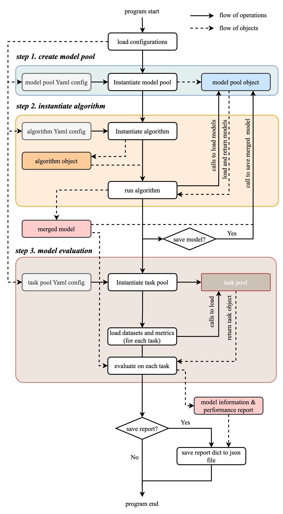

# FusionBench: A Comprehensive Benchmark of Deep Model Fusion

[](http://arxiv.org/abs/2406.03280)
[](https://github.com/tanganke/fusion_bench/blob/main/LICENSE)
[](https://pypi.org/project/fusion-bench/)
[](https://pepy.tech/project/fusion-bench)
[](https://tanganke.github.io/fusion_bench/)
[](https://github.com/psf/black)
[](https://github.com/google/yamlfmt)

!!! bug "Breaking Changes"

    Recent upgrade to v0.2.0 may cause some breaking changes.
    You can install a specific version by `pip install fusion-bench==0.1.6` or checkout to a specific version by `git checkout v0.1.6`.
    If you encounter any issues, please feel free to raise an issue.

!!! note
    
    - Any questions or comments can be directed to the [GitHub Issues](https://github.com/tanganke/fusion_bench/issues) page for this project.
    - Any contributions or pull requests are welcome. If you find any mistakes or have suggestions for improvements, please feel free to raise an issue or submit a pull request.

!!! tip "Introduction to Deep Model Fusion (The Learn From Model Paradigm)"

    Deep model fusion is a technique that merges, ensemble, or fuse multiple deep neural networks to obtain a unified model.
    It can be used to improve the performance and robustness of model or to combine the strengths of different models, such as fuse multiple task-specific models to create a multi-task model.
    For a more detailed introduction to deep model fusion, you can refer to [W. Li, 2023, 'Deep Model Fusion: A Survey'](https://arxiv.org/abs/2309.15698). 
    In this benchmark, we evaluate the performance of different fusion methods on a variety of datasets and tasks. ...

    [:octicons-arrow-right-24: Read More](introduction_to_model_fusion.md)

## Getting Started

### Installation

Install from [PyPI](https://pypi.org/project/fusion-bench/):

```bash
pip install fusion-bench

# you can also install a specific version
# pip install fusion-bench==0.1.6
```

Or install the latest version in development from github repository

```bash
git clone https://github.com/tanganke/fusion_bench.git
cd fusion_bench

# checkout to use a specific version. for example, v0.1.6
# git checkout v0.1.6

pip install -e . # install the package in editable mode
```

View documentation locally:

```bash
# install mkdocs and the required packages
pip install -r mkdocs-requirements.txt

# serve the documentation, by default it will be available at http://localhost:8000
mkdocs serve
```

### Command Line Interface

`fusion_bench` is the command line interface for running the benchmark. 
It takes a configuration file as input, which specifies the models, fusion method to be used, and the datasets to be evaluated. 
To run the benchmark, you can use the following command:

```
fusion_bench [--config-path CONFIG_PATH] [--config-name CONFIG_NAME] \
    OPTION_1=VALUE_1 OPTION_2=VALUE_2 ...
```

This program will load the configuration file specified by `--config-path` and `--config-name`, and run the fusion algorithm on the model pool.
The pseudocode is as follows:

```python
# instantiate an algorithm, a modelpool object that manages the models, 
# and a taskpool object that manages the tasks (dataset + metrics)
algorithm = load_algorithm(config.algorithm)
modelpool = load_modelpool(config.modelpool)
taskpool = load_taskpool(config.taskpool)

# run the fusion algorithm on the model pool
merged_model = algorithm.run(modelpool)
# evaluate the merged model on the tasks
report = taskpool.evaluate(merged_model)
```

For detailed information on the options available, you can refer to this [page](cli/fusion_bench.md).

### Implmentation of Fusion Algorithms

Working in progress.

<!-- ```markdown -->
<!-- --8<-- "docs/supported_algorithms.md" -->
<!-- ``` -->

## General Structure of FusionBench

<figure markdown="span">
{ width="800px" }
<figcaption>Framework of FusionBench</figcaption>
</figure>

FusionBench is a pioneering project that provides a comprehensive benchmark for deep model fusion, facilitating the evaluation and comparison of various model fusion techniques. The project is meticulously designed to support rigorous analysis and experimentation in the field of model fusion, offering a versatile and modular codebase tailored for advanced research and development.

The general structure of the FusionBench project can be visualized through its modular framework, which is divided into several key components:

1. **Fusion Algorithm**: The core component where Model Fusion takes place. It integrates models from the Model Pool and adjusts them according to the specified fusion algorithms. The output is then evaluated for performance and effectiveness.
2. **Model Pool**: A repository of various pre-trained models that can be accessed and utilized for fusion. This pool serves as the foundation for creating new, fused models by leveraging the strengths of each individual model.
3. **Task Pool**: A collection of tasks that the fused models are evaluated on. These tasks help in assessing the practical applicability and robustness of the fused models.
4. **Models & Warpers, Datasets, and Metrics**: These underlying modules include:
      - Models & Warpers: Tools and scripts for model loading, wrapping, and pre-processing.
      - Datasets: The datasets used for training, validation, and testing the fused models.
      - Metrics: The performance metrics used to evaluate the models, providing a comprehensive understanding of their capabilities.
5. **YAML Configurations**: Central to the project's modularity, YAML files are used to configure models, datasets, and metrics, allowing seamless customization and scalability. 
    This is based on the hydra framework, which allows for easy customization and scalability.
    [:octicons-arrow-right-24: Read More](https://hydra.cc/)

By organizing these components into a structured and modular codebase, FusionBench ensures flexibility, ease of use, and scalability for researchers and developers. The project not only serves as a benchmark but also as a robust platform for innovation in the realm of deep model fusion.

## Key Features

- Comprehensive Benchmark: FusionBench provides a wide range of fusion algorithms, model pools, and tasks for thorough evaluation.
- Modular Design: The project is structured into separate modules for algorithms, model pools, and task pools, allowing easy extension and customization.
- Command-line Interface: A flexible CLI tool `fusion_bench` for running experiments with various configurations.
- Web UI: An interactive web interface `fusion_bench_webui` for easier configuration and command generation.
- Extensive Documentation: Detailed guides, API references, and examples to help users get started quickly.

### Basic Example

Here we provide a basic example to demonstrate the usage of FusionBench.
We choose the [simple average algorithm](algorithms/simple_averaging.md) as the fusion algorithm, and 4 [fine-tuned CLIP-ViT-B/32 models](modelpool/clip_vit.md) to be merged.
We are going to evaluate the merged model on 4 tasks with data corrupted by Gaussian noise to evaluate the robustness of the merged model.

We provide an command line interface `fusion_bench` to run the example.
The instruction to run the example is as follows:

```{.bash .annotate}
fusion_bench \
    # (1)
    --config-name clip-vit-base-patch32_robustness_corrupted \
    corruption=gaussian_noise \
    # (2)
    method=simple_averaging  \
    # (3)
    modelpool=clip-vit-base-patch32_robustness_corrupted \
    # (4)
    taskpool=clip-vit-base-patch32_robustness_corrupted
```

1. Here we specify the main configuration file to be used. 
    The `corruption` option specifies the type of data corruption to be applied to the evaluation datasets. In this case, we use Gaussian noise. 
    In FusionBench, we are currently provide 7 types of data corruptions for imaage classification tasks Standford Cars, EuroSAT, RESISC45 and GTSRB. 
    The option `corrption` can be one of: `contrast`, `gaussian_noise`, `impulse_noise`, `jpeg_compression`, `motion_blur`, `pixelate`, `spatter`.
2. The `method` option specifies the fusion algorithm to be used. In this case, we use the simple averaging algorithm.
3. Here we specify the model pool to be used. 
    The model pool is responsible for managing the loading, preprocessing, and saving of the models.
    By pass option `modelpool=clip-vit-base-patch32_robustness_corrupted`, the program instantiate a modelpool object that manages 4 task-specific CLIP-ViT-B/32 models that are fine-tuned on Stanford Cars, EuroSAT, RESISC45, and GTSRB datasets.
4. Here we specify the task pool to be used. 
    The task pool is responsible for managing the evaluation datasets and metrics.
    By pass option `taskpool=clip-vit-base-patch32_robustness_corrupted`, the program instantiate a taskpool object that manages 4 tasks with data corrupted by Gaussian noise.

The configurations are stored in the `configs` directory, listed as follows:

=== "Method Configuration"

    The simple averaging algorithm is very straightforward. No additional hyperparameters are required. So the configuration file contains only the name of the algorithm to specify the Python class of the fusion algorithm.

    ```yaml title="config/method/simple_average.yaml"
    name: simple_average # (1)
    ```

    1. Name of the fusion algorithm. The `name` field specifies the class of the fusion algorithm.


=== "Model Pool Configuration"

    ```yaml title="config/modelpool/clip-vit-base-patch32_robustness_corrupted.yaml"
    type: huggingface_clip_vision # (1)
    models: # (2)
    - name: _pretrained_
        path: openai/clip-vit-base-patch32
    - name: stanford_cars
        path: tanganke/clip-vit-base-patch32_stanford-cars
    - name: eurosat
        path: tanganke/clip-vit-base-patch32_eurosat
    - name: resisc45
        path: tanganke/clip-vit-base-patch32_resisc45
    - name: gtsrb
        path: tanganke/clip-vit-base-patch32_gtsrb


    # `corrption` can be one of:
    # contrast, gaussian_noise, impulse_noise, jpeg_compression, motion_blur, pixelate, spatter
    corruption: ${corruption}

    # Other configurations to meet other methods' requirements.
    # For example, test dataset for test-time adaptation training.
    # ...
    ```

    1. Type of the model pool. The `type` field specifies the class of the model pool.
    2. The `models` field specifies the models to be used for fusion. In this case, we use 4 task-specific CLIP-ViT-B/32 models that are fine-tuned on Stanford Cars, EuroSAT, RESISC45, and GTSRB datasets.

=== "Task Pool Configuration"

    ```yaml title="config/taskpool/clip-vit-base-patch32_robustness_corrupted.yaml"
    type: clip_vit_classification # (1)
    name: clip-vit-robustness_clean

    # corrption can be one of:
    # contrast, gaussian_noise, impulse_noise, jpeg_compression, motion_blur, pixelate, spatter
    corruption: ${corruption}
    dataset_type: huggingface_image_classification
    tasks: # (2)
    - name: stanford_cars
        dataset:
        name: tanganke/stanford_cars
        split: ${taskpool.corruption}
    - name: eurosat
        dataset:
        name: tanganke/eurosat
        split: ${taskpool.corruption}
    - name: resisc45
        dataset:
        name: tanganke/resisc45
        split: ${taskpool.corruption}
    - name: gtsrb
        dataset:
        name: tanganke/gtsrb
        split: ${taskpool.corruption}

    clip_model: openai/clip-vit-base-patch32 # (3)
    batch_size: 128 # (4)
    num_workers: 16
    fast_dev_run: ${fast_dev_run}
    ```

    1. Type and name of the task pool. The `type` field specifies the class of the task pool, and the `name` field specifies the name of the task pool.
    2. The `tasks` field specifies the tasks to be evaluated. In this case, we evaluate the fused model on 4 tasks: Stanford Cars, EuroSAT, RESISC45, and GTSRB, with data corrupted by `${corruption}`.
    3. Base model used for intializing the classification head. Here, we need the text encoder of CLIP-ViT-B/32 to initialize the classification head.
    4. Batch size and number of workers used for data loading.


A flowchart of the FusionBench command line interface is shown below:

<figure markdown="span">
{ width="800px"}
</figure>

<div class="grid cards" markdown>

- **Fusion Algorithm Module**
    
    ---

    Implement the fusion algorithms. Receive the model pool and return the fused model.

    [:octicons-arrow-right-24: Read More](algorithms/README.md)

- **Model Pool Module**

    ---

     Magage the models. Responsible for loading, preprocessing, and saving the models.
        
    [:octicons-arrow-right-24: Read More](modelpool/README.md)

- **Task Pool Module**

    ---

    Manage the tasks. Responsible for loading evaluation datasets and metrics, and evaluating the fused model.

    [:octicons-arrow-right-24: Read More](taskpool/README.md)

</div>

## Citation

If you find this benchmark useful, please consider citing our work:

```bibtex
@misc{tangFusionBenchComprehensiveBenchmark2024,
  title = {{{FusionBench}}: {{A Comprehensive Benchmark}} of {{Deep Model Fusion}}},
  shorttitle = {{{FusionBench}}},
  author = {Tang, Anke and Shen, Li and Luo, Yong and Hu, Han and Du, Bo and Tao, Dacheng},
  year = {2024},
  month = jun,
  number = {arXiv:2406.03280},
  eprint = {2406.03280},
  publisher = {arXiv},
  url = {http://arxiv.org/abs/2406.03280},
  archiveprefix = {arxiv},
  langid = {english},
  keywords = {Computer Science - Artificial Intelligence,Computer Science - Computation and Language,Computer Science - Machine Learning}
}
```
