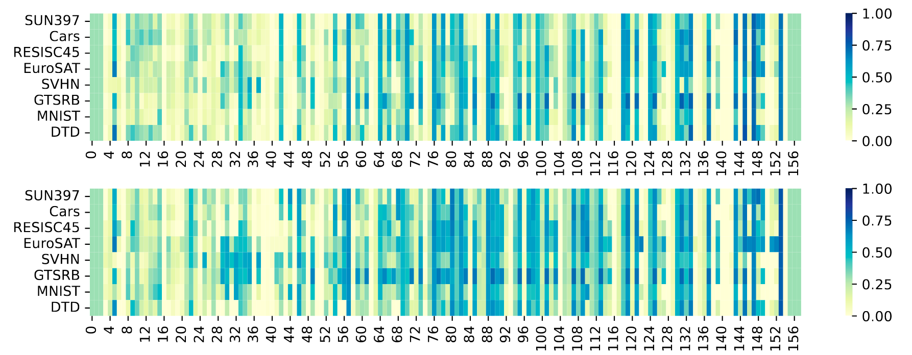

# AdaMerging

<figure markdown="span">
    { width="750" }
    <figcaption>Task Vector, Task Arithmetic, and AdaMerging. Credit to <sup id="fnref:1"><a class="footnote-ref" href="#fn:1">1</a></sup></figcaption>
</figure>

In the complex landscape of multi-task learning, AdaMerging has emerged as a potent method for adaptively merging model parameters to optimize performance across tasks. Unlike traditional fixed-coefficient methods, AdaMerging autonomously learns merging coefficients, offering a more refined and responsive approach[^1]. 

**Task Vectors**. Similar to Task Arithmetic, AdaMerging begins by computing task vectors for each fine-tuned model:

$$\tau_i = \theta_i - \theta_0$$

where $\theta_i$ represents the parameters of the model fine-tuned for task $i$, and $\theta_0$ denotes the parameters of the pre-trained model.

**Adaptive Coefficient Learning**. The cornerstone of AdaMerging lies in its adaptive nature, where it learns the coefficients for merging either on a task-wise or layer-wise basis. This adaptability is driven by an entropy minimization strategy applied to unlabeled test samples as a surrogate objective function, which serves to refine the merging coefficients for optimal performance.

The optimization objective for AdaMerging is:

$$\min_{\lambda} \mathbb{E}_{x \sim \mathcal{D}_{test}} [H(p(y|x; \theta_{\lambda}))]$$

where $H(\cdot)$ denotes the entropy function, $p(y|x; \theta_{\lambda})$ is the predicted probability distribution, and $\theta_{\lambda}$ is the merged model with coefficients $\lambda$.

**Task-wise AdaMerging** learns a single coefficient per task and is formulated as:

$$
\theta = \theta_0 + \sum_{i=1}^{n} \lambda_i \tau_i
$$

where $\lambda_i$ represents the merging coefficient for the $i$-th task, and $\tau_i$ denotes the task vector for the $i$-th task.

**Layer-wise AdaMerging** learns coefficients for each layer of each task and is articulated as:

$$\theta^l = \theta_0^l + \sum_{i=1}^{n} \lambda^{l}_{i} \tau^{l}_{i}$$

where the merging coefficient $\lambda^{l}_{i}$ and task vector $\tau^{l}_{i}$ are specific to each layer $l$ of the model.

By leveraging this adaptive learning approach, AdaMerging significantly enhances the model's ability to generalize across tasks and layers, resulting in a more robust and finely-tuned performance profile. The method's reliance on entropy minimization ensures that the merging process continually seeks the most informative and stable configuration, adapting to the specific needs of the dataset and tasks at hand.

## AdaMerging Analysis

**Task-wise Coefficients.** 
The below Figure shows the changes during the iteration process of merging coefficient optimization of each task vector in Task-wise AdaMerging and AdaMerging++, which is shown every ten steps. We consistently observe that the merging coefficients of each task vector are inconsistent. When the number of tasks is relatively large, it is obviously undesirable to grid search the coefficients of each task, but our AdaMerging avoids this manual search process.

<figure markdown="span">
{ width="900px" }
<figcaption style="max-width:90%" markdown="span">
Model merging coefficients $\{λ_k\}_{k=1}^K$ change with respect to training steps on ViT-B/32:  
(a) Task-wise AdaMerging; (b) Task-wise AdaMerging++. Each line represents the change process of the coefficient $λ_k$ of a task vector $T_k (k \in \{1, 2, . . . , K\})$.
</figcaption>
</figure>

**Layer-wise Coefficients.**
The following Figure shows the merging coefficients learned by Layer-wise AdaMerging and AdaMerging++ on ViT-B/32 respectively. We observed that:  

1. The coefficients learned by each layer of each task vector are different, which shows that the importance of each layer in the model merging process is different. 
2. The coefficients learned by shallow layers are generally smaller than those of deep layers, which indicates that shallow layers rely more on the weights of the pre-trained model rather than the weights provided by task vectors, while the deep layers rely more on the weights provided by the task vectors. This may be since the shallow layer learns general features, which are cross-task, while the deep layer learns task-specific features [^2]. This finding is also consistent with routing analysis in [^3].

<figure markdown="span">
{ width="900px" }
<figcaption style="max-width:90%" markdown="span">
Learned model merging coefficients $\{λ_l^k\}^{K,L}_{k=1,l=1}$ of Layer-wise AdaMerging (Above) and AdaMerging++ (Below) on ViT-B/32. 
The $k$-th row represents the $k$-th task vector, the $l$-th column represents the $l$-th layer, and the intersection point represents the coefficient $λ^l_k$.
</figcaption>
</figure>

## Examples

### CLI Usage

Configuration template for AdaMerging (CLIP):

```yaml title="config/method/adamerging/clip.yaml"
--8<-- "config/method/adamerging/clip.yaml"
```

#### Task-wise AdaMerging

Merge CLIP-ViT-B/32 models from eight downstream image classification tasks using task-wise AdaMerging:

```bash
fusion_bench \
    path.log_dir=outputs/ViT-B-32/task_wise_adamerging \
    method=adamerging/clip \
        method.name=clip_task_wise_adamerging \
        method.save_merging_weights=merging_weights.pt \
    modelpool=CLIPVisionModelPool/clip-vit-base-patch32_TA8 \
    taskpool=CLIPVisionModelTaskPool/clip-vit-classification_TA8
```

#### Layer-wise AdaMerging

Merge CLIP-ViT-B/32 models from eight downstream image classification tasks using layer-wise AdaMerging:

```bash
fusion_bench \
    path.log_dir=outputs/ViT-B-32/layer_wise_adamerging \
    method=adamerging/clip \
        method.name=clip_layer_wise_adamerging \
        method.save_merging_weights=merging_weights.pt \
    modelpool=CLIPVisionModelPool/clip-vit-base-patch32_TA8 \
    taskpool=CLIPVisionModelTaskPool/clip-vit-classification_TA8
```

Part of the output:

```
Profiler Report

----------------------------------------------------------------------------------------------------------------------------------
|  Action                       |  Mean duration (s)    |  Num calls            |  Total time (s)       |  Percentage %         |
----------------------------------------------------------------------------------------------------------------------------------
|  Total                        |  -                    |  26001                |  724.65               |  100 %                |
----------------------------------------------------------------------------------------------------------------------------------
|  backward pass                |  0.060172             |  8000                 |  481.38               |  66.429               |
|  forward pass                 |  0.016124             |  8000                 |  128.99               |  17.801               |
|  data loading                 |  0.0063443            |  8000                 |  50.754               |  7.004                |
|  merging weights              |  0.050735             |  1000                 |  50.735               |  7.0013               |
|  construct the wrapped model  |  7.2558               |  1                    |  7.2558               |  1.0013               |
|  optimizer step               |  0.00098186           |  1000                 |  0.98186              |  0.13549              |
----------------------------------------------------------------------------------------------------------------------------------
```

### API Usage

To use AdaMerging programmatically, you can use the specific algorithm classes:

#### Task-wise AdaMerging

```python
from fusion_bench.method.adamerging import CLIPTaskWiseAdaMergingAlgorithm
from omegaconf import DictConfig

# Configuration for task-wise AdaMerging
config = DictConfig({
    'name': 'clip_task_wise_adamerging',
    'lr': 1e-3,
    'init_values': 0.3,
    'max_steps': 1000,
    'batch_size': 16,
    'clamp_weights': False,
    'save_merging_weights': 'merging_weights.pt'
})

# Initialize the algorithm
algorithm = CLIPTaskWiseAdaMergingAlgorithm(config)

# Run the algorithm with a model pool and task pool
merged_model = algorithm.run(modelpool)
```

#### Layer-wise AdaMerging

```python
from fusion_bench.method.adamerging import CLIPLayerWiseAdaMergingAlgorithm
from omegaconf import DictConfig

# Configuration for layer-wise AdaMerging
config = DictConfig({
    'optimizer': {'_target_': 'torch.optim.Adam', 'lr': 1e-3},
    'init_values': 0.3,
    'max_steps': 1000,
    'batch_size': 16,
    'clamp_weights': False,
    'merging_weights_save_path': 'layer_wise_weights.pt'
})

# Initialize the algorithm
algorithm = CLIPLayerWiseAdaMergingAlgorithm(config)

# Run the algorithm
merged_model = algorithm.run(modelpool)
```

## Implementation Details

- [CLIPTaskWiseAdaMergingAlgorithm][fusion_bench.method.CLIPTaskWiseAdaMergingAlgorithm]
- [CLIPLayerWiseAdaMergingAlgorithm][fusion_bench.method.CLIPLayerWiseAdaMergingAlgorithm]
- [GPT2LayerWiseAdaMergingAlgorithm][fusion_bench.method.GPT2LayerWiseAdaMergingAlgorithm]
- [FlanT5LayerWiseAdaMergingAlgorithm][fusion_bench.method.FlanT5LayerWiseAdaMergingAlgorithm]

[^1]: (ICLR 2024) AdaMerging: Adaptive Model Merging for Multi-Task Learning. https://openreview.net/pdf?id=nZP6NgD3QY
[^2]: Jason Yosinski, Jeff Clune, Yoshua Bengio, and Hod Lipson. How transferable are features in deep neural networks? Advances in neural information processing systems, 27, 2014.
[^3]: A. Tang, L. Shen, Y. Luo, N. Yin, L. Zhang, and D. Tao, “Merging Multi-Task Models via Weight-Ensembling Mixture of Experts,” ICML 2024. doi: 10.48550/arXiv.2402.00433.
