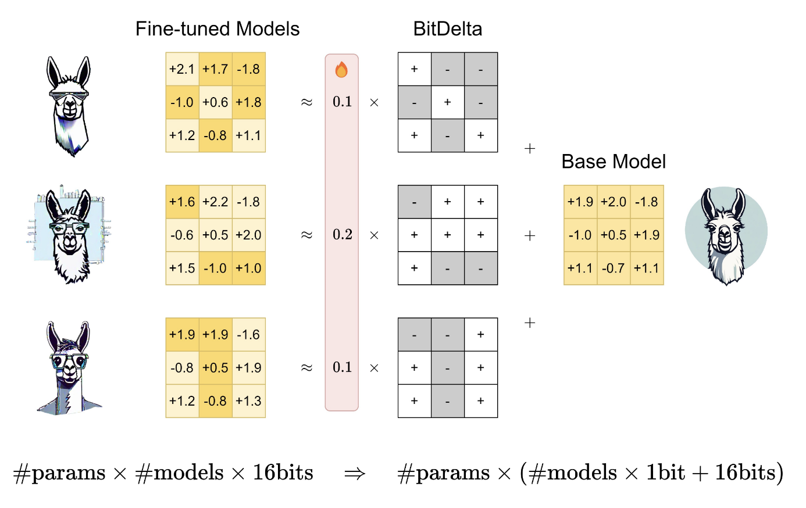

# BitDelta

[](http://arxiv.org/abs/2402.10193)
[](https://github.com/FasterDecoding/BitDelta)

<figure markdown="span">
{ width="600px" }
<figcaption>
BitDelta applies 1-bit quantization to the weight delta between fine-tuned and base models. For each weight matrix, we quantize its delta as its sign bits and a trainable high-precision scale factor. The scale factor is initialized to achieve the best approximation error in L2 norm and further refined with a few distillation steps. BitDelta shows minimal degradation in model performance and reduces memory consumption in multi-tenancy serving by representing multiple fine-tuned models with a single high-precision base model and multiple 1-bit deltas.
</figcaption>
</figure>

## Default Configurations

```yaml title="config/method/bitdelta/bitdelta.yaml"
--8<-- "config/method/bitdelta/bitdelta.yaml"
```

## Example Usage 

```bash
fusion_bench method=bitdelta/bitdelta modelpool=CausalLMPool/vicuna-7b-v1.5
```

## Implementation Details

- [fusion_bench.method.BitDeltaAlgorithm][]

