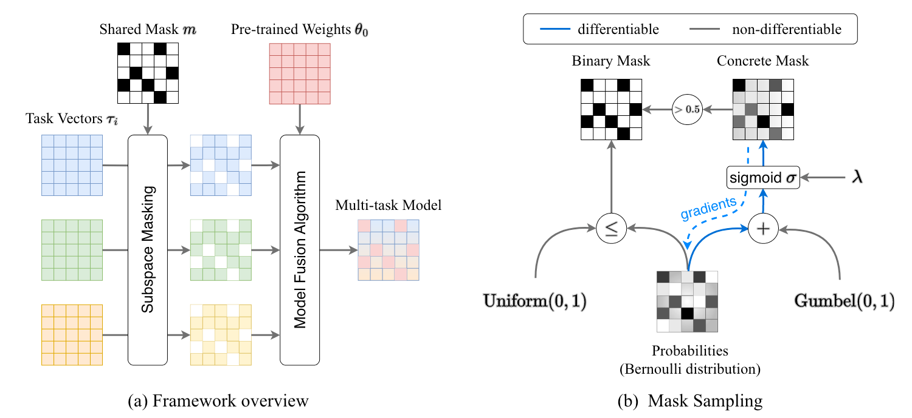
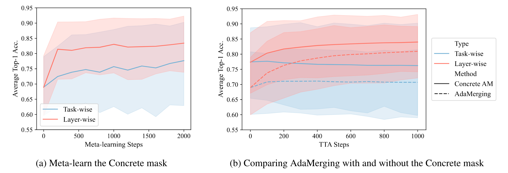

# Concrete Subspace Learning

<figure markdown="span">
{ width="900px" }
<figcaption style="max-width:90%" markdown="span">
(a) **Framework overview**. Our proposed framework comprises two main steps: first, establishing a common subspace for task vectors across various tasks using a shared mask, and second, merging the models within this shared subspace.  
(b) **Mask sampling**. Here we illustrate the procedure for sampling discrete binary masks and our differentiable Concrete mask. It's important to note that while a Concrete mask can also be binarized, this binarization process is non-differentiable.
</figcaption>
</figure>

## Contrete Masking

### The Gumbel-Max Trick

Consider a discrete categorical distribution parameterized by logits $\mathbf{x} = (x_1, \dots, x_n) \in \mathbb{R}^{n}$, where $x_i$ is the logit of the $i$-th category. The Gumbel-Max trick [^1][^2][^3] states a reparameterization trick to sample from the categorical distribution by sampling from the standard Gumbel distribution $\text{Gumbel}(\mu=0,\beta=1)$ and taking the argmax of the sum of the Gumbel random variables and the logits.

This trick proceeds as follows:
sample $n$ Gumbel random variables $g_1, \dots, g_n$ independently from the standard Gumbel distribution $\text{Gumbel}(\mu=0,\beta=1)$ (We can draw a random sample $u$ from a unifrom distribution on the interval $(0,1)$ and then transform it into a Gumbel-distributed variable $g$ using the formula $g=-\log(-\log u)$.), find the index $i$ of that maximizes $x_i + g_i$, then we have

$$
  {\arg\max}_{i\in[n]} (x_i + g_i) \sim \text{Categorical}(\text{softmax}(\mathbf{x})).
$$

If we represent the categorical distribution as a one-hot vector $\mathbf{y} = (y_1, \dots, y_n) \in \{0,1\}^n$, where $y_i=1$ indicates that the $i$-th category is sampled and for all $j\neq i$, $y_j=0$, then we have

$$
  \mathbb{P}(y_k=1) = \mathbb{P}\left({\arg\max}_{i\in[n]} (x_i + g_i) = k\right) = \frac{\exp(x_k)}{\sum_{i=1}^n \exp(x_i)}.
$$

### Continuous Relaxation of the discrete Categorical Distribution

Since the derivative of the ${\arg\max}$ function is not defined, we cannot backpropagate the gradients through it.
To address this issue,  (Maddison et al., 2017)[^4] proposed to use a continuous relaxation of the discrete categorical distribution.
A CONCRETE random variable (CONtinuous relaxation of disCRETE random variable) relax the condition that the one-hot vector $\mathbf{y}$ must be located at the vertices of the $(n-1)$-dimensional simplex $\Delta^{n-1}$, and instead, it allows $\mathbf{y}$ to be located anywhere inside the simplex $\Delta^{n-1}$, i.e. $\{ y\in \mathbb{R}^n | y_i \in [0,1], \sum_{i=1}^n y_i =1 \}$.

To sample a Concrete random variable $\mathbf{y}$ from a distribution that is parameterized by a temperature hyperparameter $\lambda > 0$ and a vector of logits $\mathbf{x} = (x_1, \dots, x_n) \in \mathbb{R}^{n}$, we have

$$
  \mathbf{y} = \text{softmax}\left(\frac{\mathbf{x} + \mathbf{g}}{\lambda}\right), \quad
  y_i = \frac{\exp\left((x_i + g_i)/{\lambda}\right)}{\sum_{j=1}^n \exp\left(({x_j + g_j})/{\lambda}\right)} \quad \text{for} \,\, i\in[n].
$$

where $\mathbf{g} = (g_1, \dots, g_n)$ is a vector of Gumbel random variables that are independently sampled from the standard Gumbel distribution $\text{Gumbel}(\mu=0,\beta=1)$.

### Concrete Masking

A subspace mask $\mathbf{m}$ is a binary vector that identifies a subspace of the parameter space.
For a neural network parametrized by $\theta$, we can use a subspace mask $\mathbf{m}$ to identify a subspace of the parameter space $\mathbf{\theta}$ by setting the parameters that are not in the subspace to zero, i.e. $\mathbf{\theta} \circ \mathbf{m}$, where $\circ$ denotes the element-wise product.
We can draw a random sample $\mathbf{m}$ from a Bernoulli distribution $\text{Bernoulli}(\mathbf{p}=\sigma(\mathbf{x}))$, where $\mathbf{p}$ is the probability ($\mathbf{x}$ denotes the logits) of each parameter being activated. However, the discrete Bernoulli distribution is not differentiable, so we cannot backpropagate the gradients through it to optimize the parameters $\mathbf{p}$ or $\mathbf{x}$.

To address this issue, we introduce the Concrete mask which can be drawn from a continuous relaxation of Bernoulli distribution. Before we introduce the Concrete mask, we first review the Gumbel-Max trick in the two-class case.

Let $p_0$ and $p_1$ denote the unnormalized probabilities of a Bernoulli random variable being 0 and 1, respectively, with $x$ representing the logits. Then, the probability of the event $m=1$ is given by

$$
  \mathbb{P}(m=1) = \frac{p_1}{p_0 + p_1} = \sigma(x),
$$

where $\sigma$ denotes the sigmoid function.
In the context of the Gumbel-Max trick, the occurrence of the event $m=1$ is determined by the condition $g_1 + \log p_1 > g_0 + \log p_0$, where $g_0$ and $g_1$ are two independent standard Gumbel random variables.
Thus we have

$$
  \mathbb{P}(m=1) = \mathbb{P}(g_1 + \log p_1 > g_0 + \log p_0)
  = \mathbb{P}\left((g_1 - g_0) + (\log p_1 - \log p_0)> 0\right).
$$

Because the difference of two standard Gumbel random variables is a Logistic random variable, we can replace $g_1 - g_0$ by $\log u - \log(1-u)$ where $u$ is a random variable sampled from a uniform distribution on the interval $(0,1)$.
Substitute this into Eq.(\ref{eq:appendix_P_m_1}) and express the probability in terms of the logits $x$ to simplify the expression, we have

$$
  \mathbb{P}(m=1) = \mathbb{P}\left(\log \frac{u}{1-u} + \log \frac{\sigma(x)}{1-\sigma(x)} > 0\right), \quad u \sim \text{Uniform}(0,1).
$$

The binary Concrete distribution offers a continuous relaxation of the discrete Bernoulli random variables, which is beneficial for gradient-based optimization as it allows for the backpropagation of gradients even through the sampling process.
Instead of making a hard decision as the above equation, we use a temperature parameter $\lambda$ to control the steepness of the sigmoid function, and hence control how close our 'soft' decisions are to being 'hard' decisions. The continuous version of the Bernoulli random variable is then given by

$$
  \hat{m} = \sigma\left(\left(\log \frac{u}{1 - u} + \log \frac{\sigma(x)}{1 - \sigma(x)}\right) / \lambda\right).
$$

As the temperature $\lambda$ approaches zero, the sigmoid function becomes a step function, and the Concrete random variable $\hat{m}$ becomes a Bernoulli random variable, as shown in the following Figure. In the limit when $\lambda \to 0$, this results in sampling $m=1$ if $\log \frac{\sigma(x)}{1 - \sigma(x)} > -\log \frac{u}{1 - u}$, consistent with the original Gumbel-Max trick.
The binary Concrete distribution thus provides a differentiable approximation to Bernoulli random variables.
We can further binarize the Concrete mask by setting the entries with values greater than 0.5 to 1 and the rest to 0.

<figure markdown="span">
    { width="400px" }
    <figcaption markdown="span"> 
    The sigmoid function $\sigma(\cdot/\lambda)$ with different temperatures $\lambda$.
    </figcaption>
</figure>

## Method Analysis

### Concrete AdaMerging

<figure markdown="span">
{ width="900px" }
<figcaption style="max-width:90%" markdown="span">
**Performance comparison between AdaMerging and Concrete AdaMerging.** Here we show the whole process of applying AdaMerging and Concrete AdaMerging to CLIP-ViT-B/32, the y-axes are shared by these two subfigures: (a) shows the performance of the merged model during the meta-learning phase of the Concrete AdaMerging; (b) illustrates the comparison between AdaMerging with and without the Concrete mask.
</figcaption>
</figure>


## Examples

### CLI Usage

Merging CLIP models on eight image classification tasks, using the concrete task arithmetic algorithm

```bash
# tensorboard logs and learned checkpoints of the shared mask can be found at https://huggingface.co/tanganke/clip-vit-base-patch32_concrete-task-arithmetic_tblogs
fusion_bench \
    path.log_dir=outputs/ViT-B-32/concrete_task_arithmetic \
    method=concrete_subspace/clip_concrete_task_arithmetic \
    modelpool=CLIPVisionModelPool/clip-vit-base-patch32_TA8 \
    taskpool=CLIPVisionModelTaskPool/clip-vit-classification_TA8
```

results

```json
{
    "svhn": {
        "accuracy": 0.903003990650177,
        "loss": 0.37700024247169495
    },
    "stanford_cars": {
        "accuracy": 0.6326327323913574,
        "loss": 1.2553859949111938
    },
    "resisc45": {
        "accuracy": 0.7558730244636536,
        "loss": 1.017554759979248
    },
    "eurosat": {
        "accuracy": 0.9407407641410828,
        "loss": 0.20871955156326294
    },
    "gtsrb": {
        "accuracy": 0.8285035490989685,
        "loss": 0.5861473679542542
    },
    "mnist": {
        "accuracy": 0.9800000190734863,
        "loss": 0.08148527890443802
    },
    "dtd": {
        "accuracy": 0.5249999761581421,
        "loss": 2.2731478214263916
    },
    "sun397": {
        "accuracy": 0.6421158909797668,
        "loss": 1.4108904600143433
    }
}
```

Concrete AdaMerging (Layer-wise)

```bash
# tensorboard logs and learned checkpoints of the shared mask can be found at https://huggingface.co/tanganke/clip-vit-base-patch32_concrete-layer-wise_adamerging_tblogs
fusion_bench \
    path.log_dir=outputs/ViT-B-32/clip_concrete_layer_wise_adamerging \
    method=concrete_subspace/clip_concrete_layer_wise_adamerging \
    modelpool=CLIPVisionModelPool/clip-vit-base-patch32_TA8 \
    taskpool=CLIPVisionModelTaskPool/clip-vit-classification_TA8
```

## Further Reading

- :llama: [:simple-github:](https://github.com/xinykou/safety_realignment) 
    X. Yi, S. Zheng, L. Wang, X. Wang, and L. He, “A safety realignment framework via subspace-oriented model fusion for large language models.” [arXiv, May 14, 2024. doi: 10.48550/arXiv.2405.09055.](http://arxiv.org/abs/2405.09055)

    > The paper introduces a safety realignment framework for large language models via subspace-oriented model fusion (SOMF, the authors learn a shared mask on the weight space of large language model), which combines safeguard capabilities of initially aligned models with fine-tuned models to ensure safety without compromising performance on downstream tasks.


[^1]: E. J. Gumbel. Statistical Theory of Extreme Values and Some Practical Applications. A Series of Lectures. Technical
Report PB175818, National Bureau of Standards, Washington, D. C. Applied Mathematics Div., 1954. URL
https://ntrl.ntis.gov/NTRL/dashboard/searchResults/titleDetail/PB175818.xhtml.
[^2]: R. Duncan Luce. Individual Choice Behavior. Individual Choice Behavior. John Wiley, Oxford, England, 1959
[^3]: Chris J Maddison, Daniel Tarlow, and Tom Minka. A* sampling. Advances in neural information processing systems,
27, 2014.
[^4]: Chris J. Maddison, Andriy Mnih, and Yee Whye Teh. The Concrete Distribution: A Continuous Relaxation of Discrete
Random Variables, March 2017. URL http://arxiv.org/abs/1611.00712.
