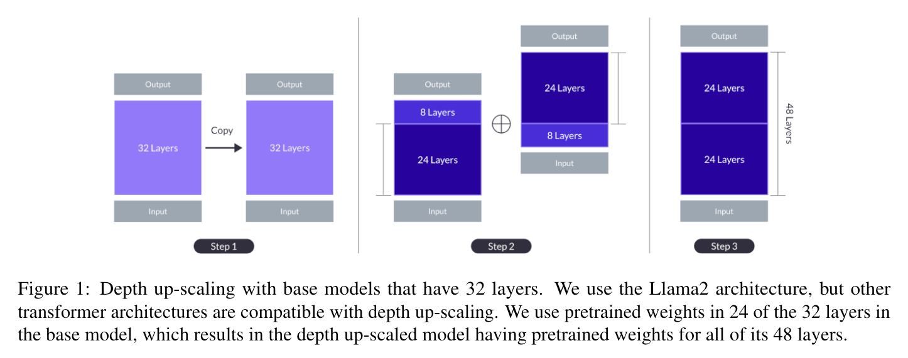

# Depth Upscaling

Depth Upscaling is a model scaling technique that increases the depth (number of layers) of neural networks by duplicating and concatenating existing layers[^1]. This approach has been shown to be effective for scaling large language models, as demonstrated in the SOLAR 10.7B model.

## Usage

The `DepthUpscalingAlgorithm` is used to upscale the depth of PyTorch models. Here's a basic guide on how to use it:

First, import the necessary modules:

```python
from omegaconf import DictConfig
from torch import nn
from fusion_bench.method.depth_upscaling import DepthUpscalingAlgorithm
```

Create an instance of `DepthUpscalingAlgorithm` by passing the layer indices directly to the constructor. 
The layer indices determine the upscaling pattern.

```python
algorithm = DepthUpscalingAlgorithm(layer_indices=[0, 1, 1, 0])
```

Assume we have a list of PyTorch models (`nn.ModuleList` instances) that we want to upscale. Here, we're creating a list of linear models as an example:

```python
layers = nn.ModuleList([nn.Linear(10, 10) for _ in range(2)])
```

Then, we can pass the layers to the `run` method of our algorithm:

```python
upscaled_model = algorithm.run(layers)
```

The `run` method will return an upscaled model. The type of the returned model will be the same as the input models (in this case, `nn.ModuleList`), and its length will be determined by the layer indices specified in the configuration.

### Layer Index Patterns

The `layer_indices` parameter supports flexible specifications:

- **Integer indices**: Direct layer references (0-indexed)
- **String expressions**: Python expressions that evaluate to lists of integers
- **Mixed patterns**: Combination of integers and strings

```python
# Example patterns:
# [0, 1, 1, 0] - Use layers 0, 1, 1, 0 (4 layers total)
# ["range(0,12)", "range(6,12)"] - First 12 layers + layers 6-11 (18 layers total)
# [0, 2, 4, "range(6,12)"] - Layers 0, 2, 4, then layers 6-11 (9 layers total)
```

## Examples

### Basic Example

Here's a simple example of depth upscaling with basic layers:

```python
from torch import nn
from fusion_bench.method.depth_upscaling import DepthUpscalingAlgorithm

# Create a simple model with 4 layers
model = nn.ModuleList([
    nn.Linear(100, 100),
    nn.ReLU(),
    nn.Linear(100, 50),
    nn.Linear(50, 10)
])

# Create upscaling algorithm with specific pattern
# This will create: layer0, layer1, layer2, layer1, layer3
algorithm = DepthUpscalingAlgorithm(layer_indices=[0, 1, 2, 1, 3])

# Apply depth upscaling
upscaled_model = algorithm.run(model)
print(f"Original model layers: {len(model)}")
print(f"Upscaled model layers: {len(upscaled_model)}")
# Outputs:
# Original model layers: 4
# Upscaled model layers: 5
```

### SOLAR-style Mistral Model Upscaling

Here we provide an example of how to use the [`DepthUpscalingAlgorithm`][fusion_bench.method.DepthUpscalingAlgorithm] to upscale the depth of a Mistral model [^1].

<figure markdown="span">
    
    <figcaption> Credit to ["SOLAR 10.7B: Scaling Large Language Models with Simple yet Effective Depth Up-Scaling"](http://arxiv.org/abs/2312.15166)</figcaption>
</figure>

```python
from omegaconf import DictConfig
from torch import nn
from transformers import AutoModelForCausalLM, MistralConfig, MistralForCausalLM
from fusion_bench.method.depth_upscaling import DepthUpscalingAlgorithm

# create a Mistral model
# here we randomly initialize the model for demonstration purposes
# in practice, you would load a pretrained model
model_config = MistralConfig(
    # https://huggingface.co/mistralai/Mistral-7B-v0.1/resolve/main/config.json
    **{
        "architectures": ["MistralForCausalLM"],
        "bos_token_id": 1,
        "eos_token_id": 2,
        "hidden_act": "silu",
        "hidden_size": 4096,
        "initializer_range": 0.02,
        "intermediate_size": 14336,
        "max_position_embeddings": 32768,
        "model_type": "mistral",
        "num_attention_heads": 32,
        "num_hidden_layers": 32,
        "num_key_value_heads": 8,
        "rms_norm_eps": 1e-05,
        "rope_theta": 10000.0,
        "sliding_window": 4096,
        "tie_word_embeddings": False,
        "torch_dtype": "bfloat16",
        "transformers_version": "4.34.0.dev0",
        "use_cache": True,
        "vocab_size": 32000,
    }
)
print('creating model')
model: MistralForCausalLM = AutoModelForCausalLM.from_config(model_config)

# Initialize the algorithm with layer indices
algorithm = DepthUpscalingAlgorithm(layer_indices=["range(0,24)", "range(8,32)"])
print('upscaling model')
upscaled_model = algorithm.run(model.model.layers)

# substitute the model with the upscaled model
model.model.layers = upscaled_model
```

### CLI Usage

The `DepthUpscalingAlgorithm` is integrated into the `fusion_bench` package. You can use it by specifying `"depth_upscaling"` as the method name in the command line or configuration file.

```yaml title="config/method/depth_upscaling.yaml"
--8<-- "config/method/depth_upscaling.yaml"
```

You can then run the `fusion_bench` command with the specified configuration file:

```bash
fusion_bench method=depth_upscaling ...
```

## Implementation Details

- [fusion_bench.method.depth_upscaling.DepthUpscalingAlgorithm][]


[^1]: [SOLAR 10.7B: Scaling Large Language Models with Simple yet Effective Depth Up-Scaling](http://arxiv.org/abs/2312.15166)
