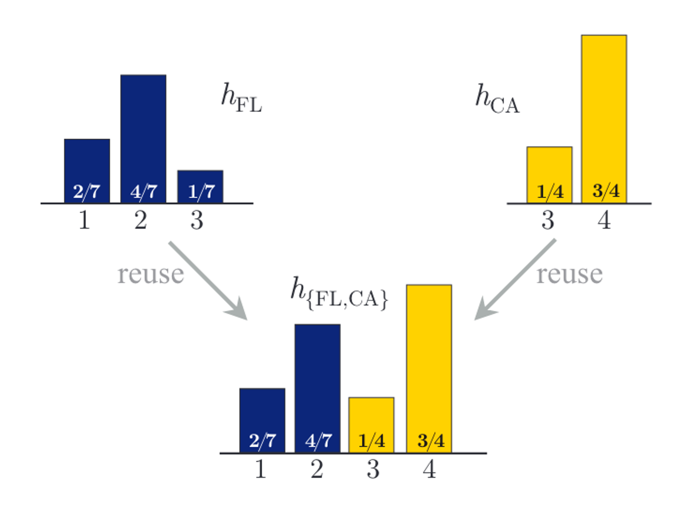

# Max-Model Predictor


The max-model predictor algorithm is a type of ensemble method.
Formally, a max-model predictor is defined as follows:

**Definition (Max-Model Predictor) [^1]**
Given a set of predictors $H = \{h_1, h_2, \ldots, h_n\}$, with $h_i: \mathcal{X} \times \mathcal{Y}_i \mapsto \mathbb{R}$, the max-model predictor $h_H$ is defined as:

$$h_H(x,y) = \max_{h_i\in H} h_i(x,y).$$

Take the flu detection problem as an example [^1]. 
Doctors want to build a learning model to detect what type of virus one patient is affected based on her symptoms, for appropriate treatment.
However, the types of influenza diverse geographically (Rejmanek et al., 2015), which means the distribution of patient records collected by a hospital in California may be different from those in Florida.
In an extreme case, some types are unknown to the other hospital. Assume there are 4 types of influenza in the United States.
In California, 2 of 4 are commonly detected, while in Florida 3 of 4 types are often detected. We assume in the two states, doctors separately trained two models $h_{CA}$ and $h_{FL}$ which work locally well in California and Florida respectively.
However, a direct ensemble of the two local models may not work well on all the patients. Let $h_{US}$ denote the ideal global model trained on the combination of local datasets.
When we input a patient record $x$, each model outputs its prediction as shown in the following table:

Table: Example of flu detection on a patient $x$ affected with type 2 flu.
Where “−” means this model is not able to predict the corresponding class. 
Taking the maximal score as prediction, $h_{FL}$ is consistent with $h_{US}$, but the combination of two local models $h_{CA,FL}$ is not since $3/4 > 4/7$.

| Type               | 1    | 2       | 3    | 4       |
| ------------------ | ---- | ------- | ---- | ------- |
| $h_{US}(x)$        | 2/10 | 4/10    | 1/10 | 3/10    |
| $h_{CA}(x)$        | -    | -       | 1/4  | **3/4** |
| $h_{FL}(x)$        | 2/7  | **4/7** | 1/7  | -       |
| $h_{\{CA,FL\}}(x)$ | 2/7  | 4/7     | 1/4  | **3/4** |


<figure markdown="span">
  { width="650" }
  <figcaption>The illustration of running our method on the flu example.</figcaption>
</figure>

## Example

### CLI Usage

Configuration template for the Max Predictor Algorithm:

```yaml title="config/method/ensemble/max_model_predictor.yaml"
--8<-- "config/method/ensemble/max_model_predictor.yaml"
```

To create a max predictor ensemble of models for a specific task, you can use the following command:

```bash
fusion_bench method=ensemble/max_model_predictor \
  modelpool=<modelpool_name> \
  taskpool=<taskpool_name>
```

### API Usage

Here is an example of how to use the Max-Model Predictor Algorithm:

```python
from fusion_bench.method import MaxModelPredictorAlgorithm
from fusion_bench.modelpool import BaseModelPool

# Instantiate the MaxPredictorAlgorithm
algorithm = MaxModelPredictorAlgorithm()

# Assume we have a ModelPool instance that contains the models we want to ensemble.
modelpool = BaseModelPool(...) # or a list of nn.Module

# Run the algorithm on the model pool.
max_model_predictor = algorithm.run(modelpool)
```


## Implementation Details

- [fusion_bench.method.MaxModelPredictorAlgorithm][]

[^1]: Zhu et.al. ICML 2019. Heterogeneous model reuse via optimizing multiparty multiclass margin
