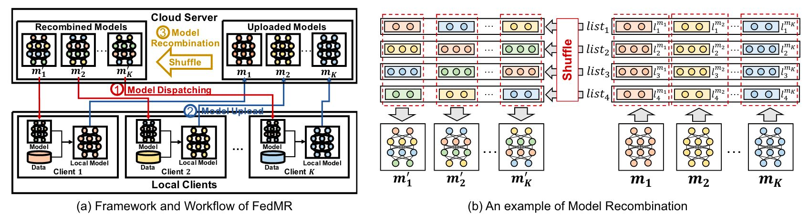

# Model Recombination

<figure markdown="span">
    { width="900"}
    <figcaption>Credit to [FedMR](http://arxiv.org/abs/2305.10730) </figcaption>
</figure>

Model recombination is a technique that shuffles the layers of different models to create new combinations. 
This method randomly redistributes the parameters across models at the layer level, which can help discover new model configurations and potentially improve performance.

## Examples

### API Usage

Here's an example demonstrating how to recombine models:

```python
import torch
from torch import nn
from fusion_bench.method import ModelRecombinationAlgorithm
from fusion_bench.modelpool import BaseModelPool

# Create sample models
models = {
    "model_1": nn.Sequential(nn.Linear(10, 5), nn.ReLU(), nn.Linear(5, 1)),
    "model_2": nn.Sequential(nn.Linear(10, 5), nn.ReLU(), nn.Linear(5, 1)), 
    "model_3": nn.Sequential(nn.Linear(10, 5), nn.ReLU(), nn.Linear(5, 1)),
}

# Create model pool
modelpool = BaseModelPool(models)

# Initialize the recombination algorithm
recombination_algorithm = ModelRecombinationAlgorithm(
    return_modelpool=True  # Return the entire recombined model pool
)

# Run recombination
recombined_pool = recombination_algorithm.run(modelpool)

print(f"Original pool size: {len(modelpool)}")
print(f"Recombined pool size: {len(recombined_pool)}")
```


### CLI Usage

This section provides a guide on how to use the `fusion_bench` command-line interface for model recombination.

#### Configuration Files

Configuration template for the model recombination method:

```yaml title="config/method/model_recombination.yaml"
--8<-- "config/method/model_recombination.yaml"
```

Run the fusion_bench command with model recombination:

```bash
fusion_bench \
    method=model_recombination \
    method.return_modelpool=false \
    modelpool=your_modelpool_config \
    taskpool=dummy  # evaluates parameter counts of recombined models
```

You can also override the return_modelpool parameter via command line:

```bash
fusion_bench \
    method=model_recombination \
    method.return_modelpool=true \
    modelpool=your_modelpool_config \
    taskpool=your_taskpool_config
```


## Implementation Details

- [fusion_bench.method.ModelRecombinationAlgorithm][]
- [fusion_bench.method.model_recombination.recombine_modellist][]
- [fusion_bench.method.model_recombination.recombine_modeldict][]
- [fusion_bench.method.model_recombination.recombine_state_dict][]

