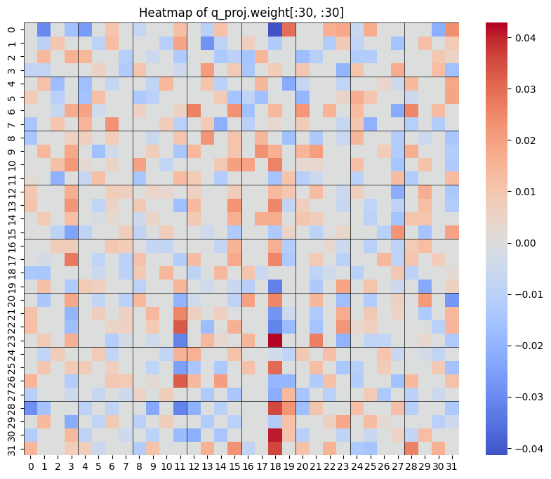

# Magnitude Pruning

## Examples

### Pruning a Llama Model

#### Unstructured Magnitude Pruning

The following command prunes a Llama model with a sparsity ratio of 0.7 (70% of the weights are pruned) using unstructured magnitude pruning. The pruned model is saved to `outputs/llama/magnitude_pruning/unstructured/0.7`.

```bash
fusion_bench \
    --config-name llama_magnitude_pruning \
    method.prune_type=unstructured \
    method.sparsity_ratio=0.7 \
    modelpool.models.0.path=decapoda-research/llama-7b-hf \
    merged_model_save_path=outputs/llama/magnitude_pruning/unstructured/0.7
```

#### Semi-Structured Magnitude Pruning

The following command prunes a Llama model with a 2:4 semi-structured pruning ratio using magnitude pruning. The pruned model is saved to `outputs/llama/magnitude_pruning/semistructure/2_4`.

```bash
fusion_bench \
    --config-name llama_magnitude_pruning \
    method.prune_type=semistructured \
    method.n=2 method.m=4 \
    modelpool.models.0.path=decapoda-research/llama-7b-hf \
    merged_model_save_path=outputs/llama/magnitude_pruning/semistructure/2_4
```

Below is an example of how to visualize the pruned weights of the first layer of the pruned model.

```python
from transformers import AutoModelForCausalLM
import matplotlib.pyplot as plt
import seaborn as sns
import torch

# Load the pruned model
model = AutoModelForCausalLM.from_pretrained("outputs/llama/magnitude_pruning/semistructure/2_4")

# Extract the tensor data
tensor_data = model.model.layers[0].self_attn.q_proj.weight[:32, :32]

# Convert to NumPy array
tensor_data_np = tensor_data.detach().cpu().numpy()

# Plot heatmap
plt.figure(figsize=(10, 8))
ax = sns.heatmap(tensor_data_np, center=0, cmap="coolwarm", annot=False)

# Add grid lines for 4x4 cells
for i in range(0, tensor_data_np.shape[0], 4):
    ax.axhline(i, color="black", linewidth=0.5)
    ax.axvline(i, color="black", linewidth=0.5)

plt.title("Heatmap of q_proj.weight[:32, :32]")
plt.show()
```

The following image shows the pruned weights of the first layer of the pruned model.

{ width="650px" }

## Implementation Details

- [fusion_bench.method.pruning.llama_magnitude_prune.MagnitudePruningForLlama][]
