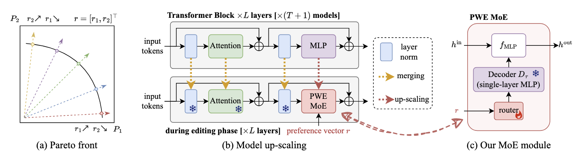

# PWEMoE: Pareto-Driven Weight-Ensembling Mixture of Experts

[](https://arxiv.org/abs/2406.09770)

<figure markdown="span">
{width="950px"}
<figcaption style="max-width:90%" markdown="span">
    **Overview of PWE MoE**
    (a) An illustration of Pareto front learning in MOOP. Where $P_1$ and $P_2$ are performance metrics for two tasks, colored lines represent different Pareto optimal solutions, and the solid black line represents the Pareto front.
    (b) An overview of the model up-scaling process.
    We upcycle the MLP modules to MoE modules and merge the remaining parts using task arithmetic.
    (c) The MoE module, comprising a routing network and a parameter decoder network.
    The routing network accepts a user preference vector and generates routing weights for weight-ensembling.</figcaption>
</figure>

!!! info "Abstract"

    Solving multi-objective optimization problems for large deep neural networks is a challenging task due to the complexity of the loss landscape and the expensive computational cost of training and evaluating models.
    Efficient Pareto front approximation of large models enables multi-objective optimization for various tasks such as multi-task learning and trade-off analysis.
    Existing algorithms for learning Pareto set, including (1) evolutionary, hypernetworks, and hypervolume-maximization methods, are computationally expensive and have restricted scalability to large models;
    (2) Scalarization algorithms, where a separate model is trained for each objective ray, which is inefficient for learning the entire Pareto set and fails to capture the objective trade-offs effectively.
    Inspired by the recent success of model merging, we propose a practical and scalable approach to Pareto set learning problem via mixture of experts (MoE) based model fusion.
    By ensembling the weights of specialized single-task models, the MoE module can effectively capture the trade-offs between multiple objectives and closely approximate the entire Pareto set of large neural networks.
    Once the routers are learned and a preference vector is set, the MoE module can be unloaded, thus no additional computational cost is introduced during inference.
    We conduct extensive experiments on vision and language tasks using large-scale models such as CLIP-ViT and GPT-2.
    The experimental results demonstrate that our method efficiently approximates the entire Pareto front of large models.
    Using only hundreds of trainable parameters of the MoE routers, our method even has lower memory usage compared to linear scalarization and algorithms that learn a single Pareto optimal solution, and are scalable to both the number of objectives and the size of the model.
    Our method significantly reduces the computational burden of learning the Pareto set, for example, in the two-task case, it can be achieved in just a few minutes.
    Code is available at: [GitHub :simple-github:](https://github.com/tanganke/pareto_set_learning).

## Examples

!!! warning "Not tested yet"

    The examples provided below have not been tested yet.

    For a thoroughly tested and verified implementation of the algorithm, please refer to the original repository: [tanganke/pareto_set_learning :simple-github:](https://github.com/tanganke/pareto_set_learning). 
    Additionally, the experimental results and further insights into the algorithm can be found in the original research paper: [arXiv:2406.09770 :simple-arxiv:](https://arxiv.org/abs/2406.09770).

PWEMoE-LS on eight image classification tasks using CLIP-ViT-B/32 models, and the results are logged to `outputs/ViT-B-32/PWEMoE-LS-8tasks`.

```bash
fusion_bench \
    path.log_dir=outputs/ViT-B-32/PWEMoE-LS-8tasks \
    method=pwe_moe/pwe_moe_ls_for_clip \
    modelpool=CLIPVisionModelPool/clip-vit-base-patch32_TA8 \
    taskpool=CLIPVisionModelTaskPool/clip-vit-classification_TA8
```

## Implementation Details

- [fusion_bench.method.pwe_moe.clip_pwe_moe.PWEMoEAlgorithmForCLIP][]
- [fusion_bench.method.pwe_moe.clip_pwe_moe.PWEMoELinearScalarizationForCLIP][]
- [fusion_bench.method.pwe_moe.clip_pwe_moe.PWEMoExactParetoOptimalForCLIP][]
