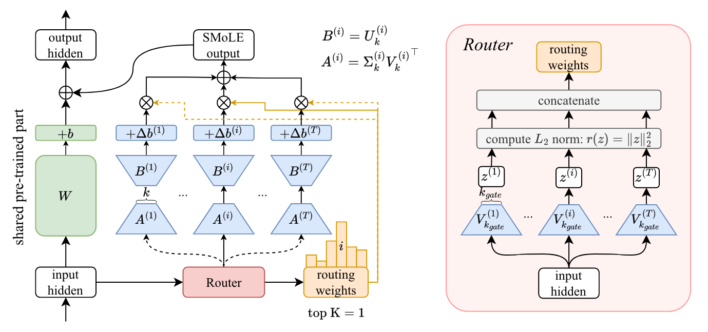

# SMILE Upscaling

[](https://arxiv.org/abs/2408.10174)

<figure markdown="span">
{width="800px"}
<figcaption style="max-width:90%" markdown="span">The architecture of the Sparse MIxture of Low-rank Experts (SMILE) module.[^1]</figcaption>
</figure>

## Taxonomy for SMILE Upscaling

Here we present the taxonomy for the SMILE upscaling method following "A Survey on Model MoErging" by Yadav et al. (2024) [^2].

|                        |          |                       |                 |                      |           |
| ---------------------- | -------- | --------------------- | --------------- | -------------------- | --------- |
| **Expert Training**    | Standard | **Expert Data**       | Private         | **Routing Dataset**  | None      |
| **Input Granularity**  | Step     | **Depth Granularity** | Module          | **Expert Selection** | Sparse    |
| **Expert Aggregation** | Output   | **Generalization**    | In-Distribution | **User Dataset**     | Zero-Shot |

## Configurations

The SMILE upscaling method offers several configuration options, which are located in the `config/method/` directory.

1. **General `nn.Module` Upscaling**: 
    This configuration is designed for upscaling any neural network module (`nn.Module`).
2. **Mistral Model Upscaling**: 
    This specific configuration is for Mistral models.

Each configuration file contains detailed parameters and options that can be adjusted to meet the specific needs of your model and application.

```yaml title="config/method/smile_upscaling/smile_upscaling.yaml"
--8<-- "config/method/smile_upscaling/smile_upscaling.yaml"
```

```yaml title="config/method/smile_upscaling/smile_mistral_upscaling.yaml"
--8<-- "config/method/smile_upscaling/smile_mistral_upscaling.yaml"
```


## Examples

### CLIP-ViT-B/32 on eight tasks

Evaluate single fine-tuned models and save the results to `outputs/ViT-B-32/single-task/` and `outputs/ViT-L-14/single-task/` for CLIP-ViT-B/32 and CLIP-ViT-L/14 models, respectively.

```bash
# evaluate singlue fine-tuned models
for task in sun397 stanford-cars resisc45 eurosat svhn gtsrb mnist dtd
do
    fusion_bench method=dummy \
        modelpool=clip-vit-base-patch32_individual \
            modelpool.models.0.path=tanganke/clip-vit-base-patch32_${task} \
        taskpool=clip-vit-classification_TA8 \
        report_save_path="outputs/ViT-B-32/single-task/clip-vit-base-patch32_${task}.json"
done

# if you have multiple GPUs, you can run the following code to evaluate the CLIP-ViT-L/14 models in parallel
# evaluate singlue fine-tuned models clip-vit-large
tasks=(sun397 stanford-cars resisc45 eurosat svhn gtsrb mnist dtd)
CUDA_DEVICES=(0 1 2 3 4 5 6 7)  # List of CUDA devices to use

for i in "${!CUDA_DEVICES[@]}"; do
    task=${tasks[$i]}
    CUDA_VISIBLE_DEVICES=${CUDA_DEVICES[$i]} fusion_bench method=dummy \
        modelpool=CLIPVisionModelPool/clip-vit-large-patch14_individual \
            modelpool.models._pretrained_=tanganke/clip-vit-large-patch14_${task} \
        taskpool=CLIPVisionModelTaskPool/clip-vit-classification_TA8 \
            taskpool.clip_model=openai/clip-vit-large-patch14 \
        report_save_path="outputs/ViT-L-14/single-task/clip-vit-large-patch14_${task}.json" &
done
```

Upscale eight CLIP-ViT-B/32 models with SMILE, each CLIP-ViT-B/32 model is trained on a downstream task.

```bash
gate_k=16
k=32
fusion_bench \
    method=smile_upscaling/smile_upscaling \
        method.device=cuda \
        method.gate_k=$gate_k method.k=$k \
    modelpool=CLIPVisionModelPool/clip-vit-base-patch32_TA8 \
    taskpool=CLIPVisionModelTaskPool/clip-vit-classification_TA8 \
    report_save_path="outputs/ViT-B-32/eight_tasks/gate_k\=${gate_k}_k\=${k}.json"
```

Hyperparameter search for SMILE upscaling. Pre-run results can be found in `examples/smile_upscaling/clip-vit-base-patch32.ipynb`.

```bash
for gate_k in 1 2 4 8 16 32 64 128 256 512 768; do
    for k in 4 8 16 32 64 128 -1; do
        fusion_bench \
            method=smile_upscaling/smile_upscaling \
                method.device=cuda \
                method.gate_k=$gate_k method.k=$k \
            modelpool=Seq2SeqLMPool/clip-vit-base-patch32_TA8 \
            taskpool=clip-vit-classification_TA8 \
            report_save_path="outputs/ViT-B-32/eight_tasks/gate_k\=${gate_k}_k\=${k}.json"
    done
done
```

Ablations on number of experts per token (Top-K). Pre-run results can be found in `examples/smile_upscaling/clip-vit-base-patch32-ablations-topk.ipynb`.

```bash
gate_k=16
k=32
for top_k in 1 2 4
do
fusion_bench \
    method=smile_upscaling/smile_upscaling \
        method.device=cuda \
        method.gate_k=$gate_k method.k=$k \
    modelpool=Seq2SeqLMPool/clip-vit-base-patch32_TA8 \
    taskpool=clip-vit-classification_TA8 \
    report_save_path="outputs/ViT-B-32/ablation/gate_k\=${gate_k}_k\=${k}.json"
done
```

### CLIP-ViT-L/14 on eight tasks

hyperparameter search for SMILE upscaling. Pre-run results can be found in `examples/smile_upscaling/clip-vit-large-patch14.ipynb`.

```bash
for gate_k in 1 2 4 8 16 32 64 128; do
    for k in 4 8 16 32 64 128 -1; do
        fusion_bench \
            method=smile_upscaling/smile_upscaling \
                method.gate_k=$gate_k method.k=$k \
            modelpool=Seq2SeqLMPool/clip-vit-large-patch14_TA8 \
            taskpool=clip-vit-classification_TA8 \
                taskpool.clip_model=openai/clip-vit-large-patch14 \
            report_save_path="outputs/ViT-B-32/eight_tasks/gate_k\=${gate_k}_k\=${k}.json"
    done
done
```

### Flan-T5 models on eight tasks from GLUE benchmark

Hyperparameter search for full fine-tuned and lora fine-tuned Flan-T5 models.
Pre-run results can be found in `examples/smile_upscaling/flan-t5-base.ipynb` and `examples/smile_upscaling/flan-t5-base-lora16.ipynb`.

```bash
# hyperparameter search for full fine-tuned flan-t5-base
for gate_k in 4 8 16 32; do
    for k in 16 32 64 128; do
        fusion_bench \
            method=smile_upscaling/smile_upscaling \
                method.device=cpu \
                method.gate_k=$gate_k method.k=$k \
            modelpool=Seq2SeqLMPool/flan-t5-base_glue \
            taskpool=flan-t5_glue_text_generation \
            report_save_path="outputs/flan-t5-base/glue_text_generation/gate_k\=${gate_k}_k\=${k}.json"
    done
done

# hyperparameter search for lora fine-tuned flan-t5-base
for gate_k in 2 4 8; do
    for k in 4 8 16; do
        fusion_bench \
            method=smile_upscaling/smile_upscaling \
                method.device=cuda \
                method.gate_k=$gate_k method.k=$k \
            modelpool=Seq2SeqLMPool/flan-t5-base_glue_lora16 \
            taskpool=flan-t5_glue_text_generation \
            report_save_path="outputs/flan-t5-base_lora16/glue_text_generation/gate_k\=${gate_k}_k\=${k}.json"
    done
done
```

### Upscale Mistral-7B models

Here we upscale several Mistral-7B models using SMILE. The models are trained on different tasks and are used as experts in the SMILE upscaling.

We first provide an example of the upscaled model, where we upscale the linear layers of the original Mistral model into a SMILE linear layer.

```python
import torch
from accelerate import init_empty_weights
from transformers import AutoConfig

from fusion_bench.models.modeling_smile_mistral import (
    SmileMistralConfig,
    SmileMistralForCausalLM,
)


config = AutoConfig.from_pretrained(
    "mistralai/Mistral-7B-v0.1"
)
config = SmileMistralConfig(
    num_experts_per_tok=1,
    rank_of_router=8,
    rank_of_expert=8,
    num_local_experts=3,
    **config.to_dict()
)
with init_empty_weights():
    model = SmileMistralForCausalLM(config)
model.to(dtype=torch.float16).to_empty(device="cuda")
```

The model architecture is as follows:

```c
SmileMistralForCausalLM(
  (model): SmileMistralModel(
    (embed_tokens): Embedding(32000, 4096)
    (layers): ModuleList(
      (0-31): 32 x SmileMistralDecoderLayer(
        (self_attn): SmileMistralAttention(
          (q_proj): SingularMoELinear(in_features=4096, out_features=4096, num_local_experts=3, num_experts_per_tok=1, rank_of_router=8, rank_of_expert=8)
          (k_proj): SingularMoELinear(in_features=4096, out_features=1024, num_local_experts=3, num_experts_per_tok=1, rank_of_router=8, rank_of_expert=8)
          (v_proj): SingularMoELinear(in_features=4096, out_features=1024, num_local_experts=3, num_experts_per_tok=1, rank_of_router=8, rank_of_expert=8)
          (o_proj): SingularMoELinear(in_features=4096, out_features=4096, num_local_experts=3, num_experts_per_tok=1, rank_of_router=8, rank_of_expert=8)
          (rotary_emb): MistralRotaryEmbedding()
        )
        (mlp): SmileMistralMLP(
          (gate_proj): SingularMoELinear(in_features=4096, out_features=14336, num_local_experts=3, num_experts_per_tok=1, rank_of_router=8, rank_of_expert=8)
          (up_proj): SingularMoELinear(in_features=4096, out_features=14336, num_local_experts=3, num_experts_per_tok=1, rank_of_router=8, rank_of_expert=8)
          (down_proj): SingularMoELinear(in_features=14336, out_features=4096, num_local_experts=3, num_experts_per_tok=1, rank_of_router=8, rank_of_expert=8)
          (act_fn): SiLU()
        )
        (input_layernorm): MistralRMSNorm()
        (post_attention_layernorm): MistralRMSNorm()
      )
    )
    (norm): MistralRMSNorm()
  )
  (lm_head): Linear(in_features=4096, out_features=32000, bias=False)
)
```

Knowing the model architecture, we can upscale the Mistral-7B models using the following steps:

1. Prepare the following 4 configuration files in `configs/modelpool`:

    ``` yaml title="config/modelpool/smile_mistral_exp_v1.yaml"
    type: AutoModelForCausalLMPool
    models:
    - name: _pretrained_
        path: mistralai/Mistral-7B-v0.1
    - name: expert_1
        path: meta-math/MetaMath-Mistral-7B

    dtype: float16
    ```

    ```yaml title="config/modelpool/smile_mistral_exp_v2.yaml"
    type: AutoModelForCausalLMPool
    models:
    - name: _pretrained_
        path: mistralai/Mistral-7B-v0.1
    - name: expert_1
        path: cognitivecomputations/dolphin-2.1-mistral-7b

    dtype: float16
    ```

    ```yaml title="config/modelpool/smile_mistral_exp_v3.yaml"
    type: AutoModelForCausalLMPool
    models:
    - name: _pretrained_
        path: mistralai/Mistral-7B-v0.1
    - name: expert_1
        path: uukuguy/speechless-code-mistral-7b-v1.0

    dtype: float16
    ```

    ```yaml title="config/modelpool/smile_mistral_exp_v4.yaml"
    type: AutoModelForCausalLMPool
    models:
    - name: _pretrained_
        path: mistralai/Mistral-7B-v0.1
    - name: expert_1
        path: meta-math/MetaMath-Mistral-7B
    - name: expert_2
        path: cognitivecomputations/dolphin-2.1-mistral-7b
    - name: expert_3
        path: uukuguy/speechless-code-mistral-7b-v1.0

    dtype: float16
    ```

2. Upscale Mistral-7B models. The upscaled models are saved in `outputs/mistral/gate_k-${gate_k}_k-${k}/version_${version}`.

    ```bash
    function model_fusion() {
        output_dir=outputs/mistral/gate_k-${gate_k}_k-${k}/version_${version}
        fusion_bench \
            method=smile_upscaling/smile_mistral_upscaling \
                method.rank_of_router=$gate_k method.rank_of_expert=$k \
                method.model_path=${output_dir} \
            modelpool=smile_mistral_exp_v${version} \
                modelpool.dtype=float32 \
            taskpool=dummy \
            report_save_path="${output_dir}/model_info.json"
    }

    gate_k=8
    for k in 8 16 32 64 128 256 384 512; do
        for version in 1 2 3 4; do
            model_fusion
        done
    done
    ```

3. Use [lm-evaluation-harness](https://github.com/EleutherAI/lm-evaluation-harness/) to evaluate the models. We use the default configurations for each task.

    ```bash
    # For some GPUs, the following environment variables need to be set
    # export NCCL_P2P_DISABLE="1"
    # export NCCL_IB_DISABLE="1"

    function model_eval() {
        output_dir=outputs/mistral/gate_k-${gate_k}_k-${k}/version_${version}

        # Check if ${output_dir}/${task}.json exists as a directory and return if it does
        if [ -d "${output_dir}/${task}.json" ]; then
            echo "Directory ${output_dir}/${task}.json already exists. Skipping evaluation."
            return
        fi

        lm_eval --model hf \
            --model_args pretrained=${output_dir},dtype="float16",parallelize=True \
            --tasks ${task} \
            --output_path ${output_dir}/${task}.json \
            --batch_size 6
    }
    ```

    The above function can be used to evaluate the models on specified task.
    Pre-run results can be found in `examples/smile_upscaling/mistral_gsm8k.ipynb`.

    ```bash
    # Evaluate all the models on GSM8K task
    gate_k=8
    task=gsm8k
    for k in 8 16 32 64 128 256 384 512; do
        for version in 1 2 3 4; do
            model_eval
        done
    done

    # Evaluate all M0;123 models on truthfulqa gsm8k arc_challenge mmlu
    k=8
    version=4
    for task in truthfulqa gsm8k arc_challenge mmlu; do
        model_eval
    done
    ```

    The reported metrics are:

    - mmlu (general): acc
    - truthfulqa (truthful): mc2
    - gsm8k (math): flexible exact match
    - arc_challenge (reasoning): acc_norm


## Scope

### Projection Merge Experiments

Pre-run results can be found in `examples/smile_upscaling/clip-vit-base-patch32_single-task_projection-merging.ipynb`.

```bash
# project into different subspaces
for task in sun397 stanford-cars resisc45 eurosat svhn gtsrb mnist dtd
do
    # Space I
    CUDA_VISIBLE_DEVICES=0 fusion_bench \
        method=smile_upscaling/singular_projection_merging \
            method.device=cuda method.rank=low method.k=-1 method.full_matrices=false \
        modelpool=CLIPVisionModelPool/clip-vit-base-patch32_single_finetuned \
            modelpool.models.finetuned=tanganke/clip-vit-base-patch32_${task} \
        taskpool=CLIPVisionModelTaskPool/clip-vit-classification_TA8 \
        report_save_path="outputs/ViT-B-32/single-task/projection_merging_zone1_${task}.json" &

    # Space II
    CUDA_VISIBLE_DEVICES=1 fusion_bench \
        method=smile_upscaling/singular_projection_merging \
            method.device=cuda method.rank=high method.k=-1 method.full_matrices=false \
        modelpool=CLIPVisionModelPool/clip-vit-base-patch32_single_finetuned \
            modelpool.models.finetuned=tanganke/clip-vit-base-patch32_${task} \
        taskpool=CLIPVisionModelTaskPool/clip-vit-classification_TA8 \
        report_save_path="outputs/ViT-B-32/single-task/projection_merging_zone2_${task}.json" &

    # Space II+III
    CUDA_VISIBLE_DEVICES=2 fusion_bench \
        method=smile_upscaling/singular_projection_merging \
            method.device=cuda method.rank=high method.k=-1 method.full_matrices=true \
        modelpool=CLIPVisionModelPool/clip-vit-base-patch32_single_finetuned \
            modelpool.models.finetuned=tanganke/clip-vit-base-patch32_${task} \
        taskpool=CLIPVisionModelTaskPool/clip-vit-classification_TA8 \
        report_save_path="outputs/ViT-B-32/single-task/projection_merging_zone23_${task}.json" &
    wait
done
```


## Implementation Details

- [fusion_bench.method.SmileUpscalingAlgorithm][]


[^1]: A. Tang et. al. SMILE: Zero-Shot Sparse Mixture of Low-Rank Experts Construction From Pre-Trained Foundation Models. Aug, 2024.
    [https://arxiv.org/abs/2408.10174](https://arxiv.org/abs/2408.10174)
[^2]: Yadav, Prateek, et al. "A Survey on Model MoErging: Recycling and Routing Among Specialized Experts for Collaborative Learning." arXiv preprint arXiv:2408.07057 (2024).
