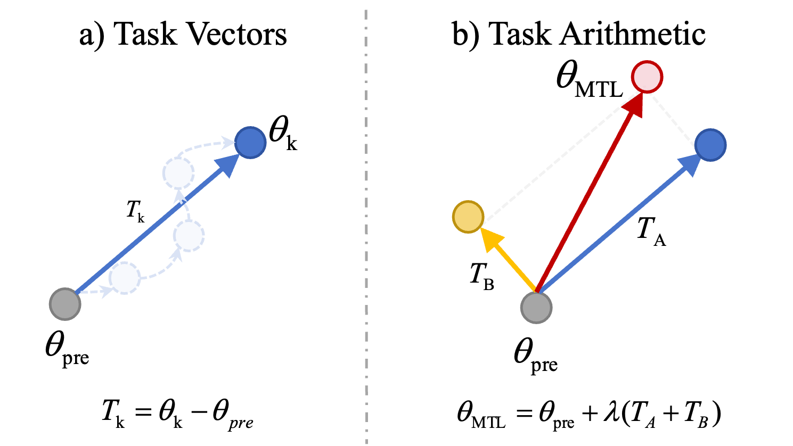

# Task Arithmetic

In the rapidly advancing field of machine learning, multi-task learning has emerged as a powerful paradigm, allowing models to leverage information from multiple tasks to improve performance and generalization. One intriguing method in this domain is Task Arithmetic, which involves the combination of task-specific vectors derived from model parameters. 

<figure markdown="span">
  { width="450" }
  <figcaption>Task Arithmetic. This figure is credited to <sup id="fnref:2"><a class="footnote-ref" href="#fn:2">2</a></sup></figcaption>
</figure>

**Task Vector**. A task vector is used to encapsulate the adjustments needed by a model to specialize in a specific task. 
It is derived from the differences between a pre-trained model's parameters and those fine-tuned for a particular task. 
Formally, if $\theta_i$ represents the model parameters fine-tuned for the i-th task and $\theta_0$ denotes the parameters of the pre-trained model, the task vector for the i-th task is defined as:

$$\tau_i = \theta_i - \theta_0$$

This representation is crucial for methods like Task Arithmetic, where multiple task vectors are aggregated and scaled to form a comprehensive multi-task model.

**Task Arithmetic**[^1] begins by computing a task vector $\tau_i$ for each individual task, using the set of model parameters $\theta_0 \cup \{\theta_i\}_i$ where $\theta_0$ is the pre-trained model and $\theta_i$ are the fine-tuned parameters for i-th task.
These task vectors are then aggregated to form a multi-task vector.
Subsequently, the multi-task vector is combined with the pre-trained model parameters to obtain the final multi-task model.
This process involves scaling the combined vector element-wise by a scaling coefficient (denoted as $\lambda$), before adding it to the initial pre-trained model parameters. 
The resulting formulation for obtaining a multi-task model is expressed as 

$$ \theta = \theta_0 + \lambda \sum_{i} \tau_i. $$

The choice of the scaling coefficient $\lambda$ plays a crucial role in the final model performance. Typically, $\lambda$ is chosen based on validation set performance. 

Recent work has also explored task arithmetic in the tangent space, which can provide improved editing of pre-trained models[^3]. 

## Examples

### CLI Usage

Configuration template for the Task Arithmetic algorithm:

```yaml title="config/method/task_arithmetic.yaml"
--8<-- "config/method/task_arithmetic.yaml"
```

Use the following command to run the Task Arithmetic algorithm:

```bash
fusion_bench method=task_arithmetic ...
```

For example, to run the Task Arithmetic algorithm on two models with scaling factor 0.5:

```bash
fusion_bench method=task_arithmetic \
    method.scaling_factor=0.5 \
  modelpool=CLIPVisionModelPool/clip-vit-base-patch32_svhn_and_mnist \
  taskpool=CLIPVisionModelTaskPool/clip-vit-base-patch32_svhn_and_mnist
```

where the configuration for the model pool is:

```yaml title="config/modelpool/CLIPVisionModelPool/clip-vit-base-patch32_svhn_and_mnist.yaml"
--8<-- "config/modelpool/CLIPVisionModelPool/clip-vit-base-patch32_svhn_and_mnist.yaml"
```

and the configuration for the task pool:

```yaml title="config/taskpool/CLIPVisionModelTaskPool/clip-vit-base-patch32_svhn_and_mnist.yaml"
--8<-- "config/taskpool/CLIPVisionModelTaskPool/clip-vit-base-patch32_svhn_and_mnist.yaml"
```

Use Task Arithmetic to merge 8 CLIP-ViT-B-32 models from different image classification tasks and evaluate the performance of the merged model.

```bash
fusion_bench \
  method=task_arithmetic \
  modelpool=CLIPVisionModelPool/clip-vit-base-patch32_TA8_model_only \
  taskpool=CLIPVisionModelTaskPool/clip-vit-classification_TA8
```

### API Usage


To use the Task Arithmetic algorithm, you can use the `TaskArithmeticAlgorithm` class from the `fusion_bench.method` module.

```python
from torch import nn
from fusion_bench.method.task_arithmetic import TaskArithmeticAlgorithm

# Instantiate the TaskArithmeticAlgorithm
algorithm = TaskArithmeticAlgorithm(scaling_factor=0.5)

# Assume we have a dict of PyTorch models (nn.Module instances) that we want to merge.
# The models should all have the same architecture.
# the dict must contain the pre-trained model with the key '_pretrained_', and arbitrary number of fine-tuned models.
models = {'_pretrained_': nn.Linear(10,10), 'model_1': nn.Linear(10,10), 'model_2': nn.Linear(10,10)}

# Run the algorithm on the models.
# This will return a new model that is the result of task arithmetic on the input models.
merged_model = algorithm.run(models)
```


## Implementation Details

- [fusion_bench.method.task_arithmetic.TaskArithmeticAlgorithm][]

[^1]: (ICLR 2023) Editing Models with Task Arithmetic. http://arxiv.org/abs/2212.04089
[^2]: (ICLR 2024) AdaMerging: Adaptive Model Merging for Multi-Task Learning. http://arxiv.org/abs/2310.02575
[^3]: (NIPS 2023 Oral) Guillermo Ortiz-Jimenez, Alessandro Favero, and Pascal Frossard, “Task Arithmetic in the Tangent Space: Improved Editing of Pre-Trained Models,” doi: 10.48550/arXiv.2305.12827.
