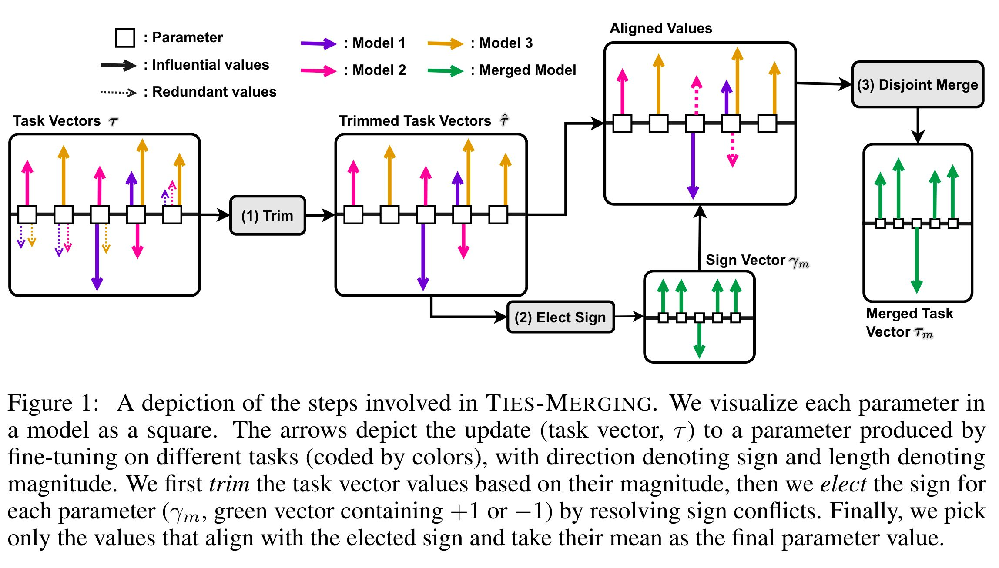
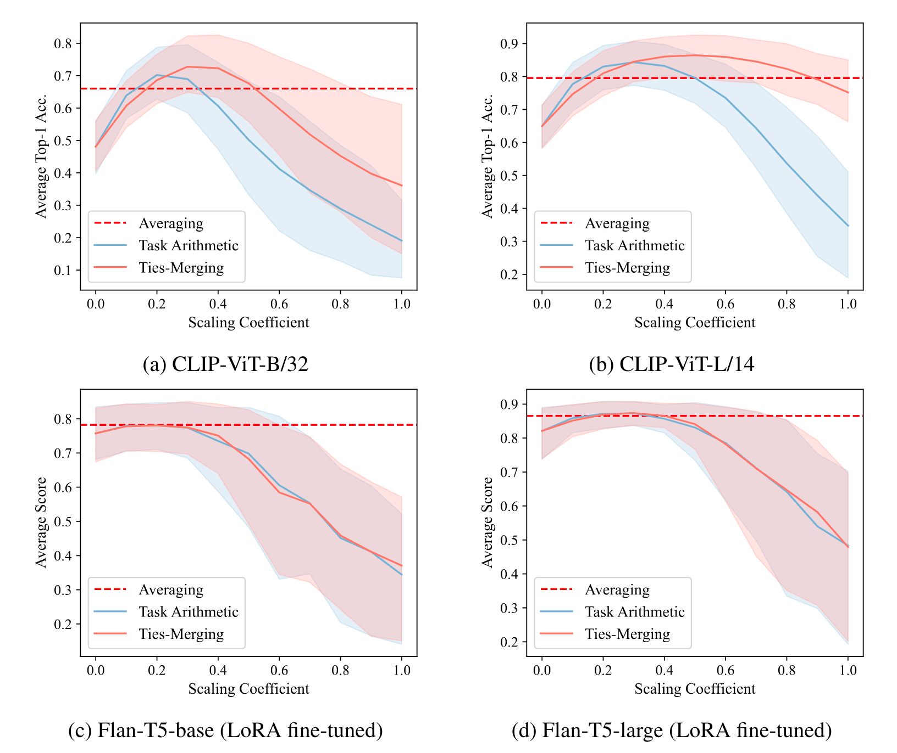

# Ties Merging

<figure markdown="span">
  { width="750" }
  <figcaption>
  Ties-Merging. Credit to <sup id="fnref:1"><a class="footnote-ref" href="#fn:1">1</a></sup>
  </figcaption>
</figure>

Ties-Merging[^1] represents a novel and structured approach to consolidating multiple task-specific models into a single, efficient multi-task model. This method employs a sequence of deliberate steps to systematically merge task vectors, ensuring that the final model effectively integrates the strengths of each individual task-specific model and resolves potential conflicts between them.

**Task Vectors**. Similar to Task Arithmetic, TIES merging begins by computing task vectors for each fine-tuned model:

$$\tau_t = \theta_t - \theta_0$$

where $\theta_t$ represents the parameters of the model fine-tuned for task $t$, and $\theta_0$ denotes the parameters of the pre-trained model.

The TIES-Merging algorithm operates through three primary steps:

1. Trim: This initial step involves refining the task-specific models by trimming unnecessary parameters, focusing the model on essential elements for each task.
2. Elect Sign of Parameters: In this step, the algorithm selects the appropriate signs for the parameters, ensuring that the integrated model parameters are optimally oriented for multi-task learning.
3. Disjoint Merge: Finally, the method performs a disjoint merge to combine the task-specific parameters into a single cohesive task vector, denoted as $\tau$.

Given the final merged task vector $\tau_m$, the ultimate model is determined as:

$$\theta = \theta_0 + \lambda \tau_m$$

where $\lambda$ is a hyperparameter (scaling factor) chosen based on validation set performance to ensure optimal model performance.

By following these structured steps, Ties-Merging effectively integrates multiple task-specific models into a unified multi-task model, balancing the contributions of each task to enhance overall performance. The process ensures that the final model retains the benefits of the pre-trained model while optimally incorporating the diverse knowledge contained within the individual task-specific models.

## Hyperparameter Tuning

<figure markdown="span">
{ width="800px" }
<figcaption style="max-width:90%" markdown="span">
**Task Arithmetic and Ties-Merging.** Here we illustrate the average performance of models merged using Task Arithmetic and Ties-Merging methods, with varying scaling coefficients. 
The subfigures represent different models: CLIP-ViT-B/32, CLIP-ViT-L/14, Flan-T5-base (LoRA fine-tuned), and Flan-T5-large (LoRA fine-tuned).
</figcaption>
</figure>

In the above figure, we show the average performance of Task Arithmetic and Ties-Merging merged models as the scaling coefficient varies. Subfigure (a), (b), (c), and (d) show the results of CLIP-ViT-B/32, CLIP-ViT-L/14, Flan-T5-base (LoRA fine-tuned), and Flan-T5-large (LoRA fine-tuned), respectively. It is evident that the merged multi-task model hits a peak in average performance across various tasks when the scaling coefficient is set around 0.3. This value was empirically selected as the scaling coefficient in our experiments. As we increase the scaling coefficient beyond this point, the average performance of the model begins to decline, eventually even falling below the level of the pre-trained model’s original performance. This suggests that too high of a scaling coefficient can have a negative impact on the knowledge that the pre-trained model initially possessed, emphasizing the importance of calibrating the scaling coefficient parameter $\lambda$ to avoid diminishing the model’s existing strengths.

## Examples

### CLI Usage

Configuration template for the Ties-Merging algorithm:

```yaml title="config/method/ties_merging.yaml"
--8<-- "config/method/ties_merging.yaml"
```

Use the following command to run the Ties-Merging algorithm:

```bash
fusion_bench method=ties_merging ...
```

For example, to run the Ties-Merging algorithm with custom parameters:

```bash
fusion_bench method=ties_merging \
    method.scaling_factor=0.3 \
    method.threshold=20 \
    method.merge_func=sum \
  modelpool=CLIPVisionModelPool/clip-vit-base-patch32_svhn_and_mnist \
  taskpool=CLIPVisionModelTaskPool/clip-vit-base-patch32_svhn_and_mnist
```

Use Ties-Merging to merge 8 CLIP-ViT-B-32 models from different image classification tasks and evaluate the performance of the merged model.

```bash
fusion_bench method=ties_merging \
  modelpool=CLIPVisionModelPool/clip-vit-base-patch32_TA8_model_only \
  taskpool=CLIPVisionModelTaskPool/clip-vit-classification_TA8
```

#### Saving Merged Model

If you want to persist the merged model, use the program-level save option `merged_model_save_path`. 
The actual save behavior is delegated to the selected ModelPool via its `save_model` implementation.

Example: save the merged model into a directory under the log folder

```bash
fusion_bench \
  path.log_dir=outputs/clip-vit-base-patch32/ties_merging \
  merged_model_save_path=$\{path.log_dir\}/merged_model \
  method=ties_merging \
    method.scaling_factor=0.3 \
  modelpool=CLIPVisionModelPool/clip-vit-base-patch32_TA8_model_only \
  taskpool=CLIPVisionModelTaskPool/clip-vit-classification_TA8
```

### API Usage

To use the Ties-Merging algorithm programmatically, you can use the `TiesMergingAlgorithm` class from the `fusion_bench.method` module.

```python
from torch import nn
from fusion_bench.method.ties_merging import TiesMergingAlgorithm

# Instantiate the TiesMergingAlgorithm
algorithm = TiesMergingAlgorithm(
    scaling_factor=0.3,
    threshold=20,
    remove_keys=[],
    merge_func="sum"
)

# Assume we have a dict of PyTorch models (nn.Module instances) that we want to merge.
# The models should all have the same architecture.
# The dict must contain the pre-trained model with the key '_pretrained_', and arbitrary number of fine-tuned models.
models = {
    '_pretrained_': nn.Linear(10, 10), 
    'model_1': nn.Linear(10, 10), 
    'model_2': nn.Linear(10, 10)
}

# Run the algorithm on the models.
# This will return a new model that is the result of TIES merging on the input models.
merged_model = algorithm.run(models)
```


## Implementation Details

- [fusion_bench.method.ties_merging.TiesMergingAlgorithm][]


[^1]: (NIPS 2023) Resolving Interference When Merging Models. http://arxiv.org/abs/2306.01708
