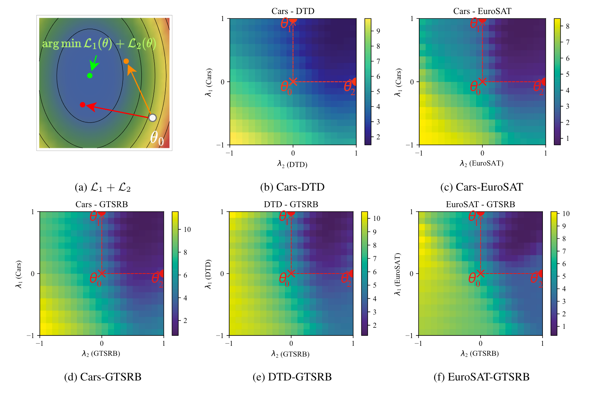
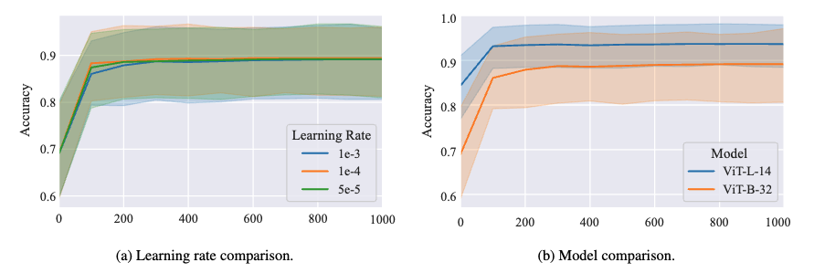

# Weight-Ensembling Mixture of Experts (Data-Adaptive Model Merging)

[](http://arxiv.org/abs/2402.00433)
[](https://github.com/tanganke/weight-ensembling_MoE)

<figure markdown="span">
    { width="90%" }
    <figcaption style="max-width:90%">
(a) **Framework overview**. This figure shows the overall framework of our proposed method to merge the pre-trained model and fine-tuned task-specific models. We merge weights in the Transformer Layers except for the MLPs. For the MLPs, we upcycle them into weight-assembling MoE modules.
(b) **Wieght-Ensembling Mixture of Experts (MoE) Module**. Here we outline the detailed structure of the Weight-Ensembling MoE module, composed of the router, pre-trained MLP weights, and a collection of task vectors. Collaboration between shared weights and task vectors is employed to create input-conditioned weights dynamically. In this way, we separate shared information and task-specific knowledge, which are then combined based on input in time.
    </figcaption>
</figure>

This method is designed to handle a wide range of tasks by segregating shared information and task-specific knowledge. 
It dynamically combines these elements based on the input samples.

The Weight-Ensembling MoE module consists of three main components: the router, the pre-trained MLP weights, and a collection of task vectors. 
The router, which is an MLP, processes the input data and generates routing weights. These weights determine how the knowledge from different tasks is combined.
The pre-trained MLP weights are crucial as they have been trained to recognize a wide range of data patterns. 
The task vectors represent the differences between the MLPs that have been fine-tuned for specific tasks and the pre-trained ones, capturing the unique adjustments made to optimize them for specific tasks.
The routing weights are averaged across the input tokens, and these weights are used to select task vectors from a dictionary matrix.
These task vectors are then added to the pre-trained MLP weights to create input-conditioned weights.

**Algorithm Requirements**:

| Method          | Access to labeled tasks data             | Access to validation data (labeled) | Test time adaptation |
| --------------- | ---------------------------------------- | ----------------------------------- | -------------------- |
| Fisher Merging  | Yes (Estimate Fisher information matrix) | No                                  | No                   |
| RegMean         | Yes (compute Gram Matrix)                | No                                  | No                   |
| Task Arithmetic | No                                       | Yes (select sacling factor)         | No                   |
| Ties-Merging    | No                                       | Yes (select sacling factor)         | No                   |
| AdaMerging      | No                                       | No                                  | Yes                  |
| Ours            | No                                       | No                                  | Yes                  |

## WEMoE V2: E-WEMoE

*L. Shen, A. Tang, E. Yang et al. Efficient and Effective Weight-Ensembling Mixture of Experts for Multi-Task Model Merging. Oct, 2024.*[^3]

[](http://arxiv.org/abs/2410.21804)
[](https://github.com/EnnengYang/Efficient-WEMoE)

<figure markdown="span">
  { width="90%" }
  <figurecaption>
  (a) **Overview of the Efficient Weight-Ensembling Mixture of Experts (E-WEMoE)** Framework. It merges all non-MLP modules through task arithmetic and upgrades the MLP modules into an efficient E-WEMoE module. (b) **E-WEMoE** Module. The module includes a router shared across all Transformer blocks, the pre-trained MLP module, and a set of sparse task-specific vectors w.r.t. MLP modules.
  </figurecaption>
</figure>

<figure markdown="span">
  { width="700px" }
  <figurecaption>
    Comparison of (a) trainable parameters and (b) total parameters between WEMoE and E-WEMoE-90%.
  </figurecaption>
</figure>

<figure markdown="span">
  { width="1000px" }
  <figurecaption>
    Comparison of the relationship between parameter count and performance across various model merging methods.
  </figurecaption>
</figure>

## Parameters Comparison

!!! tip "Tip for reducing the parameter count"

    Here we present the parameter count for the method outlined in the original paper[^1]. 
    An effective strategy to minimize the number of parameters involves employing Singular Value Decomposition (SVD) to compress the task vectors. 
    This approach significantly cuts down on the number of parameters while only marginally impacting performance. 
    For additional information, please refer to the Twin-Merging paper[^2]. 
    Which not only reduces the number of parameters but also conducts extensive experiments to demonstrate the effectiveness of data-adaptive merging on language domain.


Here is the number of parameters compared to a single pre-trained model (OpenCLIP CLIP-ViT-B/32):

| Method                   | Trainable Parameters | Total Parameters | Paremeters Reduced by Merging |
| ------------------------ | -------------------- | ---------------- | ----------------------------- |
| Single Pre-trained       | 113.45M (100%)       | 113.45M          | -                             |
| WEMoE (2-layer, 1 task)  | 7.10M (4.00%)        | 177.21M          | -                             |
| WEMoE (2-layer, 2 tasks) | 7.11M (3.04%)        | 233.89M          | 2*113.45-233.89=-6.99M        |
| WEMoE (2-layer, 3 tasks) | 7.11M (2.45%)        | 290.57M          | 3*113.45-290.57=49.78M        |
| WEMoE (2-layer, 4 tasks) | 7.12M (2.02%)        | 347.25M          | 4*113.45-347.25=106.55M       |
| WEMoE (2-layer, 5 tasks) | 7.13M (1.77%)        | 403.93M          | 5*113.45-403.93=163.32M       |
| WEMoE (2-layer, 6 tasks) | 7.14M (1.55%)        | 460.61M          | 6*113.45-460.61=220.09M       |
| WEMoE (2-layer, 7 tasks) | 7.15M (1.38%)        | 517.28M          | 7*113.45-517.28=276.87M       |
| WEMoE (2-layer, 8 tasks) | 7.16M (1.25%)        | 573.96M          | 8*113.45-573.96=333.64M       |

The number of parameter count of HuggingFace CLIP vision models (of type `transformers.models.clip.modeling_clip.CLIPVisionModel`) are different from the OpenCLIP models downloaded from [the task arithmetic repo](https://github.com/mlfoundations/task_vectors), because the OpenCLIP models (of type `src.modeling.ImageEncoder`) include the embedding layer for text tokens, while the HuggingFace CLIP vision models do not.
Therefore, the relative parameter count of the upscaled model using Transformer CLIP vision models will be larger than the OpenCLIP models.

=== "OpenCLIP models of type `src.modeling.ImageEncoder`"
    
    ```{.bash .annotate}
    ImageEncoder( # (1)
      (model): CLIP(
        (visual): VisualTransformer( # (2)
          (conv1): Conv2d(3, 768, kernel_size=(32, 32), stride=(32, 32), bias=False)
          (ln_pre): LayerNorm((768,), eps=1e-05, elementwise_affine=True)
          (transformer): Transformer(
            (resblocks): ModuleList(
              (0-11): 12 x ResidualAttentionBlock(
                (ln_1): LayerNorm((768,), eps=1e-05, elementwise_affine=True)
                (attn): MultiheadAttention(
                  (out_proj): NonDynamicallyQuantizableLinear(in_features=768, out_features=768, bias=True)
                )
                (ln_attn): Identity()
                (ln_2): LayerNorm((768,), eps=1e-05, elementwise_affine=True)
                (mlp): Sequential(
                  (c_fc): Linear(in_features=768, out_features=3072, bias=True)
                  (ln): Identity()
                  (gelu): QuickGELU()
                  (c_proj): Linear(in_features=3072, out_features=768, bias=True)
                )
              )
            )
          )
          (ln_post): LayerNorm((768,), eps=1e-05, elementwise_affine=True)
        )
        (token_embedding): Embedding(49408, 512) # (3)
        (ln_final): LayerNorm((512,), eps=1e-05, elementwise_affine=True)
      )
    )
    ```

    1. trainable params: 113.45M || all params: 113.45M || trainable%: 100.0000
    2. trainable params: 87.85M || all params: 87.85M || trainable%: 100.0000
    3. trainable params: 25.30M || all params: 25.30M || trainable%: 100.0000

=== "Transfomers CLIP vision model of type `transformers.models.clip.modeling_clip.CLIPVisionModel`"

    ``` { .bash .annotate }
    CLIPVisionModel( # (1)
      (vision_model): CLIPVisionTransformer(
        (embeddings): CLIPVisionEmbeddings(
          (patch_embedding): Conv2d(3, 768, kernel_size=(32, 32), stride=(32, 32), bias=False)
          (position_embedding): Embedding(50, 768)
        )
        (pre_layrnorm): LayerNorm((768,), eps=1e-05, elementwise_affine=True)
        (encoder): CLIPEncoder(
          (layers): ModuleList(
            (0-11): 12 x CLIPEncoderLayer(
              (self_attn): CLIPAttention(
                (k_proj): Linear(in_features=768, out_features=768, bias=True)
                (v_proj): Linear(in_features=768, out_features=768, bias=True)
                (q_proj): Linear(in_features=768, out_features=768, bias=True)
                (out_proj): Linear(in_features=768, out_features=768, bias=True)
              )
              (layer_norm1): LayerNorm((768,), eps=1e-05, elementwise_affine=True)
              (mlp): CLIPMLP(
                (activation_fn): QuickGELUActivation()
                (fc1): Linear(in_features=768, out_features=3072, bias=True)
                (fc2): Linear(in_features=3072, out_features=768, bias=True)
              )
              (layer_norm2): LayerNorm((768,), eps=1e-05, elementwise_affine=True)
            )
          )
        )
        (post_layernorm): LayerNorm((768,), eps=1e-05, elementwise_affine=True)
      )
    )
    ```

    1. trainable params: 87.85M || all params: 87.85M || trainable%: 100.0000

## Loss Landscape Visualization

<figure markdown="span">
{width="900px"}
<figcaption style="max-width:90%" markdown="span">
Visualization of the joint loss $\mathcal{L}_1 + \mathcal{L}_2$ and five task pairs for CLIP-ViT-B/32 in the loss landscape.
    We perform interpolations between pre-trained weights and two fine-tuned weights in the weight space on a 2D plane using the formula $\theta=\theta_0 + \lambda_1 \tau_1 + \lambda_2 \tau_2$, where $\theta_0$ represents pre-trained weights, $\tau_i=\theta_i -\theta_0$  are two task vectors with $\lambda_i$ in the range [-1, 1]. 
</figcaption>
</figure>

## Hyperparameter Tuning

In the below figure, we show the performance of the merged models with varying numbers of steps.
Figure (b) shows the performance of the merged WEMoE models with varying number of steps.
In Figure (a), we merge CLIP-ViT-B/32 models with different learning rate configurations.
We observe that the performance of the merged model shows an upward trend with an increase in the number of training steps, and it converges rapidly, reaching a high accuracy level in just 200 steps.
Furthermore, the influence of different learning rates is not significant, suggesting that our method is insensitive to the learning rate parameter. This is a desirable property as it reduces the need for hyperparameter tuning.

<figure markdown="span">
{width="800px"}
<figcaption style="max-width:90%" markdown="span">
The performance of the merged models with a varying number of steps.  
(a) CLIP-ViT-B/32 model with different learning rates.  
(b) Comparison of CLIP-ViT-B/32 and CLIP-ViT-L/14.
</figcaption>
</figure>

## Ablations of Router Depth


Table: Parameter comparison of WEMoE (1-layer) and WEMoE (2-layer) on CLIP-ViT-B/32 models (OpenCLIP).

| Method                  | Number of Trainable Parameters |
| ----------------------- | ------------------------------ |
| AdaMerging (layer-wise) | 1.3K                           |
| WEMoE (1-layer)         | 73.8K (0.01%)                  |
| WEMoE (2-layer)         | 7.16M (1.25%)                  |

Table: Ablation study of the router depth on the performance of the up-scaled CLIP-ViT-B/32 models (OpenCLIP).

| Method                  | SUN397 | CARS | RESISC45 | EuroSAT | SVHN | GRSRB | MNIST | DTD  | Avg. |
| ----------------------- | ------ | ---- | -------- | ------- | ---- | ----- | ----- | ---- | ---- |
| AdaMerging (layer-wise) | 66.6   | 68.3 | 82.4     | 92.5    | 86.5 | 93.7  | 97.7  | 61.1 | 80.9 |
| WEMoE (1-layer)         | 73.2   | 76.7 | 93.8     | 98.6    | 95.7 | 98.6  | 99.5  | 74.5 | 88.3 |
| WEMoE (2-layer)         | 74.1   | 77.4 | 93.7     | 99.1    | 96.2 | 98.9  | 99.6  | 76.4 | 89.4 |

To explore the influence of router depth on the performance of the scaled-up model, we perform an ablation study where the router depth is varied. In WEMoE modules, the router is implemented as a multi-layer perceptron (MLP).

- WEMoE (0-layer) functions as a bias-only model, representing a special case of an MLP with no hidden layers. It generates a constant routing weight for all inputs, captured by the formula as $r(h) = b_0$, indicating that it does not adjust based on the input.
  When we only up-scale the MLP modules of the vision Transformers to MoE modules, WEMoE (0-layer) can be considered as a partial implementation of AdaMerging. Add when we up-scale the vision Transformers layer-wisely, WEMoE (0-layer) can be considered equivalent to AdaMerging.
  For WEMoE (0-layer), the MoE modules can be unloaded, thus no additional parameters and inference cost are introduced.
- For WEMoE (1-layer), each router is a one-layer MLP that takes the input sample $h$ and outputs the routing weight $r(h)$, which is adaptive to the input. The routing weight is calculated as $r(h) = W_1 h + b_1$.
- For WEMoE (2-layer), each router is a two-layer MLP and the routing weight is calculated as $r(h) = W_2 ReLU(W_1 h + b_1) + b_2$.

In the above two Tables, we present additional findings to support our argument. We compare the number of trainable parameters and performance between WEMoE (1-layer) and WEMoE (2-layer). The data reveal that WEMoE (1-layer) possesses 73.8K trainable parameters, which constitute only 0.01% of the total parameters in the merged model. Notably, the performance of WEMoE (1-layer) is significantly better than AdaMerging and nearly matches that of WEMoE (2-layer) across all tasks. This evidence underscores our claim that the MoE design is crucial for performance enhancement.


## Examples

### CLI Usage

multi-task model fusion experiment on eight image classification tasks.

```bash
# merge eight CLIP-ViT-B/32 models using WE MoE
fusion_bench \
  method=wemoe/weight_ensembling_moe \
    method.name=clip_weight_ensembling_moe \
    method.use_grad_accumulate=false \
    method.save_checkpoint=outputs/clip-vit-base-patch32_TA8_weight_ensembling_moe_checkpoint.ckpt \
  modelpool=CLIPVisionModelPool/clip-vit-base-patch32_TA8 \
  taskpool=CLIPVisionModelTaskPool/clip-vit-classification_TA8
```

merge eight CLIP-ViT-L/14 models:

```bash
# merge eight CLIP-ViT-L/14 models using WE MoE, fine-tune the routers
fusion_bench print_config=false \
  method=wemoe/weight_ensembling_moe \
    method.name=clip_weight_ensembling_moe \
    method.use_grad_accumulate=true \
    method.save_checkpoint=outputs/clip-vit-large-patch14_TA8_weight_ensembling_moe_checkpoint.ckpt \
    method.batch_size=4 method.devices=4 \
  modelpool=CLIPVisionModelPool/clip-vit-large-patch14_TA8 \
  taskpool=dummy &&

# load the checkpoint and evaluate the model
fusion_bench \
  method=wemoe/weight_ensembling_moe \
    method.name=clip_weight_ensembling_moe \
    method.checkpoint=outputs/clip-vit-large-patch14_TA8_weight_ensembling_moe_checkpoint.ckpt \
  modelpool=CLIPVisionModelPool/clip-vit-large-patch14_TA8 \
  taskpool=CLIPVisionModelTaskPool/clip-vit-classification_TA8 \
    taskpool.clip_model=openai/clip-vit-large-patch14
```

## Implementation Details

- [fusion_bench.method.CLIPWeightEnsemblingMoEAlgorithm][]


[^1]: Anke Tang et.al. ICML 2024. Merging Multi-Task Models via Weight-Ensembling Mixture of Experts. http://arxiv.org/abs/2402.00433 ICML 2024.
[^2]: Z. Lu, C. Fan, W. Wei, X. Qu, D. Chen, and Y. Cheng, “Twin-Merging: Dynamic Integration of Modular Expertise in Model Merging,” doi: 10.48550/arXiv.2406.15479. NeurIPS 2024.
[^3]: L. Shen, A. Tang, E. Yang et al. Efficient and Effective Weight-Ensembling Mixture of Experts for Multi-Task Model Merging. Oct, 2024.
