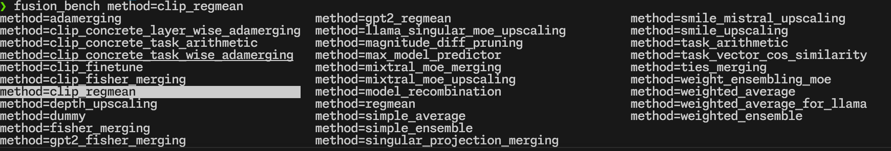
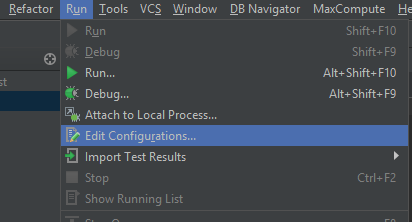
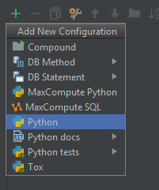

# `fusion_bench`: The Command Line Interface for FusionBench

`fusion_bench` is the command line interface for running model fusion benchmarks in the FusionBench project.
It provides a flexible way to configure and execute various fusion algorithms on different model pools and evaluate them across multiple tasks.

## Details and Options

`fusion_bench` takes a configuration file as input, which specifies the models, fusion method to be used, and the datasets to be evaluated. running `fusion_bench` is equivalent to running `python fusion_bench/scripts/cli.py`.

```bash
fusion_bench [--config-path CONFIG_PATH] [--config-name CONFIG_NAME] \
    OPTION_1=VALUE_1 OPTION_2=VALUE_2 ...

# or equivalently
python fusion_bench/scripts/cli.py [--config-path CONFIG_PATH] [--config-name CONFIG_NAME] \
    OPTION_1=VALUE_1 OPTION_2=VALUE_2 ...
```

`fusion_bench` has the following options, `method`, `modelpool`, and `taskpool` are the most important ones among these options:

### Hydra options

- **--help, -h**: Application's help. Print help message and exit.

  ```bash
  fusion_bench --help
  ```

- **--hydra-help**: Hydra's help.
- **--version**: Show Hydra's version and exit.
- **--cfg, -c**: Show config instead of running [job|hydra|all].
  This is useful for debugging the configuration. However, this just prints plain text configuration without color highlighting or formatting.

  ```bash
  fusion_bench --cfg
  ```

  Or equivalently with the following options:

  ```bash
  # this will print the configuration using rich library, which provides syntax highlighting and better formatting
  fusion_bench print_config=true dry_run=true
  ```

- **--resolve**: Used in conjunction with --cfg, resolve config interpolations before printing.
- **--package, -p**: Config package to show. For example, when you only want to see the configuration for `method`.

  ```bash
  fusion_bench --cfg job -p method
  ```

- **--info, -i**: Print Hydra information [all|config|defaults|defaults-tree|plugins|searchpath]
- **--config-path, -cp**: Overrides the config_path specified in hydra.main(). The config_path is absolute or relative to the Python file declaring @hydra.main().
By default, the config path is the `config` or `fusion_bench_config` directory in the project root.
- **--config-name, -cn**: Overrides the config_name specified in hydra.main(). By default, the config name is `example_config` so `config/example_config.yaml` will be loaded.
You can also specify another config name, for example:

  ```bash
  # this will load the config from `config/llama_weighted_average.yaml`
  fusion_bench --config-name llama_weighted_average.yaml
  ```

- **--config-dir, -cd**: Adds an additional config dir to the config search path
- **--multirun, -m**: Run multiple jobs with the configured launcher and sweeper. For more information, see [Hydra documentation](https://hydra.cc/docs/1.3/tutorials/basic/running_your_app/multi-run/).
- **--experimental-rerun**: Rerun a job from a previous config pickle

#### Shell Completion

This is useful for tab completion in the shell. You can install shell completion for Bash, Fish, and Zsh.

<figure markdown="span">
{ width="850" }
<figcaption> Screenshot of tab completion in the shell. </figcaption>
</figure>

- **--shell-completion, -sc**: Install or Uninstall shell completion:
  - **Bash - Install**:

    ```bash
    eval "$(fusion_bench -sc install=bash)"
    ```

  - **Bash - Uninstall**:

    ```bash
    eval "$(fusion_bench -sc uninstall=bash)"
    ```

  - **Fish - Install**:

    ```fish
    fusion_bench -sc install=fish | source
    ```

  - **Fish - Uninstall**:

    ```fish
    fusion_bench -sc uninstall=fish | source
    ```

  - **Zsh - Install**:
    Zsh is compatible with the Bash shell completion, see the [documentation](https://hydra.cc/docs/1.2/tutorials/basic/running_your_app/tab_completion#zsh-instructions) for details.

    ```zsh
    eval "$(fusion_bench -sc install=bash)"
    ```

  - **Zsh - Uninstall**:

    ```zsh
    eval "$(fusion_bench -sc uninstall=bash)"
    ```

### Application Options

- **report_save_path**: The path to save the report. If not specified or is `false`, the report will not be saved. The report will be saved as a JSON file. Default is `false`.
    For example, to save the report to `outputs/report.json`:

    ```bash
    fusion_bench report_save_path=outputs/report.json
    ```

- **print_config**: Whether to print the configuration to the console. If not specified or is `false`, the configuration will not be printed. Default is `true`.
    For example, to print the configuration:

    ```bash
    fusion_bench print_config=true
    ```

- **dry_run**: Perform a dry run.
    This will only validate the configuration without running the actual code. Default is `false`.
    For example, to perform a dry run and print the configuration:

    ```bash
    fusion_bench dry_run=true print_config=true
    ```

- **merged_model_save_path**: The path to save the merged model. If specified, the merged model will be saved to this path by calling `modelpool.save_model`.
    For example, to save the merged model to `outputs/merged_model.pt`:

    ```bash
    fusion_bench merged_model_save_path=outputs/merged_model.pt
    ```

    Note that the behavior of `modelpool.save_model` depends on the implementation of the model pool. Take `AutoModelForCausalLMPool` as an example, it will save the model to the specified path as a directory containing the model configuration and safetensor files, i.e., calling `model.save_pretrained(merged_model_save_path)`.

    ??? example "Example of `modelpool.save_model`"

        `ModelPool` is the base class for model pools. The `save_model` method is defined in the `ModelPool` class and can be overridden in the derived classes. For example, `AutoModelForCausalLMPool` overrides the `save_model` method to save the model using the `save_pretrained` method of the model. The following is an example of the `save_model` method in the `ModelPool` class and the `AutoModelForCausalLMPool` class.

        By default, FusionBench will call `modelpool.save_model(model, merged_model_save_path, **merged_model_save_kwargs)` if the options below are provided. That is, additional keyword arguments can be forwarded when supported by the ModelPool implementation.

- **merged_model_save_kwargs**: Extra keyword arguments forwarded to `modelpool.save_model` when saving the merged model. Provide a dict-like value.

    Example (CausalLMPool): save to a local directory and also save the tokenizer and avoid pushing to the hub.

    ```bash
    fusion_bench -c job \
        merged_model_save_path=outputs/merged_model \
        merged_model_save_kwargs='{push_to_hub: false, save_tokenizer: true}' \
        method=linear/weighted_average_for_llama \
        modelpool=CausalLMPool/simle_mixtral_exp_v4 \
        taskpool=dummy
    ```

    !!! note

        The exact set of supported kwargs is defined by the chosen ModelPool. For example, [`CausalLMPool.save_model`][fusion_bench.modelpool.CausalLMPool.save_model] accepts `push_to_hub`, `save_tokenizer`, etc.

### method, modelpool and taskpool options

As mentioned earlier, `method`, `modelpool`, and `taskpool` are the most important options in `fusion_bench`.
The basic usage is as follows:

```bash
fusion_bench method=<METHOD> modelpool=<MODELPOOL> taskpool=<TASKPOOL>
```

To override the default configuration, you can specify additional options as follows:

```bash hl_lines="2-6"
fusion_bench \
  method=<METHOD> \
    method.<OPTION_1>=<VALUE_1> \
      method.<OPTION_1>.<SUBOPTION_1>=<VALUE_1_1> \
      method.<OPTION_1>.<SUBOPTION_2>=<VALUE_1_2> \
    method.<OPTION_2>=<VALUE_2> \
  modelpool=<MODELPOOL> \
    ...
  taskpool=<TASKPOOL> \
    ...
```

**Paremeter Overrides**:
In the above example, `<METHOD>`, `<MODELPOOL>`, and `<TASKPOOL>` are the names of the method, model pool, and task pool, respectively.
`<OPTION_1>`, `<VALUE_1>`, `<SUBOPTION_1>`, `<VALUE_1_1>`, etc., are the options and values for the method.
In particular, the options for the method are prefixed with `method.`, e.g., `method.<OPTION_1>`. And the suboptions are prefixed with `method.<OPTION_1>.`, e.g., `method.<OPTION_1>.<SUBOPTION_1>`.

## Basic Examples

merge two CLIP models using task arithmetic:

```bash
fusion_bench method=task_arithmetic \
  modelpool=clip-vit-base-patch32_svhn_and_mnist \
  taskpool=clip-vit-base-patch32_svhn_and_mnist
```

The overall configuration is as follows:

```yaml linenums="1" hl_lines="1 3 5"
method: # (1)!
  ...
modelpool: # (2)!
  ...
taskpool: # (3)!
  ...
fast_dev_run: false
print_config: true
report_save_path: false
```

1. Configuration for method, `fusion_bench.method.load_algorithm_from_config` checks the 'name' attribute of the configuration and returns an instance of the corresponding algorithm.
2. Configuration for model pool, `fusion_bench.modelpool.load_modelpool_from_config` checks the 'type' attribute of the configuration and returns an instance of the corresponding model pool.
3. Configuration for task pool, `fusion_bench.taskpool.load_taskpool_from_config` checks the 'type' attribute of the configuration and returns an instance of the corresponding task pool.

merge multiple CLIP models using simple averaging:

```bash
fusion_bench method=simple_average modelpool=clip-vit-base-patch32_TA8.yaml taskpool=dummy
```

## Running in Offline Mode

In the offline mode, the model pool will not download the models from the internet.
Instead, it will use the models that are already downloaded to the local cache.

To run `fusion_bench` in offline mode, you can run the following command before running `fusion_bench`:

```bash
source offline_mode.sh
```

Or set the environment variable according to the content of `offline_mode.sh`.

## Debugging and Troubleshooting

During algorithm development, you may want to debug the code or inspect the configuration.
Here are some tips for debugging and troubleshooting.

### Debugging in VSCode

Visual Studio Code (VSCode) is a popular code editor that supports debugging Python code with Python extension.
To debug the code using VSCode, you can use the following configuration in your `.vscode/launch.json`:

```json linenums="1" hl_lines="8-9"
{
    "version": "0.2.0",
    "configurations": [
        {
            "name": "FusionBench with Arguments",
            "type": "debugpy",
            "request": "launch",
            "module": "fusion_bench.scripts.cli", // (1)!
            "args": "${command:pickArgs}", // (2)!
            "console": "integratedTerminal",
            "justMyCode": true
        }
    ]
}
```

1. The `module` field specifies the module to run. In this case, it is `fusion_bench.scripts.cli`. You can also specify the path to the script directly with `program` filed, e.g., `"program": ${workspaceFolder}/fusion_bench/scripts/cli.py`.
2. The `args` field specifies the arguments to pass to the script. You can use `${command:pickArgs}` to pick the arguments interactively when you run the debugger. Or you can specify the arguments directly, e.g., `"args": ["--config-name", "example_config"]`.

Once you have the configuration in your `launch.json`, you can start debugging by selecting the `FusionBench with Arguments` configuration and pressing `F5`.

{ width="200pt" }

### Debugging in PyCharm

Debugging in PyCharm with arguments needs to be configured in the `Run/Debug Configurations`.

1. Click on the `Run` menu click `Edit Configurations...`
    
2. Select `+` in top right corner and select `Python`  
    
3. Provide the name, absolute path of the script (`fusion_bench/scripts/cli.py`) or select the script by clicking three dots (green arrow), script parameters, and python interpreter.  
    
