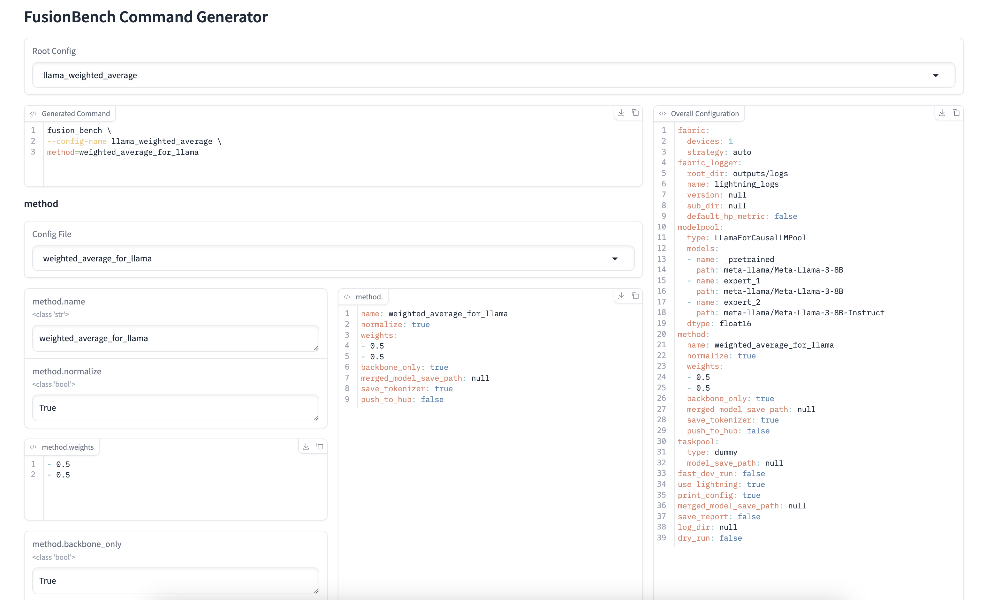

# FusionBench Command Generator WebUI

FusionBench Command Generator is a user-friendly web interface for generating FusionBench commands based on configuration files.
It provides an interactive way to select and customize FusionBench configurations, making it easier to run experiments with different settings.

<figure markdown="span">

<figcaption>FusionBench Command Generator WebUI</figcaption>
</figure>

## Usage

Run the program with the following command:

```
fusion_bench_webui [OPTIONS]
```

### Options

- `--config-path PATH`: Specify the path to the config directory. If not provided, the default FusionBench config path will be used.
- `--print-tree`: Print the configuration tree structure before launching the web interface. Default is `False`.
- `--bind-ip IP`: Specify the IP address to bind the web UI. Default is `127.0.0.1`.
- `--port PORT`: Specify the port to run the web UI. Default is `7860`.
- `--share`: Share the web UI. Default is `False`.

The web interface consists of the following components:

1. Root Config Dropdown: Select the base configuration file.
2. Configuration Groups: Nested structure of configuration options, allowing you to customize settings for each group.
3. Generated Command: Displays the generated FusionBench command based on your selections.
4. Overall Configuration: Shows the complete configuration in YAML format.
