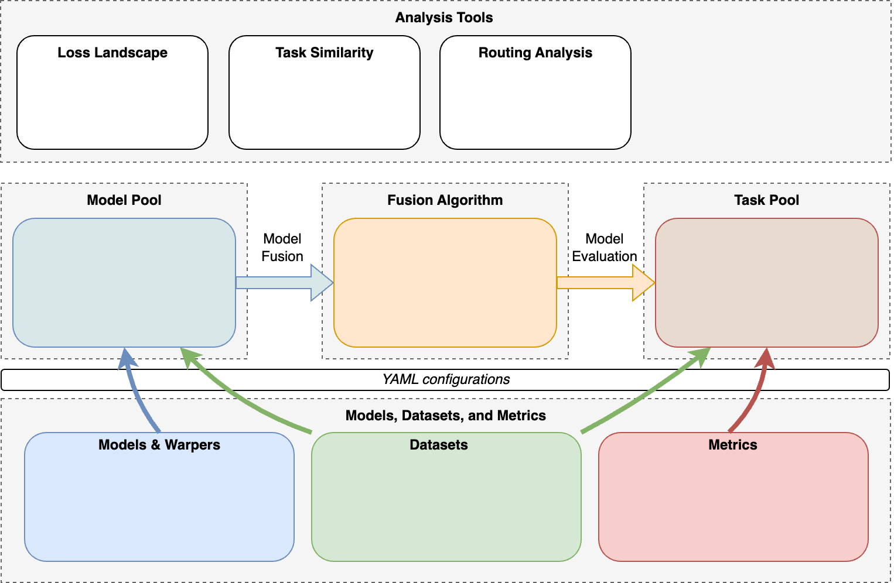
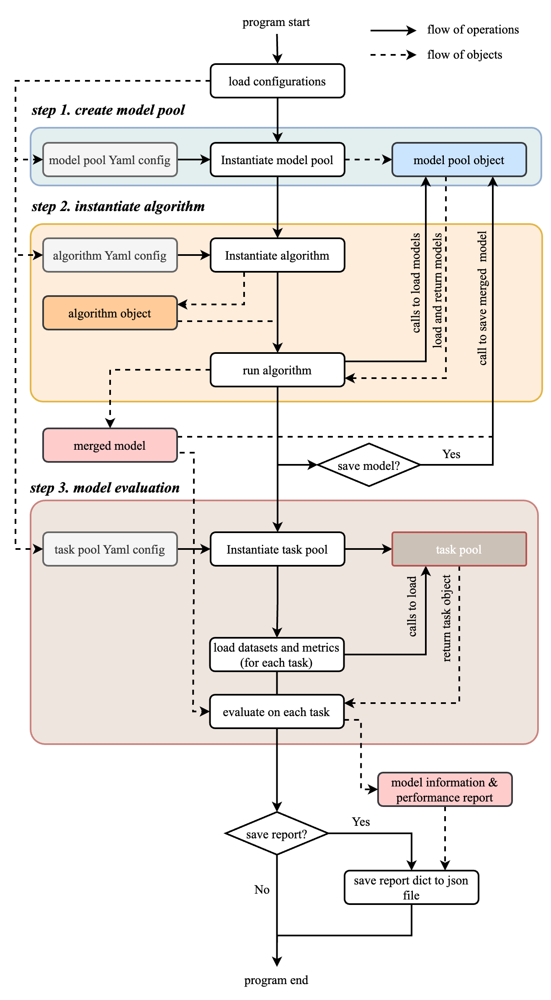

# Get Started with FusionBench

## General Structure of FusionBench

<figure markdown="span">
{ width="800px" }
<figcaption>Framework of FusionBench</figcaption>
</figure>

FusionBench is a pioneering project that provides a comprehensive benchmark for deep model fusion, facilitating the evaluation and comparison of various model fusion techniques. The project is meticulously designed to support rigorous analysis and experimentation in the field of model fusion, offering a versatile and modular codebase tailored for advanced research and development.

The general structure of the FusionBench project can be visualized through its modular framework, which is divided into several key components:

1. **Fusion Algorithm**: The core component where Model Fusion takes place. It integrates models from the Model Pool and adjusts them according to the specified fusion algorithms. The output is then evaluated for performance and effectiveness.
2. **Model Pool**: A repository of various pre-trained models that can be accessed and utilized for fusion. This pool serves as the foundation for creating new, fused models by leveraging the strengths of each individual model.
3. **Task Pool**: A collection of tasks that the fused models are evaluated on. These tasks help in assessing the practical applicability and robustness of the fused models.
4. **Models & Warpers, Datasets, and Metrics**: These underlying modules include:
      - Models & Warpers: Tools and scripts for model loading, wrapping, and pre-processing.
      - Datasets: The datasets used for training, validation, and testing the fused models.
      - Metrics: The performance metrics used to evaluate the models, providing a comprehensive understanding of their capabilities.
5. **YAML Configurations**: Central to the project's modularity, YAML files are used to configure models, datasets, and metrics, allowing seamless customization and scalability.
    This is based on the hydra framework, which allows for easy customization and scalability.
    [:octicons-arrow-right-24: Read More](https://hydra.cc/)

By organizing these components into a structured and modular codebase, FusionBench ensures flexibility, ease of use, and scalability for researchers and developers. The project not only serves as a benchmark but also as a robust platform for innovation in the realm of deep model fusion.

To summarize the key features of FusionBench:

- **Comprehensive Benchmark**: FusionBench provides a wide range of fusion algorithms, model pools, and tasks for thorough evaluation.
- **Modular Design**: The project is structured into separate modules for algorithms, model pools, and task pools, allowing easy extension and customization.
- **Command-line Interface**: A flexible CLI tool `fusion_bench` for running experiments with various configurations.
- **Extensive Documentation**: Detailed guides, API references, and examples to help users get started quickly.

<div class="grid cards" markdown style="display: grid; grid-template-columns: repeat(3, 1fr); gap: 0.5rem;">

- **Fusion Algorithm Module**

    ---

    Implement the fusion algorithms. Receive the model pool and return the fused model.

    [:octicons-arrow-right-24: Read More](../algorithms/README.md)

- **Model Pool Module**

    ---

    Manage the models, including [large language models](../modelpool/llm/index.md). Responsible for loading, preprocessing, and saving the models.

    [:octicons-arrow-right-24: Read More](../modelpool/README.md)

- **Task Pool Module**

    ---

    Manage the tasks. Responsible for loading evaluation datasets and metrics, and evaluating the fused model.

    [:octicons-arrow-right-24: Read More](../taskpool/README.md)

</div>

### Why Hydra for configuration management and argument parsing?

Hydra is a powerful framework for managing complex configurations in Python applications. It allows you to compose and override configurations easily, making it an ideal choice for projects like FusionBench that has a modular design and require flexible and dynamic configuration management.

## The FusionBench Command Line Interface

The `fusion_bench` CLI is your primary tool for executing model fusion experiments and benchmarks. This powerful command-line interface serves as the entry point for all FusionBench operations, orchestrating the entire fusion pipeline from model loading to evaluation.

The CLI operates on a configuration-driven approach, where you specify:

- **Models to fuse**: Define which pre-trained models from your model pool to combine
- **Fusion algorithm**: Choose the specific fusion technique (e.g., simple averaging, task arithmetic, AdaMerging)
- **Evaluation datasets**: Specify the tasks and datasets for assessing the fused model's performance
- **Execution parameters**: Configure runtime settings, device allocation, and output preferences

To execute a fusion experiment, use the following command structure:

```bash
fusion_bench [--config-path CONFIG_PATH] [--config-name CONFIG_NAME] \
    OPTION_1=VALUE_1 OPTION_2=VALUE_2 ...
```

- **`--config-path`**: Specifies the directory containing your configuration files (optional if using default paths)
- **`--config-name`**: Names the specific YAML configuration file to use (without the `.yaml` extension)
- **Dynamic overrides**: `OPTION_KEY=VALUE` pairs that allow you to modify configuration parameters on-the-fly

Example Usage:

```bash
# Run with a specific configuration
fusion_bench --config-name custom_config

# Override specific parameters
fusion_bench --config-name custom_config method.alpha=0.5

# Use a custom config path
fusion_bench --config-path ./my_configs --config-name custom_fusion
```

### Execution Pipeline

When you run `fusion_bench`, the system orchestrates a sophisticated pipeline that handles model fusion and evaluation. Here's what happens under the hood:

1. **Configuration Loading**: The system loads and validates your YAML configuration
2. **Component Initialization**: Model pools, task pools, and fusion algorithms are instantiated
3. **Model Fusion**: The specified algorithm processes models from the pool to create a unified model
4. **Evaluation**: The fused model is tested against the defined task datasets
5. **Reporting**: Performance metrics and comparison results are generated

The following pseudocode illustrates this process:

```python title="FusionBench Execution Pipeline" linenums="1" hl_lines="16"
class FusionBenchProgram:
    def __init__(self, method, modelpool, taskpool):
        """Initialize the fusion program with core components."""
        self.method = method          # Fusion algorithm configuration
        self.modelpool = modelpool    # Collection of models to fuse
        self.taskpool = taskpool      # Evaluation tasks and datasets

    def run(self):
        """Execute the complete fusion and evaluation pipeline."""
        # Step 1: Load and initialize components
        algorithm = load_algorithm(self.method)
        modelpool = load_modelpool(self.modelpool)
        taskpool = load_taskpool(self.taskpool)

        # Step 2: Execute fusion algorithm to create merged model
        merged_model = algorithm.run(modelpool)
        
        # Step 3: Evaluate the fused model on specified tasks
        report = taskpool.evaluate(merged_model)
        
        # Step 4: Generate performance reports and comparisons
        return report

def main(cfg):
    """Main entry point for FusionBench execution."""
    program = FusionBenchProgram(
        method=cfg.method,        # Algorithm configuration
        modelpool=cfg.modelpool,  # Model collection settings
        taskpool=cfg.taskpool,    # Evaluation task settings
    )
    results = program.run()
    return results

if __name__ == "__main__":
    # Load configuration and execute fusion pipeline
    main(cfg)
```

### Understanding the Workflow

The execution follows a clear, linear progression.
For comprehensive information on all available CLI options, configuration parameters, and advanced usage patterns, refer to the detailed [CLI documentation](../cli/fusion_bench.md).

The following flowchart illustrates the complete FusionBench execution pipeline:

<figure markdown="span">
{ width="600px"}
</figure>

### Runtime Framework: ⚡ Lightning Fabric Integration

By default, `fusion_bench` launches a `FabricModelFusionProgram` that orchestrates the entire fusion workflow, including model loading, fusion computation, and evaluation. This program is built on [Lightning Fabric](https://lightning.ai/docs/fabric/stable/).

#### Why Lightning Fabric?

Lightning Fabric serves as our runtime framework for several compelling reasons:

Lightning Fabric is a lightweight and flexible framework that provides a unified interface for distributed training and device management. It simplifies the process of scaling models across multiple GPUs, TPUs, and other hardware accelerators, making it easier to develop and deploy complex machine learning applications.

However, it is possible to implement the program without relying on Lightning Fabric. This would involve manually handling the complexities of distributed training, device management, and other aspects that Lightning Fabric abstracts away. While this approach may offer more control and customization, it also requires significantly more effort and expertise to implement effectively.
