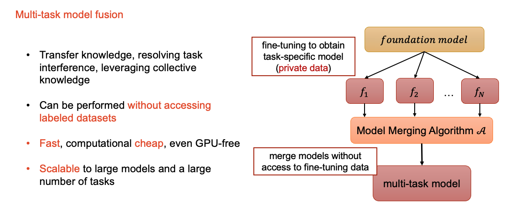

# Introduction to Deep Model Fusion (The Learn From Model Paradigm)

Deep model fusion is a technique that merges, ensemble, or fuse multiple deep neural networks to obtain a unified model.
It can be used to improve the performance and robustness of model or to combine the strengths of different models, such as fuse multiple task-specific models to create a multi-task model.
For a more detailed introduction to deep model fusion, you can refer to [W. Li, 2023, 'Deep Model Fusion: A Survey'](http://arxiv.org/abs/2309.15698).
In this benchmark, we evaluate the performance of different fusion methods on a variety of datasets and tasks.

### Background

The traditional approach of training deep networks with supervised learning requires:

1. gathering a large dataset relevant to the problem at hand. 
2. Once the dataset is collected, manual labeling may be necessary to provide supervision.
3. After the dataset is prepared, Feature Engineering can be conducted to select and transform variables that are most relevant to the predictive model. This step is optional but can significantly improve the accuracy of the model.
4. The next step is Model Training, in which the design model architecture is developed and an optimization algorithm is chosen.

We call this the "learn from data" paradigm. This approach has been very successful in many applications, and the size of both the dataset and the model has been increasing rapidly. 

<figure markdown="span">
{ width="800px"}
<figcaption><a href="https://arxiv.org/abs/2310.08184" target="_blank">Hongling Zheng, Li Shen, et al. "Learn from model beyond fine-tuning: A survey."  arXiv:2310.08184 (2023).</a></figcaption>
</figure>

However, in the past few years, it is obvious that the learning paradigm of deep neural networks has undergone a significant shift. The traditional approach of training deep networks with supervised learning has been complemented with emerging techniques that transfer knowledge from existing models, edit existing models, or leverage unlabeled data to tune the models. Many data-efficient approaches have been proposed, such as model tuning, model distillation, model ensemble, model pruning, model editing and so on. 
We can even achieve satisfactory results with just prompt design in a few minutes, without any data or model training.

This transformation is driven by the increasing complexity of the models and the increasing cost of data labeling. We call this the "learn from model" paradigm.

So why do we need to learn from models? What are the advantages of learning from models?
By learning from model, we aim to enhance model performance, reduce training costs, improve generalization...

- Knowledge transfer across models (accelerate training, reuse sunk training cost)  
- Knowledge transfer across tasks (Facilitating learning from smaller datasets)
- Task regularization improve generalization and reduce overfitting
- Reduced model/parameter maintenance costs
- Improve the efficiency of the inference phase (one forward inference to obtain multiple task predictions)
- ...
         
### Applications of Deep Model Fusion

#### Accelerating Model Training

Leveraging existing models provides a significant advantage in accelerating the development of new models. 
Training a model from scratch is often both costly and time-consuming, so utilizing pre-existing models can substantially speed up this process. 
By harnessing the knowledge embedded in these models, we can enhance the training efficiency for new models.

<figure markdown="span">
{ width="950px"}
</figure>

#### Multi-Task Learning

Another popular application of deep model fusion is to construct multi-task models (***FusionBench provides a comprehensive benchmark for multi-task model fusion***).
Where we aim to collaboratively train one single model with data from multiple tasks to facilitate knowledge transfer.
Unlike traditional multi-task learning approaches that train a single model with data from multiple tasks, the multi-task model fusion approach reuse the task-specific models to construct a multi-task model. 
This approach can be more data-efficient.

Similar to single-task model training, train a multi-task model needs three steps: 

1. Data collection and preparation.
2. Model design and algorithm selection.
3. Model training and evaluation.

<figure markdown="span">
    { width="750px" }
<figurecaption> Core steps of multi-task model training </figurecaption>
</figure>

However, the traditional model training strategy has limitations in certain applications. 
Particularly when the training data for each task is private and cannot be shared. 
In other cases, we may only have access to the models trained on the private data, but not the data itself. In these cases, we need to develop a new training strategy that can train a multi-task model without sharing the private data. 
And training a multi-task model from scratch can be very expensive.

Model fusion without accessing training data in machine learning has attracted increasing interest due to the practical resource-saving and data privacy issues. 
Creating a multi-task model by merging models for distinct tasks has proven to be an economical andscalable approach.
By fuse deep neural networks, transfer knowledge, addressing task interference, and utilizing combined knowledge can be achieved without the need for accessing labeled datasets. This is scalable to large models and a wide array of tasks. 

<figure markdown="span">
{ width="850px" }
<figcaption>The general framework of multi-task model fusion</figcaption>
</figure>

#### Improving Model Performance

Moreover, the knowledge from existing models can be used to create new models. 
For instance, if we have multiple models, we can combine their knowledge through techniques like model ensembling or weight manipulation. 
This approach allows us to develop more sophisticated models by integrating the strengths of several pre-trained models.

<figure markdown="span">
{ width="950px"}
</figure>

#### Scaling Up Models

Additionally, we can upscale existing models to create larger, more powerful models. 
This can be achieved by mixing the weights of existing models or by adding new layers to them. 
One of the more popular methods for scaling up models recently is the use of Mixture of Experts (MoE) methods. 
These methods allow for the scaling of models to very large sizes while maintaining a manageable inference cost.

<figure markdown="span">
{ width="950px"}
</figure>

### Formal Definition and Taxonomies of Deep Model Fusion

In this section, we provide a formal definition of deep model fusion and introduce several taxonomies to categorize different fusion methods.
We define deep model fusion as the process of combining multiple deep neural networks to create a unified model that leverages the knowledge and capabilities of the individual models.
We taxonomize these fusion methods based on their underlying principles and mechanisms, providing a structured framework for understanding and comparing different fusion techniques.
We categorize deep model fusion methods into three main types: **Model Ensemble**, **Model Merging**, and **Model Mixing**.

The initial diagram presented below provides a visual representation of the Model Ensemble technique. 
This method involves the training of several independent models, each generating its own set of predictions. 
These individual predictions are then aggregated to produce a final, more accurate prediction.
The Model Ensemble technique is frequently employed to enhance both the performance and reliability of models. 
It achieves this by leveraging the collective intelligence of multiple models, thereby reducing the likelihood of errors that could arise from a single model's predictions.
However, it's important to note that this technique does come with its own set of challenges. 
The necessity to train and maintain multiple models can lead to increased computational costs. 
This is due to the additional resources required for the training process, as well as the storage needed for each model. 
Therefore, while the Model Ensemble technique can lead to improved accuracy, it's essential to consider the potential trade-off in terms of computational expense.

<figure markdown="span">
{ width="930px" }
</figure>

Moving on, the second diagram represents Model Merging. This technique involves combining multiple models into a single model of the same architecture.
By merging these models, we can create a more robust and comprehensive model that leverages the strengths of its constituent models. 
This can lead to improved performance and generalization, especially in scenarios where the individual models excel in different areas.

<figure markdown="span">
{ width="850px" }
</figure>

Lastly, the third diagram depicts Model Mixing, a technique where the weights of multiple models are combined to form a new model. 
The new model typically has a different architecture from the original models, such as a larger size or more complex structure.

<figure markdown="span">
{ width="900px" }
</figure>
