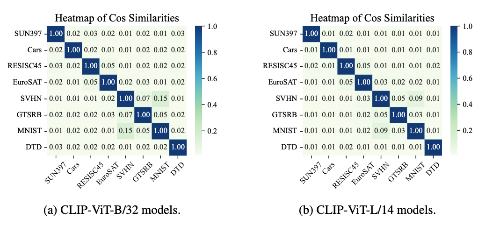

# CLIP-ViT Models for Open Vocabulary Image Classification

Here we provides a list of CLIP-ViT models that are trained for open vocabulary image classification. 

## The Eight Tasks

The most common eight tasks used in the research community are SUN397, Cars, RESISC45, EuroSAT, SVHN, GTSRB, MNIST, and DTD.
These tasks cover a wide range of domains, including natural images, satellite images, and digit recognition.
You can download the datasets from [this HuggingFace Collection](https://huggingface.co/collections/tanganke/the-eight-image-classification-tasks-6644ce0376c0a469f6928507) or using the `datasets` library as follows:

```python
from datasets import load_dataset

# take `gtsrb` as an example
dataset = load_dataset("tanganke/gtsrb")

train_dataset = dataset["train"]
test_dataset = dataset["test"]
```

The authors of Task Arithmetic have fine-tuned the CLIP-ViT models from the *open_clip* library on these eight tasks and provide the models publicly on [Google Drive](https://drive.google.com/drive/folders/1u_Tva6x0p6oxu5Eo0ZZsf-520Cc_3MKw?usp=share_link). 
However, these models rely on a specific version of the *open_clip* library. 

To make experiments more convenient and avoid dependency on a specific library version, we have re-trained these models and made them publicly available on the HuggingFace Model Hub.
We use the Adam Optimizer with a fixed learning rate of 1e-5 over 4000 training steps (batch_size=32).
Only the vision encoder is fine-tuned, while the text encoder remains fixed to preserve the open-vocabulary property of the model.

- [fine-tuned CLIP-ViT-B/32 models](https://huggingface.co/collections/tanganke/clip-vit-b-32-on-the-eight-image-classication-tasks-6644d0c476c0a469f693cf91)
- [fine-tuned CLIP-ViT-L/14 models](https://huggingface.co/collections/tanganke/clip-vit-l-14-on-the-eight-image-classification-tasks-6644d2b014331c746683de63)

To use these models, you can load them from the Transformers library as follows:

load vision backbone

```python
from transformers import CLIPVisionModel

# load the CLIP-ViT-B/32 model, take `gtsrb` as an example
vision_model = CLIPVisionModel.from_pretrained('tanganke/clip-vit-base-patch32_gtsrb')
```

substitute the vision encoder of clip

```python
from transformers import CLIPProcessor, CLIPModel

# load pre-trained CLIP model
clip_model = CLIPModel.from_pretrained("openai/clip-vit-base-patch32")
# substitute the vision model with the fine-tuned one
clip_model.vision_model.load_state_dict(vision_model.vision_model.state_dict())
```

### Model Pool Configuration

To use these models from our FusionBench library, you can specify the modelpool configuration file as follows:

```yaml title="config/modelpool/clip-vit-base-patch32_TA8.yaml"
type: huggingface_clip_vision
models:
  - name: _pretrained_
    path: openai/clip-vit-base-patch32
  - name: sun397
    path: tanganke/clip-vit-base-patch32_sun397
  - name: stanford_cars
    path: tanganke/clip-vit-base-patch32_stanford-cars
  - name: resisc45
    path: tanganke/clip-vit-base-patch32_resisc45
  - name: eurosat
    path: tanganke/clip-vit-base-patch32_eurosat
  - name: svhn
    path: tanganke/clip-vit-base-patch32_svhn
  - name: gtsrb
    path: tanganke/clip-vit-base-patch32_gtsrb
  - name: mnist
    path: tanganke/clip-vit-base-patch32_mnist
  - name: dtd
    path: tanganke/clip-vit-base-patch32_dtd
```


The type of the modelpool is `huggingface_clip_vision`, corresponding to the modelpool class `HuggingFaceClipVisionPool`.

::: fusion_bench.modelpool.HuggingFaceClipVisionPool

## Basic Examples

Here are some basic examples of using the CLIP-ViT models for open vocabulary image classification with different fusion methods, using the [`fusion_bench`](../cli/fusion_bench.md) command line interface.

### Single Model Evaluation

evaluate the CLIP-ViT-B/32 model on the eight tasks

```bash
fusion_bench method=dummy \
  modelpool=clip-vit-base-patch32_individual \
    modelpool.models.0.path="'${path_to_clip_model}'" \
  taskpool=clip-vit-classification_TA8
```

Here the `dummy` method is a special method used to skip the model merging process (see [dummy method](../algorithms/dummy.md) for more information), and the `clip-vit-classification_TA8` taskpool is used to evaluate the model on the eight tasks.
if `$path_to_clip_model` is not specified, the pre-trained model from HuggingFace will be used by default.

evaluate the CLIP-ViT-L/14 model on the eight tasks

```bash
fusion_bench method=dummy \
  modelpool=clip-vit-large-patch14_individual \
    modelpool.models.0.path="'${path_to_clip_model}'" \
  taskpool=clip-vit-classification_TA8 \
    taskpool.clip_model=openai/clip-vit-large-patch14
```

### Simple Averaging

merge CLIP-ViT-B/32 models using simple average and evaluate on the eight tasks

```bash
fusion_bench method=simple_average \
  modelpool=clip-vit-base-patch32_TA8 \
  taskpool=clip-vit-classification_TA8 

# results
{
    "svhn": {"accuracy": 0.6451674699783325, "loss": 1.128771424293518},
    "stanford_cars": {"accuracy": 0.625668466091156, "loss": 1.135254979133606},
    "resisc45": {"accuracy": 0.7079365253448486, "loss": 0.9697789549827576},
    "eurosat": {"accuracy": 0.7685185074806213, "loss": 0.6301173567771912},
    "gtsrb": {"accuracy": 0.5494061708450317, "loss": 1.492265224456787},
    "mnist": {"accuracy": 0.8626000285148621, "loss": 0.5933865308761597},
    "dtd": {"accuracy": 0.5090425610542297, "loss": 1.79731023311615},
    "sun397": {"accuracy": 0.6543576717376709, "loss": 1.1993952989578247},
}
```

merge CLIP-ViT-L/14 models using simple average and evaluate on the eight tasks

```bash
fusion_bench method=simple_average \
  modelpool=clip-vit-large-patch14_TA8 \
  taskpool=clip-vit-classification_TA8 taskpool.clip_model=openai/clip-vit-large-patch14 # because when evaluate the model, we need text encoder, so we need to specify the clip model
```

### Fisher Merging

merge CLIP-ViT-B/32 models using Fisher Merging and evaluate on the eight tasks

```bash
fusion_bench method=clip_fisher_merging \
  modelpool=clip-vit-base-patch32_TA8 \
  taskpool=clip-vit-classification_TA8
```

merge CLIP-ViT-L/14 models using Fisher Merging and evaluate on the eight tasks

```bash
fusion_bench \
  method=clip_fisher_merging \
    method.batch_size=8 method.num_workers=4 \
  modelpool=clip-vit-large-patch14_TA8 \
  taskpool=clip-vit-classification_TA8 \
    taskpool.clip_model=openai/clip-vit-large-patch14
```

### RegMean

merge CLIP-ViT-B/32 models using RegMean and evaluate on the eight tasks

```bash
fusion_bench method=clip_regmean \
  modelpool=clip-vit-base-patch32_TA8 \
  taskpool=clip-vit-classification_TA8
```

For CLIP-ViT-L/14 models:

```bash
fusion_bench \
  method=clip_regmean \
    method.batch_size=8 method.num_workers=4 \
  modelpool=clip-vit-large-patch14_TA8 \
  taskpool=clip-vit-classification_TA8 \
    taskpool.clip_model=openai/clip-vit-large-patch14
```

### Task Arithmetic

merge CLIP-ViT-B/32 models using task arithmetic and evaluate on the eight tasks

```bash
fusion_bench method=task_arithmetic method.scaling_factor=0.3\
  modelpool=clip-vit-base-patch32_TA8 \
  taskpool=clip-vit-classification_TA8

# results
{
    "svhn": {"accuracy": 0.77927166223526, "loss": 0.7050645351409912},
    "stanford_cars": {"accuracy": 0.5565228462219238, "loss": 1.4873239994049072},
    "resisc45": {"accuracy": 0.6487301588058472, "loss": 1.3709946870803833},
    "eurosat": {"accuracy": 0.7674074172973633, "loss": 0.6550557017326355},
    "gtsrb": {"accuracy": 0.6850356459617615, "loss": 1.2349143028259277},
    "mnist": {"accuracy": 0.9606999754905701, "loss": 0.1570172756910324},
    "dtd": {"accuracy": 0.471808522939682, "loss": 2.1495635509490967},
    "sun397": {"accuracy": 0.571083128452301, "loss": 1.7016042470932007},
}
```

```bash
# or use a for loop to try different scaling factors 
# and save the results to different files
for scaling_factor in 0.1 0.2 0.3 0.4 0.5 0.6 0.7 0.8 0.9 1.0
do
  fusion_bench \
    method=task_arithmetic method.scaling_factor=$scaling_factor\
    modelpool=clip-vit-base-patch32_TA8 \
    taskpool=clip-vit-classification_TA8 \
    save_report=outputs/clip-vit-base-patch32_TA8_task_arithmetic_scaling_factor_${scaling_factor}.json
done
```

merge CLIP-ViT-L/14 models using task arithmetic and evaluate on the eight tasks

```bash
fusion_bench method=task_arithmetic method.scaling_factor=0.3\
  modelpool=clip-vit-large-patch14_TA8 \
  taskpool=clip-vit-classification_TA8 taskpool.clip_model=openai/clip-vit-large-patch14
```

### Ties-Merging

merge CLIP-ViT-B/32 models using Ties-Merging and evaluate on the eight tasks

```bash
fusion_bench method=ties_merging method.scaling_factor=0.3 method.threshold=20 \
  modelpool=clip-vit-base-patch32_TA8 \
  taskpool=clip-vit-classification_TA8
```

```bash
# or use a for loop to try different scaling factors
# and save the results to different files
for scaling_factor in 0.1 0.2 0.3 0.4 0.5 0.6 0.7 0.8 0.9 1.0
do
  fusion_bench \
    method=ties_merging method.scaling_factor=$scaling_factor method.threshold=20 \
    modelpool=clip-vit-base-patch32_TA8 \
    taskpool=clip-vit-classification_TA8 \
    save_report=outputs/clip-vit-base-patch32_TA8_ties_merging_scaling_factor_${scaling_factor}.json
done
```

merge CLIP-ViT-L/14 models using Ties-Merging and evaluate on the eight tasks

```bash
fusion_bench method=ties_merging method.scaling_factor=0.3 method.threshold=20 \
  modelpool=clip-vit-large-patch14_TA8 \
  taskpool=clip-vit-classification_TA8 taskpool.clip_model=openai/clip-vit-large-patch14
```


### [AdaMerging](../algorithms/adamerging.md)

merge CLIP-ViT-B/32 models using task-wise AdaMerging and evaluate on the eight tasks, and save the merging weights by specifying the `method.save_merging_weights` parameter

```bash
fusion_bench \
  method=adamerging \
    method.name=clip_task_wise_adamerging \
    method.save_merging_weights=outputs/clip-vit-base-patch32_TA8_task_wise_adamerging_weights.pt \
  modelpool=clip-vit-base-patch32_TA8 \
  taskpool=clip-vit-classification_TA8
```

merge CLIP-ViT-L/14 models using task-wise AdaMerging and evaluate on the eight tasks, and save the merging weights by specifying the `method.save_merging_weights` parameter.
Here we split the training process into two stages, the first stage is to train the merging weights, and the second stage is to evaluate the model with the learned merging weights.

```bash
# learn the merging weights.
# the per-device batch size is 4, and the total batch size is 4*4=16
fusion_bench print_config=false \
  method=adamerging \
    method.name=clip_task_wise_adamerging \
    method.save_merging_weights=outputs/clip-vit-large-patch14_TA8_task_wise_adamerging_weights.pt \
    method.devices=4 method.batch_size=4 \
  modelpool=clip-vit-large-patch14_TA8 \
  taskpool=dummy # dummy taskpool is used to skip the evaluation process

# by specifying the learned merging weights, we skip the training process and directly evaluate the model
fusion_bench print_config=false \
  method=adamerging \
    method.name=clip_task_wise_adamerging \
    method.weights=outputs/clip-vit-large-patch14_TA8_task_wise_adamerging_weights.pt \
  modelpool=clip-vit-large-patch14_TA8 \
  taskpool=clip-vit-classification_TA8 taskpool.clip_model=openai/clip-vit-large-patch14
```

merge CLIP-ViT-B/32 models using layer-wise AdaMerging and evaluate on the eight tasks

```bash
fusion_bench \
    method=adamerging \
        method.name=clip_layer_wise_adamerging \
        method.save_merging_weights=merging_weights.pt \
    modelpool=clip-vit-base-patch32_TA8 \
    taskpool=clip-vit-classification_TA8 \
    fabric_logger.root_dir=outputs/logs/ViT-B-32 \
    fabric_logger.name=clip_layer_wise_adamerging_adam
```

merge CLIP-ViT-L/14 models using layer-wise AdaMerging and evaluate on the eight tasks

```bash
# learn the merging weights.
# the per-device batch size is 4, and the total batch size is 4*4=16
fusion_bench print_config=false \
  method=adamerging \
    method.name=clip_layer_wise_adamerging \
    method.save_merging_weights=outputs/clip-vit-large-patch14_TA8_layer_wise_adamerging_weights.pt \
    method.devices=4 method.batch_size=4 \
  modelpool=clip-vit-large-patch14_TA8 \
  taskpool=dummy # dummy taskpool is used to skip the evaluation process

# by specifying the learned merging weights, we skip the training process and directly evaluate the model
fusion_bench \
  method=adamerging \
    method.name=clip_layer_wise_adamerging \
    method.weights=outputs/clip-vit-large-patch14_TA8_layer_wise_adamerging_weights.pt \
  modelpool=clip-vit-large-patch14_TA8 \
  taskpool=clip-vit-classification_TA8 taskpool.clip_model=openai/clip-vit-large-patch14
```

### Weight-Ensembling MoE

fuse CLIP-ViT-B/32 models using Weight-Ensembling Mixture of Experts and evaluate on the eight tasks

```bash
fusion_bench \
  method=weight_ensembling_moe \
    method.name=clip_weight_ensembling_moe \
    method.use_grad_accumulate=false \
    method.save_checkpoint=outputs/clip-vit-base-patch32_TA8_weight_ensembling_moe_checkpoint.ckpt \
  modelpool=clip-vit-base-patch32_TA8 \
  taskpool=clip-vit-classification_TA8
```

fuse CLIP-ViT-L/14 models using Weight-Ensembling Mixture of Experts and evaluate on the eight tasks

```bash
# merge eight CLIP-ViT-L/14 models using WE MoE, fine-tune the routers
fusion_bench print_config=false \
  method=weight_ensembling_moe \
    method.name=clip_weight_ensembling_moe \
    method.use_grad_accumulate=true \
    method.save_checkpoint=outputs/clip-vit-large-patch14_TA8_weight_ensembling_moe_checkpoint.ckpt \
    method.batch_size=4 method.devices=4 \
  modelpool=clip-vit-large-patch14_TA8 \
  taskpool=dummy &&

# load the checkpoint and evaluate the model
fusion_bench \
  method=weight_ensembling_moe \
    method.name=clip_weight_ensembling_moe \
    method.checkpoint=outputs/clip-vit-large-patch14_TA8_weight_ensembling_moe_checkpoint.ckpt \
  modelpool=clip-vit-large-patch14_TA8 \
  taskpool=clip-vit-classification_TA8 \
    taskpool.clip_model=openai/clip-vit-large-patch14
```


### Experimental Results

We provide the experimental results of the CLIP-ViT models for open vocabulary image classification on the eight tasks in the following table.

!!! note "hyperparameters"

    The hyperparameters of the merging methods are not optimized, and the results are only for reference.
    If you discover more effective parameters, we'd appreciate it if you could inform us so we can update our findings.


=== "Table: Mutli-task model merging methods using CLIP-ViT-B/32 models."

    | Method                                         | SUN397 | Cars | RESISC45 | EuroSAT | SVHN | GTSRB | MNIST | DTD  | Average |
    | ---------------------------------------------- | ------ | ---- | -------- | ------- | ---- | ----- | ----- | ---- | ------- |
    | Reference Results                              |        |      |          |         |      |       |       |      |         |
    | Pre-trained                                    | 63.2   | 59.8 | 60.7     | 46.0    | 31.6 | 32.5  | 48.2  | 43.9 | 48.2    |
    | Fine-tuned (STL)                               | 75.0   | 78.3 | 95.2     | 99.0    | 97.3 | 98.9  | 99.6  | 79.7 | 90.3    |
    | Model Merging                                  |        |      |          |         |      |       |       |      |         |
    | Simple Averaging                               | 65.4   | 62.6 | 70.8     | 76.9    | 64.5 | 54.9  | 86.3  | 50.9 | 66.5    |
    | Fisher Merging                                 | 66.7   | 64.0 | 72.2     | 91.6    | 69.0 | 64.3  | 83.5  | 53.7 | 70.6    |
    | RegMean                                        | 67.8   | 68.9 | 82.5     | 94.4    | 90.6 | 79.2  | 97.6  | 63.2 | 80.5    |
    | Task Arithmetic ($\lambda=0.3$)                | 57.1   | 55.7 | 64.9     | 76.7    | 77.9 | 68.5  | 96.1  | 47.2 | 68.0    |
    | Concrete Task Arithmetic ($\lambda=0.3$)       | 64.2   | 63.3 | 75.6     | 94.1    | 90.3 | 82.9  | 98.0  | 52.5 | 77.6    |
    | Ties-Merging ($\lambda=0.3$)                   | 67.1   | 64.2 | 74.1     | 76.8    | 77.7 | 69.4  | 94.1  | 54.0 | 72.2    |
    | Task-wise AdaMerging ($\lambda=0.3$)           | 58.6   | 56.9 | 69.8     | 82.4    | 70.3 | 58.9  | 97.2  | 55.3 | 68.7    |
    | Layer-wise AdaMerging ($\lambda=0.3$)          | 67.9   | 71.3 | 83.5     | 92.7    | 87.4 | 92.9  | 98.2  | 67.0 | 82.6    |
    | Concrete Layer-wise AdaMerging ($\lambda=0.3$) | 69.1   | 72.7 | 85.9     | 94.7    | 91.3 | 95.7  | 98.7  | 66.8 | 84.4    |
    | Model Mixing                                   |
    | Weight-Ensembling MoE                          | 73.7   | 76.8 | 93.4     | 98.2    | 96.8 | 98.2  | 99.6  | 76.6 | 89.2    |

=== "Table: Mutli-task model merging methods using CLIP-ViT-L/14 models."

    | Method                                | SUN397 | Cars | RESISC45 | EuroSAT | SVHN | GTSRB | MNIST | DTD  | Average |
    | ------------------------------------- | ------ | ---- | -------- | ------- | ---- | ----- | ----- | ---- | ------- |
    | Reference Results                     |        |      |          |         |      |       |       |      |         |
    | Pre-trained                           | 68.3   | 77.8 | 71.0     | 58.9    | 58.4 | 50.6  | 76.4  | 55.5 | 64.6    |
    | Fine-tuned (STL)                      | 82.8   | 92.9 | 97.4     | 99.2    | 97.9 | 99.2  | 99.8  | 85.5 | 94.3    |
    | Model Merging                         |        |      |          |         |      |       |       |      |         |
    | Simple Averaging                      | 72.5   | 81.5 | 82.2     | 90.0    | 81.6 | 74.0  | 96.6  | 61.8 | 80.0    |
    | Fisher Merging                        | 70.6   | 79.4 | 84.1     | 98.1    | 74.7 | 85.0  | 89.5  | 61.0 | 80.3    |
    | RegMean                               | 75.3   | 88.4 | 90.0     | 97.1    | 95.9 | 92.4  | 98.5  | 72.6 | 88.8    |
    | Task Arithmetic ($\lambda=0.3$)       | 72.0   | 79.0 | 80.5     | 86.0    | 87.5 | 83.5  | 98.0  | 58.8 | 80.7    |
    | Ties-Merging ($\lambda=0.3$)          | 74.7   | 83.3 | 86.4     | 91.3    | 89.7 | 85.2  | 97.8  | 63.9 | 84.0    |
    | Task-wise AdaMerging ($\lambda=0.3$)  | 75.8   | 80.1 | 77.2     | 83.6    | 68.4 | 93.5  | 93.1  | 69.0 | 80.1    |
    | Layer-wise AdaMerging ($\lambda=0.3$) | 78.1   | 90.7 | 90.8     | 96.5    | 94.8 | 97.5  | 98.6  | 81.3 | 91.0    |
    | Model Mixing                          |
    | Weight-Ensembling MoE                 | 81.5   | 92.3 | 96.5     | 98.8    | 97.6 | 99.4  | 99.6  | 84.5 | 93.8    |

## Scope

### Task Vector Cosine Similarity

Compute the cosine similarities between the task vectors and save the results to a CSV file.

```bash
# CLIP-ViT-B/32 models
fusion_bench \
  method=task_vector_cos_similarity \
    method.save_to_csv='outputs/clip-vit-base-patch32_cos.csv' \
  modelpool=clip-vit-base-patch32_TA8 \
  taskpool=dummy  # do not evaluate the model

# CLIP-ViT-L/14 models
fusion_bench \
  method=task_vector_cos_similarity \
    method.save_to_csv='outputs/clip-vit-large-patch14_cos.csv' \
  modelpool=clip-vit-large-patch14_TA8 \
  tsakpool=dummy
```

<figure markdown="span">
  
  <figcaption>Cosine similarity matrices of task vectors for CLIP-ViT-B/32 and CLIP-ViT-L/14 models.</figcaption>
</figure>

### Generalization and Robustness Evaluation

You can also evaluate the generalization and robustness of different multi-task model fusion methods by change the configurations.

### Experimental Results

=== "Table: Results of the generalization experiments (Exp1)."

    |                       | Seen Tasks |      |          |      |      |       |      | Unseen Tasks |         |      |
    | --------------------- | ---------- | ---- | -------- | ---- | ---- | ----- | ---- | ------------ | ------- | ---- |
    | Method                | SUN397     | Cars | RESISC45 | DTD  | SVHN | GTSRB | Avg. | MNIST        | EuroSAT | Avg. |
    | Pre-trained           | 63.2       | 59.9 | 60.6     | 43.9 | 23.5 | 30.4  | 46.9 | 47.6         | 45.6    | 46.6 |
    | Fisher Merging        | 65.5       | 67.2 | 78.2     | 57.6 | 84.2 | 75.9  | 71.4 | 71.8         | 49.4    | 60.6 |
    | RegMean               | 68.7       | 70.0 | 86.5     | 65.9 | 93.9 | 86.7  | 78.6 | 82.2         | 49.3    | 65.7 |
    | Task Arithmetic       | 64.3       | 63.0 | 73.2     | 54.9 | 84.7 | 79.5  | 69.9 | 75.5         | 42.6    | 59.1 |
    | Ties-Merging          | 68.3       | 65.5 | 76.9     | 54.9 | 75.4 | 72.0  | 68.9 | 73.1         | 47.3    | 60.2 |
    | Layer-wise AdaMerging | 68.4       | 71.9 | 87.9     | 69.1 | 92.2 | 93.8  | 80.5 | 77.7         | 47.3    | 62.5 |
    | Weight-Ensembling MoE | 75.4       | 77.5 | 94.3     | 77.0 | 96.8 | 98.7  | 86.6 | 78.3         | 44.0    | 61.1 |

=== "Table: Results of the generalization experiments (Exp2)."

    |                       | Seen Tasks |      |       |         |      |       |      | Unseen Tasks |      |      |
    | --------------------- | ---------- | ---- | ----- | ------- | ---- | ----- | ---- | ------------ | ---- | ---- |
    | Method                | SUN397     | Cars | GTSRB | EuroSAT | DTD  | MNIST | Avg. | RESISC45     | SVHN | Avg. |
    | Pre-trained           | 63.2       | 59.9 | 30.4  | 45.6    | 43.9 | 47.6  | 48.4 | 60.6         | 23.5 | 40.1 |
    | Fisher Merging        | 68.1       | 67.4 | 67.2  | 86.4    | 58.6 | 81.6  | 71.5 | 60.2         | 42.5 | 51.3 |
    | RegMean               | 69.4       | 70.5 | 86.9  | 97.0    | 67.1 | 98.3  | 81.5 | 50.2         | 51.5 | 50.8 |
    | Task Arithmetic       | 65.2       | 63.6 | 76.1  | 87.1    | 56.4 | 94.2  | 73.8 | 52.4         | 45.2 | 48.8 |
    | Ties-Merging          | 68.2       | 65.9 | 70.0  | 81.2    | 56.0 | 89.0  | 71.7 | 60.3         | 47.3 | 53.8 |
    | Layer-wise AdaMerging | 69.8       | 72.4 | 95.5  | 95.1    | 70.7 | 98.1  | 83.6 | 48.7         | 60.7 | 54.7 |
    | Weight-Ensembling MoE | 74.3       | 78.1 | 98.8  | 98.7    | 75.1 | 99.5  | 87.4 | 47.3         | 51.3 | 49.3 |


Table: Results of the robustness experiments ($\lambda=0.3$).

| Method                | Cars           | EuroSAT | RESISC45 | GTSRB | Avg. | Cars             | EuroSAT | RESISC45 | GTSRB | Avg. |
| --------------------- | -------------- | ------- | -------- | ----- | ---- | ---------------- | ------- | -------- | ----- | ---- |
|                       | Clean Test set |         |          |       |      | Motion Blur      |         |          |       |      |
| Fisher Merging        | 66.0           | 92.7    | 83.7     | 78.7  | 80.3 | 60.7             | 57.6    | 81.7     | 78.4  | 69.6 |
| RegMean               | 72.1           | 97.5    | 88.9     | 93.9  | 88.1 | 70.0             | 71.3    | 87.5     | 86.8  | 78.9 |
| Task Arithmetic       | 64.6           | 91.8    | 80.2     | 74.8  | 77.9 | 62.4             | 59.2    | 78.5     | 63.3  | 65.9 |
| Ties-Merging          | 65.2           | 83.3    | 78.1     | 67.4  | 73.5 | 64.4             | 53.9    | 76.4     | 57.1  | 62.9 |
| Layer-wise AdaMerging | 75.2           | 94.3    | 87.6     | 96.7  | 88.5 | 72.4             | 72.7    | 85.3     | 94.3  | 81.2 |
| Weight-Ensembling MoE | 77.4           | 98.9    | 94.4     | 99.0  | 92.4 | 76.5             | 74.2    | 93.7     | 97.4  | 85.5 |
|                       | Impulse Noise  |         |          |       |      | Gaussian Noise   |         |          |       |      |
| Fisher Merging        | 61.5           | 50.0    | 74.7     | 52.6  | 59.7 | 61.6             | 48.1    | 76.0     | 51.3  | 59.3 |
| RegMean               | 66.9           | 51.0    | 80.6     | 68.7  | 66.8 | 69.4             | 41.8    | 84.0     | 67.7  | 65.7 |
| Task Arithmetic       | 59.8           | 53.3    | 72.3     | 45.0  | 57.6 | 61.5             | 52.5    | 75.0     | 50.1  | 59.8 |
| Ties-Merging          | 60.2           | 45.6    | 69.8     | 38.3  | 53.5 | 61.8             | 47.3    | 73.1     | 42.3  | 56.1 |
| Layer-wise AdaMerging | 69.2           | 40.0    | 79.6     | 83.3  | 68.0 | 70.0             | 53.3    | 82.1     | 80.0  | 71.4 |
| Weight-Ensembling MoE | 75.1           | 9.7     | 91.5     | 91.8  | 67.0 | 76.5             | 9.6     | 92.7     | 88.7  | 66.8 |
|                       | Pixelate       |         |          |       |      | Spatter          |         |          |       |      |
| Fisher Merging        | 2.2            | 34.0    | 17.0     | 63.2  | 29.1 | 61.4             | 64.2    | 74.6     | 47.3  | 61.9 |
| RegMean               | 2.3            | 38.3    | 18.2     | 89.4  | 37.0 | 67.7             | 60.0    | 81.3     | 81.9  | 72.7 |
| Task Arithmetic       | 2.3            | 33.2    | 19.1     | 65.6  | 30.0 | 61.0             | 62.5    | 72.8     | 57.0  | 63.3 |
| Ties-Merging          | 3.3            | 31.8    | 18.0     | 58.5  | 27.9 | 61.3             | 52.9    | 70.3     | 48.1  | 58.2 |
| Layer-wise AdaMerging | 1.3            | 52.9    | 21.0     | 91.0  | 41.5 | 68.4             | 55.9    | 78.3     | 92.3  | 73.7 |
| Weight-Ensembling MoE | 0.5            | 11.6    | 2.3      | 97.5  | 28.0 | 75.1             | 9.7     | 91.4     | 96.3  | 68.1 |
|                       | Contrast       |         |          |       |      | JPEG Compression |         |          |       |      |
| Fisher Merging        | 63.8           | 58.4    | 75.5     | 70.4  | 67.0 | 66.3             | 67.6    | 82.6     | 58.9  | 68.8 |
| RegMean               | 69.6           | 64.8    | 84.4     | 90.0  | 77.2 | 71.5             | 72.6    | 88.7     | 82.2  | 78.7 |
| Task Arithmetic       | 62.3           | 55.7    | 75.3     | 70.8  | 66.0 | 63.9             | 66.1    | 80.1     | 61.0  | 67.8 |
| Ties-Merging          | 64.2           | 52.4    | 74.8     | 63.5  | 63.7 | 65.0             | 59.5    | 77.9     | 53.2  | 63.9 |
| Layer-wise AdaMerging | 73.1           | 67.4    | 83.0     | 96.2  | 79.9 | 72.9             | 70.7    | 86.3     | 90.6  | 80.1 |
| Weight-Ensembling MoE | 77.2           | 34.7    | 93.1     | 98.4  | 75.9 | 77.3             | 61.0    | 94.1     | 95.7  | 82.0 |

