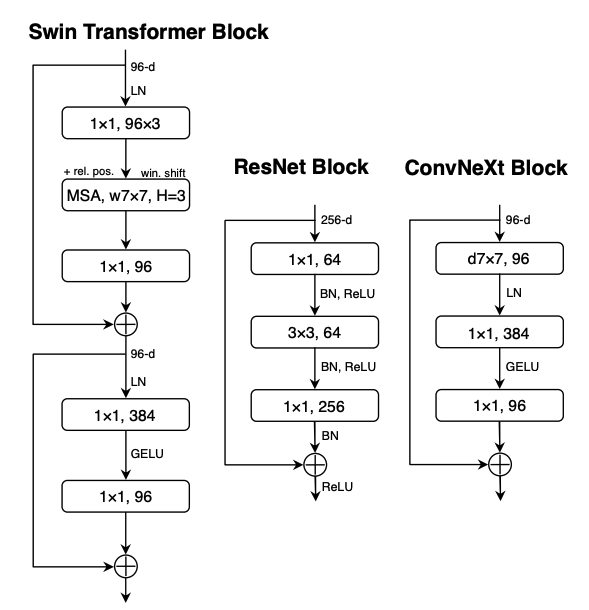

# ConvNeXt Models for Image Classification

This page documents the ConvNeXt image classification model pool in FusionBench. It wraps Hugging Face Transformers ConvNeXt models with convenient loading, processor management, dataset-aware head adaptation, and save utilities.

Implementation: [ConvNextForImageClassificationPool][fusion_bench.modelpool.convnext_for_image_classification.ConvNextForImageClassificationPool]



## Quick start

Minimal Python usage with a single pretrained ConvNeXt model (e.g., base-224):

```python
from fusion_bench.modelpool import ConvNextForImageClassificationPool

pool = ConvNextForImageClassificationPool(
		models={
				"_pretrained_": {
						"config_path": "facebook/convnext-base-224",
						"pretrained": True,
						# set to a known dataset key (e.g., "cifar10") to resize classifier
						# and populate id2label/label2id mappings
						"dataset_name": None,
				}
		}
)

model = pool.load_model("_pretrained_")
processor = pool.load_processor()  # AutoImageProcessor
```

Low-level construction is available via helpers:

- [fusion_bench.modelpool.convnext_for_image_classification.load_transformers_convnext][]

## Ready-to-use config

Use the provided Hydra config to set up a pretrained ConvNeXt-base model:

```yaml title="config/modelpool/ConvNextForImageClassification/convnext-base-224.yaml"
--8<-- "config/modelpool/ConvNextForImageClassification/convnext-base-224.yaml"
```

Tip: set `dataset_name` to a supported dataset key (e.g., `cifar10`, `svhn`, `gtsrb`, …) to auto-resize the classifier and label mappings.

## The 8-Task Benchmark

This pool includes a preset configuration for an 8-task image classification benchmark. The tasks are:
**SUN397**, **Stanford Cars**, **RESISC45**, **EuroSAT**, **SVHN**, **GTSRB**, **MNIST**, and **DTD**.

```yaml title="config/modelpool/ConvNextForImageClassification/convnext-base-224_8-tasks.yaml"
--8<-- "config/modelpool/ConvNextForImageClassification/convnext-base-224_8-tasks.yaml"
```

These models are fine-tuned from `facebook/convnext-base-224`.

When merging these models (e.g., using `simple_average`), we typically want to fuse the shared backbone while potentially keeping task-specific heads separate or handling them specially. The ConvNeXt implementation sets:

```python
model._fusion_bench_target_modules = ["convnext"]
```

This attribute informs partial fusion algorithms to target the `convnext` backbone module. 
For standard parameter merging, this ensures we focus on the shared feature extractor.

```python title="examples/simple_average/convnext-base-224.py"
"""
Example of merging ConvNeXt models using simple averaging.
"""

import lightning as L

from fusion_bench.method import SimpleAverageAlgorithm
from fusion_bench.modelpool import ConvNextForImageClassificationPool, BaseModelPool
from fusion_bench.models.wrappers.switch import SwitchModule, set_active_option
from fusion_bench.taskpool.image_classification import ImageClassificationTaskPool
from fusion_bench.utils import initialize_hydra_config, instantiate

fabric = L.Fabric(accelerator="auto", devices=1)
fabric.launch()

config = initialize_hydra_config(
    config_name="fabric_model_fusion",
    overrides=[
        "method=simple_average",
        "modelpool=ConvNextForImageClassification/convnext-base-224_8-tasks",
        "taskpool=ImageClassificationTaskPool/convnext-base-224_8-tasks.yaml",
    ],
)

algorithm: SimpleAverageAlgorithm = instantiate(config.method)
modelpool: ConvNextForImageClassificationPool = instantiate(config.modelpool)
taskpool: ImageClassificationTaskPool = instantiate(config.taskpool)
taskpool.fabric = fabric

models = {
    model_name: modelpool.load_model(model_name) for model_name in modelpool.model_names
}

# Wrap classification heads in a SwitchModule
heads = {model_name: m.classifier for model_name, m in models.items()}
head = SwitchModule(heads)

merged_model = algorithm.run(modelpool=BaseModelPool(models))
merged_model.classifier = head
report = taskpool.evaluate(merged_model)
print(report)
```

## Implementation Details

- Pool class: [fusion_bench.modelpool.convnext_for_image_classification.ConvNextForImageClassificationPool][]
- Loader helper: [fusion_bench.modelpool.convnext_for_image_classification.load_transformers_convnext][]
