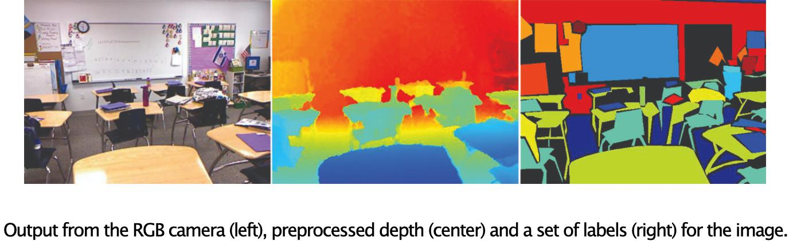

# Scene Understanding on NYUv2 tasks



## Examples


### Simple Average

```bash
fusion_bench --config-name nyuv2_config \
    method=simple_average
```

### Task Arithmetic

```bash
fusion_bench --config-name nyuv2_config \
    method=task_arithmetic \
        method.scaling_factor=0.3
```

### Ties-Merging

```bash
fusion_bench --config-name nyuv2_config \
    method=ties_merging \
        method.scaling_factor=0.3
```

### Experimental Results

| Method                            | Segmentation (mIoU $\uparrow$) | Segmentation (Pix Acc $\uparrow$) | Depth Estimation (Abs Err $\downarrow$) | Depth Estimation (Rel Err $\downarrow$) | Normal (Mean $\downarrow$) |
| --------------------------------- | ------------------------------ | --------------------------------- | --------------------------------------- | --------------------------------------- | -------------------------- |
| *Single-Task Learning*            |                                |                                   |                                         |                                         |                            |
| Segmentation                      | 52.0                           | 73.8                              | 242.8                                   | 88.7                                    | 82.8                       |
| Depth Estimation                  | 2.3                            | 6.2                               | 42.5                                    | 17.7                                    | 82.8                       |
| Normal                            | 2.0                            | 4.9                               | 264.0                                   | 98.1                                    | 24.7                       |
| *Multi-Task Model Fusion Methods* |                                |                                   |                                         |                                         |                            |
| Weight Averaging                  | 39.0                           | 67.0                              | 55.1                                    | 22.7                                    | 30.4                       |
| Task Arithmetic ($\lambda=0.3$)   | 33.6                           | 63.3                              | 56.3                                    | 23.2                                    | 31.3                       |
| Ties-Merging ($\lambda=0.3$)      | 36.3                           | 61.7                              | 60.5                                    | 24.5                                    | 33.1                       |
