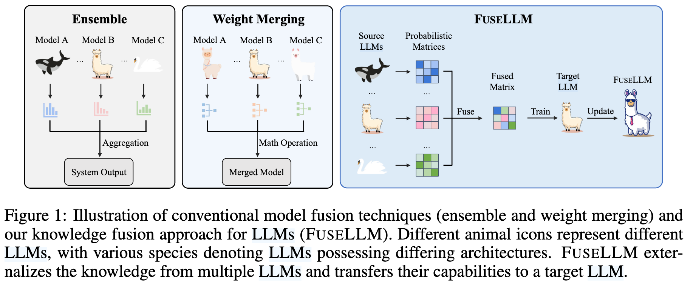
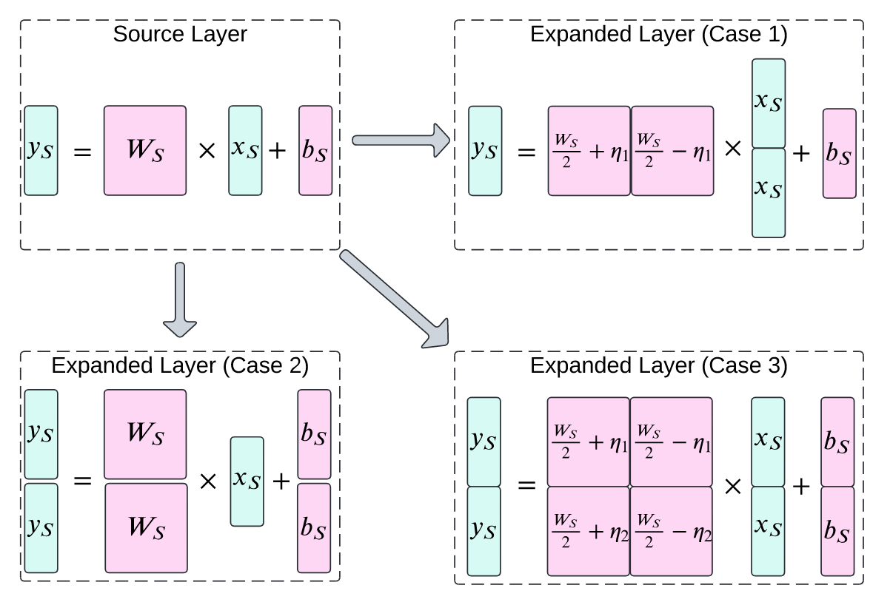

# Reading Lists

!!! info
    working in progress. Any suggestions are welcome.

I've been compiling a comprehensive list of papers and resources that have been instrumental in my research journey. 
This collection is designed to serve as a valuable starting point for those interested in delving into the field of deep model fusion.
*If you have any suggestions for papers to add, please feel free to raise an issue or submit a pull request.*

!!! note

    Meaning of the symbols in the list:
    
    - :star: Highly recommended
    - :llama: LLaMA model-related or Mistral-related work
    - :simple-github: Code available on GitHub
    - :hugging: models or datasets available on Hugging Face

## Survey Papers

- [:simple-github:](https://github.com/EnnengYang/Awesome-Model-Merging-Methods-Theories-Applications) 
    E. Yang et al., “Model Merging in LLMs, MLLMs, and Beyond: Methods, Theories, Applications and Opportunities.” [arXiv, Aug. 14, 2024.](https://arxiv.org/pdf/2408.07666)

    ??? quote

        { width=900px }

- :star: Yadav et al. A Survey on Model MoErging: Recycling and Routing Among Specialized Experts for Collaborative Learning [arXiv:2408.07057](http://arxiv.org/abs/2408.07057)
- :star: 
    W. Li, Y. Peng, M. Zhang, L. Ding, H. Hu, and L. Shen, “Deep Model Fusion: A Survey.” [arXiv, Sep. 27, 2023. doi: 10.48550/arXiv.2309.15698.](http://arxiv.org/abs/2309.15698)
- [:simple-github:](https://github.com/ruthless-man/Awesome-Learn-from-Model) 
    H. Zheng et al., “Learn From Model Beyond Fine-Tuning: A Survey.” [arXiv, Oct. 12, 2023.](http://arxiv.org/abs/2310.08184)

## Findings on Model Fusion

- :llama: Aakanksha et al. Mix Data or Merge Models? Optimizing for Diverse Multi-Task Learning [arXiv:2410.10801](http://arxiv.org/abs/2410.10801)
- :star: Yadav et al. What Matters for Model Merging at Scale? [arXiv:2410.03617](http://arxiv.org/abs/2410.03617)

## Model Ensemble

- Liu T Y, Soatto S. Tangent Model Composition for Ensembling and Continual Fine-tuning. arXiv, 2023.
- :llama: Wan et al. Knowledge Fusion of Large Language Models [arXiv:2401.10491](http://arxiv.org/abs/2401.10491)

    ??? quote

        { width=800px }

- :llama: Wan F, Yang Z, Zhong L, et al. FuseChat: Knowledge Fusion of Chat Models. arXiv, 2024.

    ??? quote

        { width=800px }

## Model Merging

### Mode Connectivity

Mode connectivity is such an important concept in model merging that it deserves [its own page](mode_connectivity.md).

### Weight Interpolation

- Osowiechi et al. WATT: Weight Average Test-Time Adaptation of CLIP [arXiv:2406.13875](http://arxiv.org/abs/2406.13875)

    ??? quote

        { width=800px }

- Jiang et al. ForkMerge: Mitigating Negative Transfer in Auxiliary-Task Learning

    ??? quote

        { width=800px }

- Chronopoulou et al. Language and Task Arithmetic with Parameter-Efficient Layers for Zero-Shot Summarization [arXiv:2311.09344](http://arxiv.org/abs/2311.09344)

    ??? quote

        { width=900px }

- :llama: [:simple-github:](https://github.com/yule-BUAA/MergeLM)
    L. Yu, B. Yu, H. Yu, F. Huang, and Y. Li, “Language Models are Super Mario: Absorbing Abilities from Homologous Models as a Free Lunch,” Nov. 06, 2023, arXiv: arXiv:2311.03099. Available: http://arxiv.org/abs/2311.03099
- :star: [:simple-github:](https://github.com/EnnengYang/AdaMerging) 
    E. Yang et al., “AdaMerging: Adaptive Model Merging for Multi-Task Learning,” ICLR 2024, arXiv: arXiv:2310.02575. doi: 10.48550/arXiv.2310.02575.
- :star: P. Yadav, D. Tam, L. Choshen, C. Raffel, and M. Bansal, “Resolving Interference When Merging Models,” Jun. 02, 2023, arXiv: arXiv:2306.01708. Available: http://arxiv.org/abs/2306.01708
- :star: Guillermo Ortiz-Jimenez, Alessandro Favero, and Pascal Frossard, “Task Arithmetic in the Tangent Space: Improved Editing of Pre-Trained Models,” May 30, 2023, arXiv: arXiv:2305.12827. doi: 10.48550/arXiv.2305.12827.
- :star: G. Ilharco et al., “Editing Models with Task Arithmetic,” Mar. 31, 2023, arXiv: arXiv:2212.04089. doi: 10.48550/arXiv.2212.04089.
- Tang et al. Towards Efficient Pareto Set Approximation via Mixture of Experts Based Model Fusion

    ??? quote

        { width=800px }

- Rame et al. Rewarded soups: towards Pareto-optimal alignment by interpolating weights fine-tuned on diverse rewards [arXiv:2306.04488](http://arxiv.org/abs/2306.04488)
- Huang et al. LoraHub: Efficient Cross-Task Generalization via Dynamic LoRA Composition [arXiv:2307.13269](http://arxiv.org/abs/2307.13269)

    ??? quote

        

- Wu et al. Pi-Tuning: Transferring Multimodal Foundation Models with Optimal Multi-task Interpolation
        
    ??? quote

        

- Chronopoulou et al. AdapterSoup: Weight Averaging to Improve Generalization of Pretrained Language Models [arXiv:2302.07027](http://arxiv.org/abs/2302.07027)

    ??? quote

        { width=450px }

- Zimmer et al. Sparse Model Soups: A Recipe for Improved Pruning via Model Averaging [arXiv:2306.16788](http://arxiv.org/abs/2306.16788)

    ??? quote

        { width=800px }

- :star: Wortsman et al. Model soups: averaging weights of multiple fine-tuned models improves accuracy without increasing inference time [arXiv:2203.05482](http://arxiv.org/abs/2203.05482)

### Alignment-based Methods

- Kinderman et al. Foldable SuperNets: Scalable Merging of Transformers with Different Initializations and Tasks [arXiv:2410.01483](http://arxiv.org/abs/2410.01483)

    ??? quote

        { width=800px }

- S. K. Ainsworth, J. Hayase, and S. Srinivasa, “Git Re-Basin: Merging Models modulo Permutation Symmetries,” ICLR 2023. Available: http://arxiv.org/abs/2209.04836
- George Stoica, Daniel Bolya, Jakob Bjorner, Taylor Hearn, and Judy Hoffman, “ZipIt! Merging Models from Different Tasks without Training,” May 04, 2023, arXiv: arXiv:2305.03053. Available: http://arxiv.org/abs/2305.03053

### Subspace-based Methods

- Tang A, Shen L, Luo Y, et al. Concrete subspace learning based interference elimination for multi-task model fusion. [arXiv preprint arXiv:2312.06173](https://arxiv.org/abs/2312.06173), 2023.
- :llama: [:simple-github:](https://github.com/xinykou/safety_realignment) 
    X. Yi, S. Zheng, L. Wang, X. Wang, and L. He, “A safety realignment framework via subspace-oriented model fusion for large language models.” [arXiv, May 14, 2024. doi: 10.48550/arXiv.2405.09055.](http://arxiv.org/abs/2405.09055)
- [:simple-github:](https://github.com/nik-dim/tall_masks) Wang K, Dimitriadis N, Ortiz-Jimenez G, et al. Localizing Task Information for Improved Model Merging and Compression. [arXiv preprint arXiv:2405.07813](http://arxiv.org/abs/2405.07813), 2024.

### Online Model Merging

- :llama: Alexandrov el al. Mitigating Catastrophic Forgetting in Language Transfer via Model Merging [arXiv:2407.08699](http://arxiv.org/abs/2407.08699)

    ??? quote

        { width=450px }
        { width=450px }

- :llama: Lu et al. Online Merging Optimizers for Boosting Rewards and Mitigating Tax in Alignment [arXiv:2405.17931](http://arxiv.org/abs/2405.17931)
- Izmailov et al. Averaging Weights Leads to Wider Optima and Better Generalization
- Kaddour et al. Stop Wasting My Time! Saving Days of ImageNet and BERT Training with Latest Weight Averaging [arXiv:2209.14981](http://arxiv.org/abs/2209.14981)
- Zhang et al. Lookahead Optimizer: k steps forward, 1 step back [http://arxiv.org/abs/1907.08610](http://arxiv.org/abs/1907.08610)

## Model Mixing/Upscaling/Expansion

- :llama: Samragh et al. Scaling Smart: Accelerating Large Language Model Pre-training with Small Model Initialization [arXiv:2409.12903](http://arxiv.org/abs/2409.12903)

    ??? quote
        
        { width=800px }

- Zhao et al. Merging LoRAs like Playing LEGO: Pushing the Modularity of LoRA to Extremes Through Rank-Wise Clustering [arXiv:2409.16167](http://arxiv.org/abs/2409.16167)

    ??? quote

        { width=800px }

- Tang et al. SMILE: Zero-Shot Sparse Mixture of Low-Rank Experts Construction From Pre-Trained Foundation Models [arXiv:2408.10174](http://arxiv.org/abs/2408.10174)

    ??? quote

        { width=800px }

- :llama: [:simple-github:](https://github.com/THUNLP-MT/ModelCompose) :hugging:
    C. Chen et al., “Model Composition for Multimodal Large Language Models.” [arXiv, Feb. 20, 2024. doi: 10.48550/arXiv.2402.12750.](http://arxiv.org/abs/2402.12750)
- A. Tang, L. Shen, Y. Luo, N. Yin, L. Zhang, and D. Tao, “Merging Multi-Task Models via Weight-Ensembling Mixture of Experts,” Feb. 01, 2024, arXiv: arXiv:2402.00433. doi: 10.48550/arXiv.2402.00433.
- :llama: [:simple-github:](https://github.com/LZY-the-boys/Twin-Merging) 
    Zhenyi Lu et al., "Twin-Merging: Dynamic Integration of Modular Expertise in Model Merging" [10.48550/arXiv.2406.15479](http://arxiv.org/abs/2406.15479)

    ??? quote

        { width=800px }

- :llama: [:simple-github:](http://github.com/tanganke/fusion_bench) :hugging: Tang A, Shen L, Luo Y, et al. SMILE: Zero-Shot Sparse Mixture of Low-Rank Experts Construction From Pre-Trained Foundation Models. [arXiv](http://arxiv.org/abs/2408.10174), 2024.
- :llama: Kim et al. SOLAR 10.7B: Scaling Large Language Models with Simple yet Effective Depth Up-Scaling [arXiv:2312.15166](http://arxiv.org/abs/2312.15166)

    ??? quote

        { width=800px }

- Komatsuzaki et al. Sparse Upcycling: Training Mixture-of-Experts from Dense Checkpoints [arXiv:2212.05055](http://arxiv.org/abs/2212.05055)

    ??? quote

        { width=800px }

## Benchmarks

- Tam et al. Realistic Evaluation of Model Merging for Compositional Generalization [arXiv:2409.18314](http://arxiv.org/abs/2409.18314)
- :star: Tang et al. FusionBench: A Comprehensive Benchmark of Deep Model Fusion.

## Libraries and Tools

### Fine-tuning, Preparing models for fusion

- [:simple-github:](https://github.com/tanganke/pytorch_classification)
    PyTorch Classification: A PyTorch library for training/fine-tuning models (CNN, ViT, CLIP) on image classification tasks
- :star: [:simple-github:](https://github.com/hiyouga/LLaMA-Factory)
    LLaMA Factory: A PyTorch library for fine-tuning LLMs

### Model Fusion

- :star: [:simple-github:](https://github.com/tanganke/fusion_bench) [:hugging:](https://huggingface.co/tanganke)
    FusionBench: A Comprehensive Benchmark of Deep Model Fusion.
- :star: :llama: [:simple-github:](https://github.com/arcee-ai/mergekit) 
    MergeKit: A PyTorch library for merging large language models.

### Version Control

- Kandpal et al. Git-Theta: A Git Extension for Collaborative Development of Machine Learning Models [arXiv:2306.04529](http://arxiv.org/abs/2306.04529)

## Other Applications of Model Fusion

### Applications in Reinforcement Learning (RL)

- (**Survey Paper**) Song Y, Suganthan P N, Pedrycz W, et al. Ensemble reinforcement learning: A survey. [Applied Soft Computing, 2023.](https://www.sciencedirect.com/science/article/abs/pii/S1568494623009936)
- :star: Lee K, Laskin M, Srinivas A, et al. “Sunrise: A simple unified framework for ensemble learning in deep reinforcement learning", ICML, 2021.
- Ren J, Li Y, Ding Z, et al. “Probabilistic mixture-of-experts for efficient deep reinforcement learning". arXiv:2104.09122, 2021.
- :star: Celik O, Taranovic A, Neumann G. “Acquiring Diverse Skills using Curriculum Reinforcement Learning with Mixture of Experts". arXiv preprint arXiv:2403.06966, 2024.

